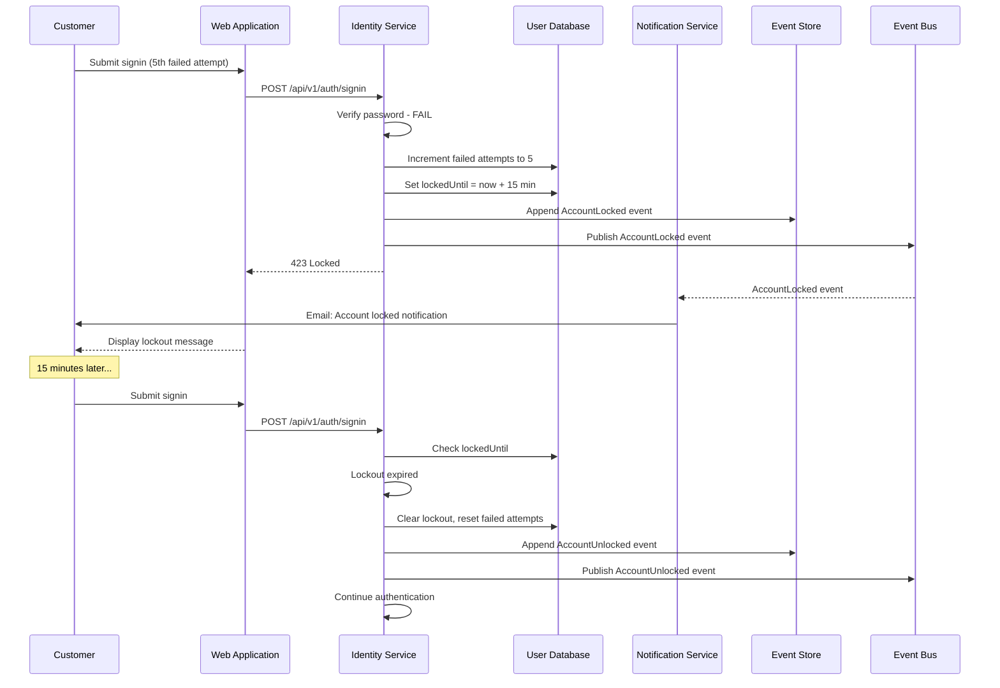
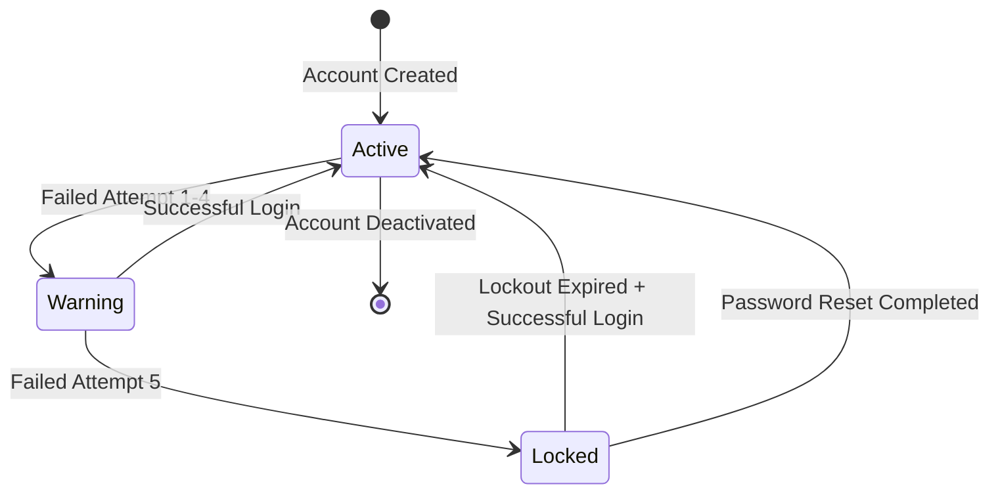

# US-0003-04: Account Lockout

## User Story

**As the** Identity Management Service,
**I want** to lock accounts after multiple failed signin attempts,
**So that** customer accounts are protected from brute force attacks.

## Story Details

| Field        | Value                                          |
|--------------|------------------------------------------------|
| Story ID     | US-0003-04                                     |
| Epic         | [US-0003: Customer Signin](./README.md)        |
| Priority     | Must Have                                      |
| Phase        | Phase 1 (MVP)                                  |
| Story Points | 5                                              |

## Description

This story implements account lockout functionality that triggers after a configurable number of consecutive failed signin attempts. Locked accounts are temporarily prevented from signing in, and customers are notified via email. The lockout automatically expires after a defined duration, and password reset provides an immediate bypass.

## Lockout Rules

| Parameter               | Value       |
|-------------------------|-------------|
| Failed Attempts Trigger | 5           |
| Lockout Duration        | 15 minutes  |
| Counter Reset           | On success  |
| Password Reset Bypass   | Yes         |

## Architecture

### Sequence Diagram



### State Diagram



## API Contract

### Response (Account Locked)

```
HTTP/1.1 423 Locked
Content-Type: application/json

{
  "error": "ACCOUNT_LOCKED",
  "message": "Account temporarily locked due to too many failed attempts",
  "lockedUntil": "2026-01-17T10:45:00Z",
  "lockoutRemainingSeconds": 893,
  "supportUrl": "https://www.acme.com/support",
  "passwordResetUrl": "https://www.acme.com/forgot-password"
}
```

### Domain Event: AccountLocked

```json
{
  "eventId": "01941234-5678-7abc-def0-123456789207",
  "eventType": "AccountLocked",
  "eventVersion": "1.0",
  "timestamp": "2026-01-17T10:29:59Z",
  "aggregateId": "01941234-5678-7abc-def0-123456789abc",
  "aggregateType": "User",
  "payload": {
    "userId": "01941234-5678-7abc-def0-123456789abc",
    "reason": "EXCESSIVE_FAILED_ATTEMPTS",
    "failedAttemptCount": 5,
    "lockedUntil": "2026-01-17T10:44:59Z",
    "ipAddress": "192.168.1.100"
  }
}
```

### Domain Event: AccountUnlocked

```json
{
  "eventId": "01941234-5678-7abc-def0-123456789208",
  "eventType": "AccountUnlocked",
  "eventVersion": "1.0",
  "timestamp": "2026-01-17T10:45:00Z",
  "aggregateId": "01941234-5678-7abc-def0-123456789abc",
  "aggregateType": "User",
  "payload": {
    "userId": "01941234-5678-7abc-def0-123456789abc",
    "reason": "LOCKOUT_EXPIRED",
    "unlockedAt": "2026-01-17T10:45:00Z"
  }
}
```

## Acceptance Criteria

### AC-0003-04-01: Lock After 5 Failed Attempts

**Given** a user has 4 failed signin attempts
**When** a 5th failed signin attempt occurs
**Then** the account is locked for 15 minutes
**And** an AccountLocked event is published
**And** a 423 Locked response is returned

### AC-0003-04-02: Lockout Response Contains Time Info

**Given** an account is locked
**When** a signin attempt is made for that account
**Then** the response includes lockedUntil timestamp
**And** the response includes lockoutRemainingSeconds
**And** the response includes passwordResetUrl

### AC-0003-04-03: Lockout Duration is 15 Minutes

**Given** an account is locked at time T
**When** a signin attempt is made at T + 14 minutes
**Then** the account is still locked
**And** a 423 response is returned

**Given** an account is locked at time T
**When** a signin attempt is made at T + 16 minutes
**Then** the lockout has expired
**And** normal credential validation proceeds

### AC-0003-04-04: Account Locked Notification

**Given** an account becomes locked
**When** the AccountLocked event is published
**Then** the Notification Service sends an email to the customer
**And** the email contains: lockout reason, duration, password reset link, support contact

### AC-0003-04-05: Password Reset Bypasses Lockout

**Given** an account is currently locked
**When** the customer completes a password reset
**Then** the lockout is cleared immediately
**And** the account can be used for signin
**And** the failed attempts counter is reset to 0

### AC-0003-04-06: Lockout Clears on Expiry

**Given** an account was locked 15 minutes ago
**When** the customer attempts to signin with valid credentials
**Then** the lockout is cleared
**And** an AccountUnlocked event is published
**And** the signin proceeds normally

### AC-0003-04-07: Failed Attempts Counter Persists

**Given** a user has 3 failed attempts
**When** 24 hours pass without a successful signin
**Then** the failed attempts counter remains at 3
**And** 2 more failures will trigger lockout

### AC-0003-04-08: UI Displays Remaining Attempts

**Given** a user has 3 failed signin attempts
**When** a 4th failed attempt occurs
**Then** the UI displays "1 attempt remaining before account lockout"

### AC-0003-04-09: Lockout Message is User-Friendly

**Given** an account is locked
**When** the error is displayed
**Then** the message explains the lockout reason
**And** the message shows time remaining
**And** the message provides password reset option
**And** the message provides support contact option

### AC-0003-04-10: Analytics Tracking

**Given** an account becomes locked
**When** the AccountLocked event is processed by Analytics
**Then** the lockout is recorded with: userId, timestamp, IP address, reason
**And** lockout metrics are updated

## Technical Implementation

### Backend Stack

- **Framework**: Spring Boot 4 with Kotlin 2.2
- **Database**: PostgreSQL 16+ for account state
- **Events**: Kafka for AccountLocked/AccountUnlocked events
- **Notifications**: Notification Service consumes events

### Configuration

```yaml
identity:
  lockout:
    max-failed-attempts: 5
    lockout-duration: 15m
    counter-expiry: null  # Never expires, only resets on success
```

### User Entity Updates

```kotlin
@Entity
@Table(name = "users")
class User(
    @Id
    val id: UUID,

    @Column(nullable = false, unique = true)
    val email: String,

    @Column(nullable = false)
    var passwordHash: String,

    @Enumerated(EnumType.STRING)
    var status: AccountStatus = AccountStatus.ACTIVE,

    @Column(nullable = false)
    var failedAttempts: Int = 0,

    @Column
    var lockedUntil: Instant? = null,

    // ... other fields
) {
    fun isLocked(): Boolean = lockedUntil?.isAfter(Instant.now()) == true

    fun lockoutRemainingSeconds(): Long? =
        lockedUntil?.let { Duration.between(Instant.now(), it).seconds.coerceAtLeast(0) }

    fun lock(duration: Duration) {
        lockedUntil = Instant.now().plus(duration)
    }

    fun unlock() {
        lockedUntil = null
        failedAttempts = 0
    }

    fun incrementFailedAttempts(): Int {
        return ++failedAttempts
    }

    fun resetFailedAttempts() {
        failedAttempts = 0
    }
}
```

### Lockout Use Case

```kotlin
@Service
class LockoutService(
    private val userRepository: UserRepository,
    private val eventPublisher: DomainEventPublisher,
    private val lockoutConfig: LockoutConfig
) {
    fun checkAndApplyLockout(user: User, ipAddress: String): Either<AccountLocked, Unit> = either {
        // Check if already locked
        if (user.isLocked()) {
            raise(AccountLocked(
                lockedUntil = user.lockedUntil!!,
                remainingSeconds = user.lockoutRemainingSeconds()!!
            ))
        }

        // Clear expired lockout if present
        if (user.lockedUntil != null && !user.isLocked()) {
            user.unlock()
            userRepository.save(user)
            eventPublisher.publish(AccountUnlockedEvent(
                userId = user.id,
                reason = "LOCKOUT_EXPIRED",
                unlockedAt = Instant.now()
            ))
        }
    }

    fun handleFailedAttempt(user: User, ipAddress: String): LockoutResult {
        val attempts = user.incrementFailedAttempts()

        return if (attempts >= lockoutConfig.maxFailedAttempts) {
            user.lock(lockoutConfig.lockoutDuration)
            userRepository.save(user)

            eventPublisher.publish(AccountLockedEvent(
                userId = user.id,
                reason = "EXCESSIVE_FAILED_ATTEMPTS",
                failedAttemptCount = attempts,
                lockedUntil = user.lockedUntil!!,
                ipAddress = ipAddress
            ))

            LockoutResult.Locked(
                lockedUntil = user.lockedUntil!!,
                remainingSeconds = user.lockoutRemainingSeconds()!!
            )
        } else {
            userRepository.save(user)
            LockoutResult.Warning(
                failedAttempts = attempts,
                remainingAttempts = lockoutConfig.maxFailedAttempts - attempts
            )
        }
    }
}

sealed interface LockoutResult {
    data class Warning(
        val failedAttempts: Int,
        val remainingAttempts: Int
    ) : LockoutResult

    data class Locked(
        val lockedUntil: Instant,
        val remainingSeconds: Long
    ) : LockoutResult
}
```

### Notification Email Template

```html
Subject: Your ACME Account Has Been Locked

Dear Customer,

Your ACME account ({{email}}) has been temporarily locked due to multiple
failed sign-in attempts.

Lockout Details:
- Locked at: {{lockTime}}
- Unlocks at: {{unlockTime}}
- Failed attempts: {{failedAttempts}}
- IP Address: {{ipAddress}}

If this was you:
Please wait {{remainingMinutes}} minutes before trying again, or reset
your password immediately: {{passwordResetUrl}}

If this wasn't you:
Someone may be trying to access your account. We recommend:
1. Reset your password immediately: {{passwordResetUrl}}
2. Review your account activity after signing in
3. Contact support if you notice any suspicious activity

Need help? Contact our support team at {{supportUrl}}

Best regards,
The ACME Team
```

## Definition of Done

- [ ] Account locks after 5 consecutive failed attempts
- [ ] Lockout duration is 15 minutes
- [ ] 423 response includes lockout timing information
- [ ] AccountLocked event published on lockout
- [ ] AccountUnlocked event published on expiry
- [ ] Notification email sent on account lockout
- [ ] Password reset clears lockout immediately
- [ ] UI displays remaining attempts before lockout
- [ ] Failed attempts counter persists across sessions
- [ ] Unit tests cover all lockout scenarios (>90% coverage)
- [ ] Integration tests verify lockout flow end-to-end
- [ ] Code reviewed and approved

## Dependencies

- PostgreSQL database with users table (lockedUntil column)
- Kafka for event publishing
- Notification Service for email delivery
- Email templates configured

## Related Documents

- [Journey Error Scenario E2: Account Locked](../../journeys/0003-customer-signin.md#e2-account-locked)
- [US-0003-02: Credential Validation](./US-0003-02-credential-validation.md)
- [US-0003-03: Rate Limiting](./US-0003-03-rate-limiting.md)
- [US-0003-13: Password Reset Flow](./US-0003-13-password-reset.md)
