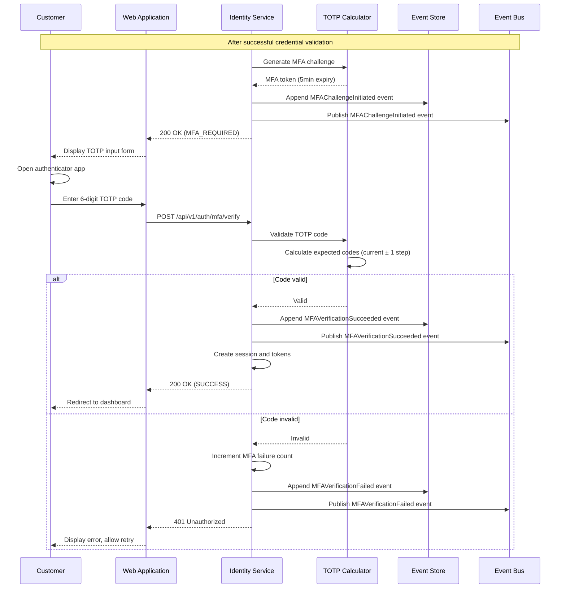
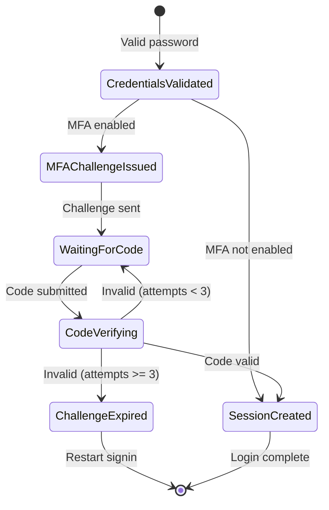

# US-0003-05: MFA Challenge (TOTP)

## User Story

**As a** security-conscious customer,
**I want** to verify my identity using a time-based one-time password (TOTP),
**So that** my account has an additional layer of protection against unauthorized access.

## Story Details

| Field        | Value                                          |
|--------------|------------------------------------------------|
| Story ID     | US-0003-05                                     |
| Epic         | [US-0003: Customer Signin](./README.md)        |
| Priority     | Must Have                                      |
| Phase        | Phase 2 (Enhanced Security)                    |
| Story Points | 8                                              |

## Description

This story implements TOTP (Time-based One-Time Password) verification as part of the multi-factor authentication flow. After successful credential validation, customers with TOTP MFA enabled are prompted to enter a 6-digit code from their authenticator app (Google Authenticator, Authy, etc.).

## TOTP Configuration

| Parameter        | Value              |
|------------------|---------------------|
| Algorithm        | SHA-1               |
| Digits           | 6                   |
| Time Step        | 30 seconds          |
| Time Tolerance   | 1 step (±30 seconds)|
| Code Validity    | Single use          |
| Challenge Expiry | 5 minutes           |
| Max Attempts     | 3                   |

## Architecture

### Sequence Diagram



### MFA Flow State Machine



## API Contract

### Request: Verify TOTP

```
POST /api/v1/auth/mfa/verify
Content-Type: application/json

{
  "mfaToken": "mfa_01941234-5678-7abc-def0-123456789abc",
  "code": "123456",
  "method": "TOTP",
  "rememberDevice": true
}
```

### Response: Success

```
HTTP/1.1 200 OK
Content-Type: application/json
Set-Cookie: access_token=<jwt>; HttpOnly; Secure; SameSite=Strict; Path=/; Max-Age=900
Set-Cookie: refresh_token=<jwt>; HttpOnly; Secure; SameSite=Strict; Path=/api/v1/auth/refresh; Max-Age=604800
Set-Cookie: device_trust=<token>; HttpOnly; Secure; SameSite=Strict; Path=/; Max-Age=2592000

{
  "status": "SUCCESS",
  "userId": "01941234-5678-7abc-def0-123456789abc",
  "deviceTrusted": true,
  "expiresIn": 900
}
```

### Response: Invalid Code

```
HTTP/1.1 401 Unauthorized
Content-Type: application/json

{
  "error": "INVALID_MFA_CODE",
  "message": "Invalid verification code",
  "remainingAttempts": 2
}
```

### Response: MFA Expired

```
HTTP/1.1 401 Unauthorized
Content-Type: application/json

{
  "error": "MFA_EXPIRED",
  "message": "MFA challenge has expired. Please sign in again."
}
```

### Domain Event: MFAChallengeInitiated

```json
{
  "eventId": "01941234-5678-7abc-def0-123456789202",
  "eventType": "MFAChallengeInitiated",
  "eventVersion": "1.0",
  "timestamp": "2026-01-17T10:30:00Z",
  "aggregateId": "01941234-5678-7abc-def0-123456789abc",
  "aggregateType": "User",
  "payload": {
    "userId": "01941234-5678-7abc-def0-123456789abc",
    "mfaToken": "mfa_01941234-5678-7abc-def0-123456789abc",
    "method": "TOTP",
    "expiresAt": "2026-01-17T10:35:00Z"
  }
}
```

### Domain Event: MFAVerificationSucceeded

```json
{
  "eventId": "01941234-5678-7abc-def0-123456789203",
  "eventType": "MFAVerificationSucceeded",
  "eventVersion": "1.0",
  "timestamp": "2026-01-17T10:30:01Z",
  "aggregateId": "01941234-5678-7abc-def0-123456789abc",
  "aggregateType": "User",
  "payload": {
    "userId": "01941234-5678-7abc-def0-123456789abc",
    "method": "TOTP",
    "deviceRemembered": true
  }
}
```

## Acceptance Criteria

### AC-0003-05-01: TOTP Code Validation

**Given** a customer has completed credential validation with TOTP MFA enabled
**When** they enter a valid 6-digit TOTP code from their authenticator app
**Then** the code is validated against the expected value
**And** a 30-second time window with ±1 step tolerance is applied
**And** authentication succeeds if the code matches

### AC-0003-05-02: Time Window Tolerance

**Given** a TOTP code was generated at time T
**When** the code is submitted at T + 25 seconds
**Then** the code is still valid (within 30-second window)

**Given** a TOTP code was generated at time T
**When** the code is submitted at T + 45 seconds
**Then** the code is still valid (within ±1 step tolerance)

**Given** a TOTP code was generated at time T
**When** the code is submitted at T + 65 seconds
**Then** the code is invalid (outside tolerance)

### AC-0003-05-03: Single Use Codes

**Given** a valid TOTP code was successfully used
**When** the same code is submitted again within its validity window
**Then** the code is rejected
**And** the response indicates the code has already been used

### AC-0003-05-04: MFA Challenge Expiry

**Given** an MFA challenge was issued 5 minutes ago
**When** a TOTP code is submitted
**Then** the challenge is rejected
**And** the response error is "MFA_EXPIRED"
**And** the customer must restart the signin process

### AC-0003-05-05: Maximum 3 Attempts

**Given** a customer has failed TOTP verification twice
**When** they fail a third time
**Then** the MFA challenge expires
**And** the response error is "MFA_EXPIRED"
**And** the customer must restart the signin process

### AC-0003-05-06: MFA Verification Response Time

**Given** a TOTP code is submitted for verification
**When** the Identity Service processes the request
**Then** the response is returned within 200ms (p95)

### AC-0003-05-07: MFA Events Published

**Given** an MFA challenge is initiated
**Then** an MFAChallengeInitiated event is published with method "TOTP"

**Given** TOTP verification succeeds
**Then** an MFAVerificationSucceeded event is published

**Given** TOTP verification fails
**Then** an MFAVerificationFailed event is published with reason and attempt count

### AC-0003-05-08: UI TOTP Input Form

**Given** the customer is on the MFA verification screen for TOTP
**Then** a 6-digit numeric input field is displayed
**And** the input auto-focuses on page load
**And** the input accepts only numeric characters
**And** form auto-submits when 6 digits are entered

### AC-0003-05-09: Remaining Attempts Display

**Given** a customer has 1 remaining attempt
**When** the MFA verification screen is shown after a failed attempt
**Then** a warning message displays "1 attempt remaining"

### AC-0003-05-10: Authenticator App Instructions

**Given** the customer is on the MFA verification screen for TOTP
**Then** instructions are displayed: "Enter the 6-digit code from your authenticator app"
**And** a link to troubleshooting help is provided

## Technical Implementation

### Backend Stack

- **Framework**: Spring Boot 4 with Kotlin 2.2
- **TOTP Library**: dev.samstevens.totp (or similar)
- **Cache**: Redis for MFA challenge state
- **Events**: Kafka for MFA events

### Frontend Stack

- **Framework**: TanStack Start with React 19.2
- **UI Components**: shadcn/ui OTP input component
- **Validation**: Zod for input validation

### TOTP Service (Kotlin)

```kotlin
@Service
class TotpService(
    private val totpGenerator: TotpGenerator,
    private val challengeRepository: MfaChallengeRepository,
    private val usedCodeRepository: UsedTotpCodeRepository,
    private val eventPublisher: DomainEventPublisher
) {
    private val timeStepSeconds = 30L
    private val timeTolerance = 1 // ±1 step

    fun createChallenge(user: User): MfaChallenge {
        val challenge = MfaChallenge(
            id = UUID.randomUUID(),
            userId = user.id,
            method = MfaMethod.TOTP,
            token = "mfa_${UUID.randomUUID()}",
            expiresAt = Instant.now().plusSeconds(300), // 5 minutes
            attempts = 0,
            maxAttempts = 3
        )
        challengeRepository.save(challenge)

        eventPublisher.publish(MFAChallengeInitiated(
            userId = user.id,
            mfaToken = challenge.token,
            method = "TOTP",
            expiresAt = challenge.expiresAt
        ))

        return challenge
    }

    fun verifyCode(
        mfaToken: String,
        code: String,
        rememberDevice: Boolean
    ): Either<MfaError, MfaSuccess> = either {
        val challenge = ensureNotNull(challengeRepository.findByToken(mfaToken)) {
            MfaError.InvalidToken
        }

        ensure(challenge.expiresAt.isAfter(Instant.now())) {
            MfaError.Expired
        }

        ensure(challenge.attempts < challenge.maxAttempts) {
            MfaError.Expired
        }

        val user = ensureNotNull(userRepository.findById(challenge.userId)) {
            MfaError.InvalidToken
        }

        // Check if code was already used
        val codeKey = "${user.id}:$code:${Instant.now().epochSecond / timeStepSeconds}"
        ensure(!usedCodeRepository.exists(codeKey)) {
            challenge.attempts++
            challengeRepository.save(challenge)
            MfaError.CodeAlreadyUsed
        }

        // Verify TOTP
        val isValid = verifyTotp(user.totpSecret!!, code)

        if (!isValid) {
            challenge.attempts++
            challengeRepository.save(challenge)

            eventPublisher.publish(MFAVerificationFailed(
                userId = user.id,
                method = "TOTP",
                reason = "INVALID_CODE",
                attemptCount = challenge.attempts
            ))

            raise(MfaError.InvalidCode(remainingAttempts = challenge.maxAttempts - challenge.attempts))
        }

        // Mark code as used
        usedCodeRepository.save(codeKey, Duration.ofMinutes(2))

        // Delete challenge
        challengeRepository.delete(challenge)

        eventPublisher.publish(MFAVerificationSucceeded(
            userId = user.id,
            method = "TOTP",
            deviceRemembered = rememberDevice
        ))

        MfaSuccess(
            userId = user.id,
            deviceRemembered = rememberDevice
        )
    }

    private fun verifyTotp(secret: String, code: String): Boolean {
        val currentTime = Instant.now().epochSecond / timeStepSeconds

        // Check current time step and ±1 tolerance
        for (offset in -timeTolerance..timeTolerance) {
            val expectedCode = totpGenerator.generate(secret, currentTime + offset)
            if (code == expectedCode) {
                return true
            }
        }
        return false
    }
}

sealed interface MfaError {
    data object InvalidToken : MfaError
    data object Expired : MfaError
    data object CodeAlreadyUsed : MfaError
    data class InvalidCode(val remainingAttempts: Int) : MfaError
}

data class MfaSuccess(
    val userId: UUID,
    val deviceRemembered: Boolean
)
```

### Frontend OTP Input Component

```typescript
import { OTPInput } from '@/components/ui/otp-input';

interface TotpVerificationFormProps {
  mfaToken: string;
  remainingAttempts: number;
  onSuccess: () => void;
}

export function TotpVerificationForm({
  mfaToken,
  remainingAttempts,
  onSuccess
}: TotpVerificationFormProps) {
  const [code, setCode] = useState('');
  const [error, setError] = useState<string | null>(null);
  const [isSubmitting, setIsSubmitting] = useState(false);

  const handleComplete = async (value: string) => {
    setIsSubmitting(true);
    setError(null);

    try {
      const response = await verifyMfa({
        mfaToken,
        code: value,
        method: 'TOTP',
        rememberDevice: false,
      });

      if (response.status === 'SUCCESS') {
        onSuccess();
      }
    } catch (err) {
      if (err.error === 'INVALID_MFA_CODE') {
        setError(`Invalid code. ${err.remainingAttempts} attempts remaining.`);
      } else if (err.error === 'MFA_EXPIRED') {
        setError('Verification expired. Please sign in again.');
      }
    } finally {
      setIsSubmitting(false);
    }
  };

  return (
    <div className="space-y-6">
      <div className="text-center">
        <h2 className="text-xl font-semibold">Two-Factor Authentication</h2>
        <p className="text-muted-foreground mt-2">
          Enter the 6-digit code from your authenticator app
        </p>
      </div>

      <OTPInput
        length={6}
        onComplete={handleComplete}
        disabled={isSubmitting}
        autoFocus
      />

      {error && (
        <p className="text-destructive text-center">{error}</p>
      )}

      {remainingAttempts <= 2 && (
        <p className="text-warning text-center">
          {remainingAttempts} attempt{remainingAttempts !== 1 ? 's' : ''} remaining
        </p>
      )}
    </div>
  );
}
```

## Definition of Done

- [ ] TOTP codes validated with SHA-1 algorithm, 30-second step
- [ ] Time tolerance of ±1 step (±30 seconds) implemented
- [ ] Single-use code enforcement prevents replay
- [ ] MFA challenge expires after 5 minutes
- [ ] Maximum 3 attempts before challenge expires
- [ ] MFA verification responds within 200ms (p95)
- [ ] All MFA events published correctly
- [ ] Frontend OTP input auto-submits on 6 digits
- [ ] Remaining attempts warning displayed
- [ ] Unit tests cover all TOTP scenarios (>90% coverage)
- [ ] Integration tests verify MFA flow end-to-end
- [ ] Code reviewed and approved

## Dependencies

- TOTP library integrated in Identity Service
- Redis for challenge state and used code tracking
- User entity has totpSecret field populated (from MFA setup)
- shadcn/ui OTP input component available

## Related Documents

- [Journey Step 3: MFA Challenge](../../journeys/0003-customer-signin.md#step-3-mfa-challenge)
- [US-0003-02: Credential Validation](./US-0003-02-credential-validation.md)
- [US-0003-06: MFA Challenge (SMS)](./US-0003-06-mfa-sms.md)
- [US-0003-08: Remember Device](./US-0003-08-remember-device.md)
