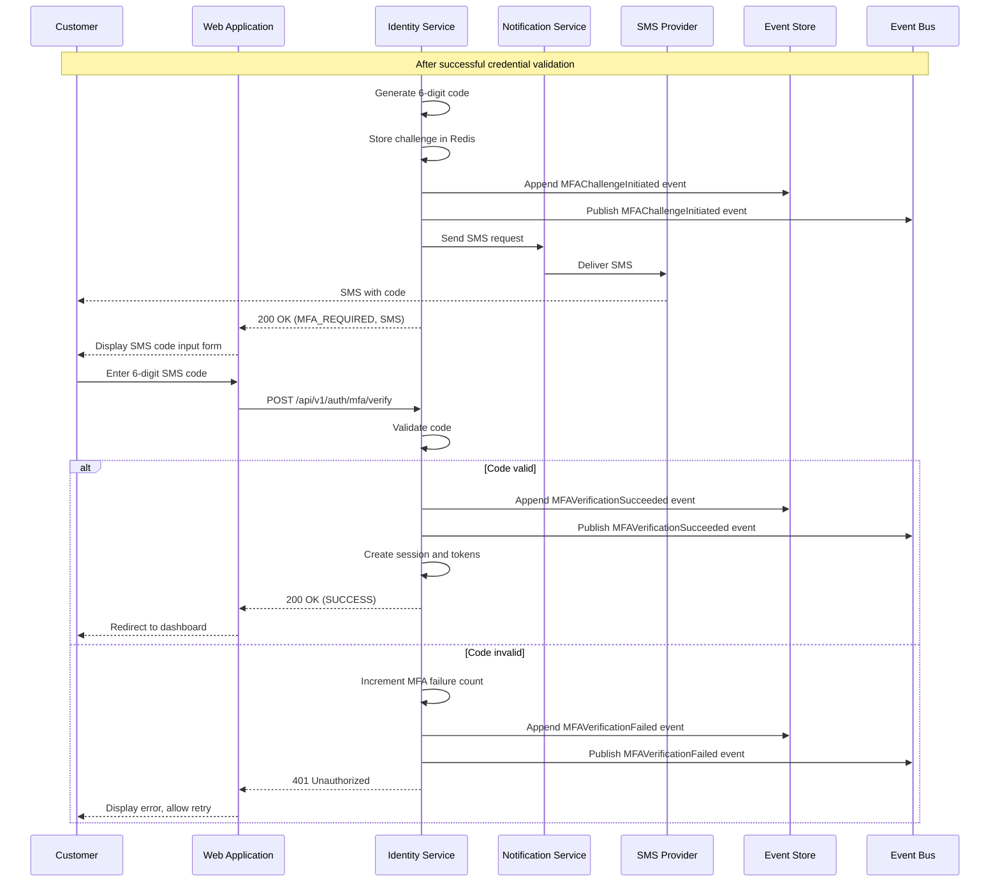
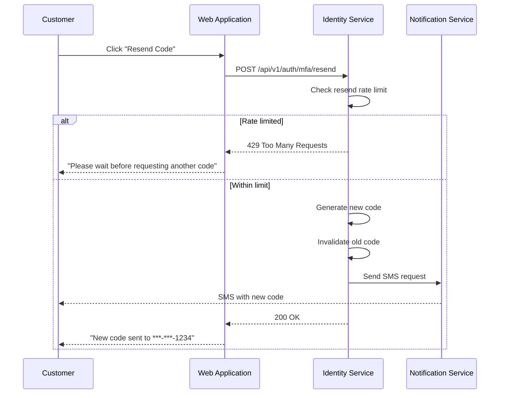

# US-0003-06: MFA Challenge (SMS)

## User Story

**As a** customer who prefers SMS verification,
**I want** to verify my identity using a code sent to my phone,
**So that** I can securely access my account without an authenticator app.

## Story Details

| Field        | Value                                          |
|--------------|------------------------------------------------|
| Story ID     | US-0003-06                                     |
| Epic         | [US-0003: Customer Signin](./README.md)        |
| Priority     | Should Have                                    |
| Phase        | Phase 2 (Enhanced Security)                    |
| Story Points | 8                                              |

## Description

This story implements SMS-based MFA as an alternative to TOTP. After successful credential validation, customers with SMS MFA enabled (or who select SMS as their preferred method) receive a 6-digit verification code via SMS that they must enter to complete authentication.

## SMS MFA Configuration

| Parameter        | Value               |
|------------------|---------------------|
| Code Length      | 6 digits            |
| Code Validity    | 5 minutes           |
| Code Uniqueness  | Single use          |
| Max Attempts     | 3                   |
| SMS Rate Limit   | 3 per hour          |
| Resend Cooldown  | 60 seconds          |

## Architecture

### Sequence Diagram



### SMS Resend Flow



## API Contract

### Response: MFA Required (SMS)

```
HTTP/1.1 200 OK
Content-Type: application/json

{
  "status": "MFA_REQUIRED",
  "mfaToken": "mfa_01941234-5678-7abc-def0-123456789abc",
  "mfaMethods": ["SMS"],
  "maskedPhone": "***-***-1234",
  "expiresIn": 300,
  "resendAvailableIn": 0
}
```

### Request: Verify SMS Code

```
POST /api/v1/auth/mfa/verify
Content-Type: application/json

{
  "mfaToken": "mfa_01941234-5678-7abc-def0-123456789abc",
  "code": "847293",
  "method": "SMS",
  "rememberDevice": true
}
```

### Request: Resend SMS Code

```
POST /api/v1/auth/mfa/resend
Content-Type: application/json

{
  "mfaToken": "mfa_01941234-5678-7abc-def0-123456789abc",
  "method": "SMS"
}
```

### Response: Resend Success

```
HTTP/1.1 200 OK
Content-Type: application/json

{
  "status": "CODE_SENT",
  "maskedPhone": "***-***-1234",
  "expiresIn": 300,
  "resendAvailableIn": 60
}
```

### Response: Resend Rate Limited

```
HTTP/1.1 429 Too Many Requests
Content-Type: application/json

{
  "error": "SMS_RATE_LIMITED",
  "message": "Too many SMS requests. Please try again later.",
  "resendAvailableIn": 2400,
  "retryAfter": 2400
}
```

## Acceptance Criteria

### AC-0003-06-01: SMS Code Generation

**Given** a customer has completed credential validation with SMS MFA enabled
**When** the MFA challenge is initiated
**Then** a cryptographically random 6-digit code is generated
**And** the code is stored securely with 5-minute expiry
**And** an SMS is sent to the customer's registered phone number

### AC-0003-06-02: SMS Code Validation

**Given** a valid SMS code was sent to the customer
**When** they enter the correct code within 5 minutes
**Then** authentication succeeds
**And** the customer is redirected to the dashboard

### AC-0003-06-03: Code Expiry

**Given** an SMS code was sent 5 minutes ago
**When** the customer enters the code
**Then** the code is rejected
**And** the response error is "MFA_EXPIRED"

### AC-0003-06-04: Single Use Enforcement

**Given** a valid SMS code was successfully used
**When** the same code is submitted again
**Then** the code is rejected
**And** the response indicates the code is invalid

### AC-0003-06-05: Maximum 3 Attempts

**Given** a customer has failed SMS verification twice
**When** they fail a third time
**Then** the MFA challenge expires
**And** the customer must restart the signin process

### AC-0003-06-06: SMS Rate Limiting (3 per hour)

**Given** a customer has requested 3 SMS codes in the last hour
**When** they request another code
**Then** a 429 response is returned
**And** the response indicates when they can request again

### AC-0003-06-07: Resend Cooldown (60 seconds)

**Given** an SMS code was sent less than 60 seconds ago
**When** the customer clicks "Resend Code"
**Then** the request is rejected
**And** the UI shows a countdown until resend is available

### AC-0003-06-08: Phone Number Masking

**Given** the customer's phone number is 555-123-4567
**When** the MFA challenge response is returned
**Then** the phone number is displayed as "***-***-4567"

### AC-0003-06-09: SMS Delivery Confirmation

**Given** an SMS verification flow is initiated
**When** the SMS is sent
**Then** the UI confirms "Code sent to ***-***-1234"
**And** a "Didn't receive the code?" link is displayed after 30 seconds

### AC-0003-06-10: Fallback to Alternative Method

**Given** the customer has both TOTP and SMS MFA configured
**When** they are on the SMS verification screen
**Then** a link "Use authenticator app instead" is displayed
**And** clicking it switches to TOTP verification

## Technical Implementation

### Backend Stack

- **Framework**: Spring Boot 4 with Kotlin 2.2
- **SMS Provider**: Twilio or AWS SNS
- **Cache**: Redis for challenge state
- **Rate Limiting**: Redis sliding window

### SMS MFA Service (Kotlin)

```kotlin
@Service
class SmsMfaService(
    private val smsProvider: SmsProvider,
    private val challengeRepository: MfaChallengeRepository,
    private val rateLimiter: SmsRateLimiter,
    private val eventPublisher: DomainEventPublisher
) {
    private val codeLength = 6
    private val codeExpiry = Duration.ofMinutes(5)
    private val resendCooldown = Duration.ofSeconds(60)
    private val maxSmsPerHour = 3

    fun createChallenge(user: User): Either<SmsError, MfaChallenge> = either {
        // Check rate limit
        ensure(!rateLimiter.isLimited(user.id, maxSmsPerHour)) {
            SmsError.RateLimited(rateLimiter.getResetTime(user.id))
        }

        // Generate code
        val code = generateSecureCode(codeLength)

        // Create challenge
        val challenge = MfaChallenge(
            id = UUID.randomUUID(),
            userId = user.id,
            method = MfaMethod.SMS,
            token = "mfa_${UUID.randomUUID()}",
            code = hashCode(code),
            expiresAt = Instant.now().plus(codeExpiry),
            lastSentAt = Instant.now(),
            attempts = 0,
            maxAttempts = 3
        )
        challengeRepository.save(challenge)

        // Send SMS
        smsProvider.send(
            to = user.phoneNumber,
            message = "Your ACME verification code is: $code. Valid for 5 minutes."
        )

        // Track rate limit
        rateLimiter.record(user.id)

        // Publish event
        eventPublisher.publish(MFAChallengeInitiated(
            userId = user.id,
            mfaToken = challenge.token,
            method = "SMS",
            expiresAt = challenge.expiresAt
        ))

        challenge
    }

    fun resendCode(mfaToken: String): Either<SmsError, ResendResult> = either {
        val challenge = ensureNotNull(challengeRepository.findByToken(mfaToken)) {
            SmsError.InvalidToken
        }

        val user = ensureNotNull(userRepository.findById(challenge.userId)) {
            SmsError.InvalidToken
        }

        // Check cooldown
        val timeSinceLastSend = Duration.between(challenge.lastSentAt, Instant.now())
        ensure(timeSinceLastSend >= resendCooldown) {
            SmsError.CooldownActive(resendCooldown.minus(timeSinceLastSend).seconds)
        }

        // Check rate limit
        ensure(!rateLimiter.isLimited(user.id, maxSmsPerHour)) {
            SmsError.RateLimited(rateLimiter.getResetTime(user.id))
        }

        // Generate new code
        val newCode = generateSecureCode(codeLength)
        challenge.code = hashCode(newCode)
        challenge.lastSentAt = Instant.now()
        challenge.expiresAt = Instant.now().plus(codeExpiry)
        challengeRepository.save(challenge)

        // Send SMS
        smsProvider.send(
            to = user.phoneNumber,
            message = "Your ACME verification code is: $newCode. Valid for 5 minutes."
        )

        rateLimiter.record(user.id)

        ResendResult(
            maskedPhone = maskPhoneNumber(user.phoneNumber),
            expiresIn = codeExpiry.seconds,
            resendAvailableIn = resendCooldown.seconds
        )
    }

    fun verifyCode(
        mfaToken: String,
        code: String,
        rememberDevice: Boolean
    ): Either<MfaError, MfaSuccess> = either {
        val challenge = ensureNotNull(challengeRepository.findByToken(mfaToken)) {
            MfaError.InvalidToken
        }

        ensure(challenge.method == MfaMethod.SMS) {
            MfaError.InvalidToken
        }

        ensure(challenge.expiresAt.isAfter(Instant.now())) {
            MfaError.Expired
        }

        ensure(challenge.attempts < challenge.maxAttempts) {
            MfaError.Expired
        }

        // Verify code
        val isValid = verifyHash(code, challenge.code)

        if (!isValid) {
            challenge.attempts++
            challengeRepository.save(challenge)

            eventPublisher.publish(MFAVerificationFailed(
                userId = challenge.userId,
                method = "SMS",
                reason = "INVALID_CODE",
                attemptCount = challenge.attempts
            ))

            raise(MfaError.InvalidCode(remainingAttempts = challenge.maxAttempts - challenge.attempts))
        }

        // Delete challenge (single use)
        challengeRepository.delete(challenge)

        eventPublisher.publish(MFAVerificationSucceeded(
            userId = challenge.userId,
            method = "SMS",
            deviceRemembered = rememberDevice
        ))

        MfaSuccess(
            userId = challenge.userId,
            deviceRemembered = rememberDevice
        )
    }

    private fun generateSecureCode(length: Int): String {
        val random = SecureRandom()
        return (1..length).map { random.nextInt(10) }.joinToString("")
    }

    private fun maskPhoneNumber(phone: String): String {
        val digits = phone.filter { it.isDigit() }
        val lastFour = digits.takeLast(4)
        return "***-***-$lastFour"
    }
}

sealed interface SmsError {
    data class RateLimited(val resetAt: Instant) : SmsError
    data class CooldownActive(val waitSeconds: Long) : SmsError
    data object InvalidToken : SmsError
}
```

### Frontend SMS Verification Component

```typescript
interface SmsVerificationFormProps {
  mfaToken: string;
  maskedPhone: string;
  remainingAttempts: number;
  resendAvailableIn: number;
  onSuccess: () => void;
}

export function SmsVerificationForm({
  mfaToken,
  maskedPhone,
  remainingAttempts,
  resendAvailableIn: initialCooldown,
  onSuccess,
}: SmsVerificationFormProps) {
  const [code, setCode] = useState('');
  const [error, setError] = useState<string | null>(null);
  const [isSubmitting, setIsSubmitting] = useState(false);
  const [cooldown, setCooldown] = useState(initialCooldown);

  useEffect(() => {
    if (cooldown > 0) {
      const timer = setInterval(() => setCooldown((c) => c - 1), 1000);
      return () => clearInterval(timer);
    }
  }, [cooldown]);

  const handleResend = async () => {
    try {
      const result = await resendMfaCode({ mfaToken, method: 'SMS' });
      setCooldown(result.resendAvailableIn);
      setError(null);
    } catch (err) {
      if (err.error === 'SMS_RATE_LIMITED') {
        setError(`Too many requests. Try again in ${Math.ceil(err.retryAfter / 60)} minutes.`);
      }
    }
  };

  const handleSubmit = async (value: string) => {
    setIsSubmitting(true);
    setError(null);

    try {
      const response = await verifyMfa({
        mfaToken,
        code: value,
        method: 'SMS',
        rememberDevice: false,
      });

      if (response.status === 'SUCCESS') {
        onSuccess();
      }
    } catch (err) {
      if (err.error === 'INVALID_MFA_CODE') {
        setError(`Invalid code. ${err.remainingAttempts} attempts remaining.`);
      } else if (err.error === 'MFA_EXPIRED') {
        setError('Verification expired. Please sign in again.');
      }
    } finally {
      setIsSubmitting(false);
    }
  };

  return (
    <div className="space-y-6">
      <div className="text-center">
        <h2 className="text-xl font-semibold">Verify Your Phone</h2>
        <p className="text-muted-foreground mt-2">
          Enter the 6-digit code sent to {maskedPhone}
        </p>
      </div>

      <OTPInput
        length={6}
        onComplete={handleSubmit}
        disabled={isSubmitting}
        autoFocus
      />

      {error && (
        <p className="text-destructive text-center">{error}</p>
      )}

      <div className="text-center">
        {cooldown > 0 ? (
          <p className="text-muted-foreground">
            Resend code in {cooldown}s
          </p>
        ) : (
          <Button variant="link" onClick={handleResend}>
            Didn't receive the code? Resend
          </Button>
        )}
      </div>
    </div>
  );
}
```

## Definition of Done

- [ ] SMS codes are cryptographically random 6 digits
- [ ] Codes expire after 5 minutes
- [ ] Single-use enforcement prevents replay
- [ ] Maximum 3 attempts before challenge expires
- [ ] SMS rate limit of 3 per hour enforced
- [ ] Resend cooldown of 60 seconds enforced
- [ ] Phone number is masked in responses
- [ ] Resend functionality works correctly
- [ ] All MFA events published correctly
- [ ] Unit tests cover all SMS MFA scenarios (>90% coverage)
- [ ] Integration tests verify SMS flow end-to-end
- [ ] Code reviewed and approved

## Dependencies

- SMS provider (Twilio/AWS SNS) configured
- Redis for challenge state and rate limiting
- User entity has verified phone number

## Related Documents

- [Journey Step 3: MFA Challenge](../../journeys/0003-customer-signin.md#step-3-mfa-challenge)
- [US-0003-05: MFA Challenge (TOTP)](./US-0003-05-mfa-totp.md)
- [US-0003-08: Remember Device](./US-0003-08-remember-device.md)
