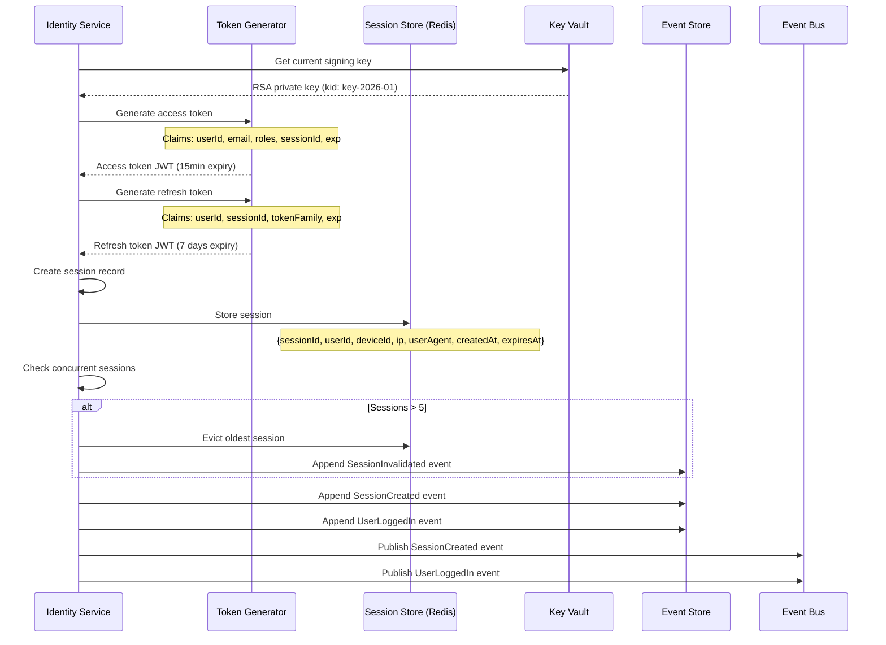
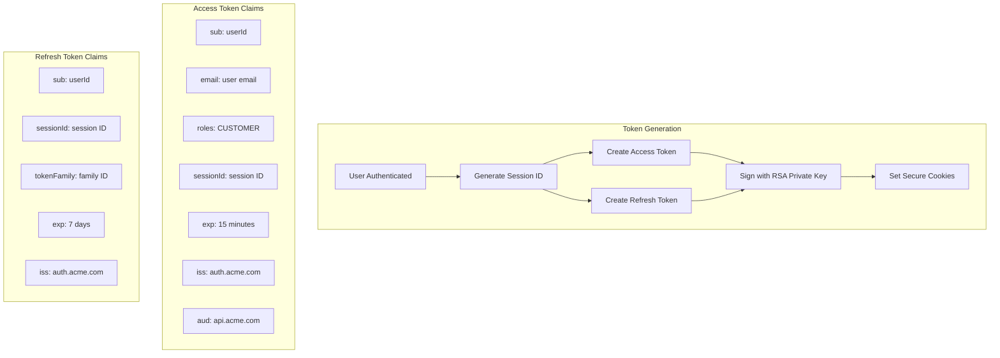

# US-0003-07: Session and Token Creation

## User Story

**As the** Identity Management Service,
**I want** to create secure sessions and generate JWT tokens,
**So that** authenticated customers can access protected resources securely.

## Story Details

| Field        | Value                                          |
|--------------|------------------------------------------------|
| Story ID     | US-0003-07                                     |
| Epic         | [US-0003: Customer Signin](./README.md)        |
| Priority     | Must Have                                      |
| Phase        | Phase 1 (MVP)                                  |
| Story Points | 8                                              |

## Description

This story implements session management and JWT token generation for authenticated customers. After successful credential validation (and MFA if enabled), the Identity Service creates a session, generates access and refresh tokens, and sets secure HTTP-only cookies.

## Token Configuration

| Token Type    | Algorithm | Expiry    | Storage        |
|---------------|-----------|-----------|----------------|
| Access Token  | RS256     | 15 minutes| HttpOnly Cookie|
| Refresh Token | RS256     | 7 days    | HttpOnly Cookie|

## Session Configuration

| Parameter          | Value           |
|--------------------|-----------------|
| Session TTL        | 7 days          |
| Max Sessions/User  | 5 devices       |
| Session Store      | Redis           |

## Architecture

### Sequence Diagram



### Token Architecture



## API Contract

### Response: Successful Authentication

```
HTTP/1.1 200 OK
Content-Type: application/json
Set-Cookie: access_token=<jwt>; HttpOnly; Secure; SameSite=Strict; Path=/; Max-Age=900
Set-Cookie: refresh_token=<jwt>; HttpOnly; Secure; SameSite=Strict; Path=/api/v1/auth/refresh; Max-Age=604800

{
  "status": "SUCCESS",
  "userId": "01941234-5678-7abc-def0-123456789abc",
  "expiresIn": 900
}
```

### Access Token Structure

```json
{
  "header": {
    "alg": "RS256",
    "typ": "JWT",
    "kid": "key-2026-01"
  },
  "payload": {
    "sub": "01941234-5678-7abc-def0-123456789abc",
    "email": "customer@example.com",
    "roles": ["CUSTOMER"],
    "sessionId": "sess_01941234-5678-7abc-def0-123456789def",
    "iat": 1705487400,
    "exp": 1705488300,
    "iss": "https://auth.acme.com",
    "aud": "https://api.acme.com"
  }
}
```

### Refresh Token Structure

```json
{
  "header": {
    "alg": "RS256",
    "typ": "JWT",
    "kid": "key-2026-01"
  },
  "payload": {
    "sub": "01941234-5678-7abc-def0-123456789abc",
    "sessionId": "sess_01941234-5678-7abc-def0-123456789def",
    "tokenFamily": "fam_01941234-5678-7abc-def0-123456789ghi",
    "iat": 1705487400,
    "exp": 1706092200,
    "iss": "https://auth.acme.com"
  }
}
```

### Domain Event: SessionCreated

```json
{
  "eventId": "01941234-5678-7abc-def0-123456789205",
  "eventType": "SessionCreated",
  "eventVersion": "1.0",
  "timestamp": "2026-01-17T10:30:01Z",
  "aggregateId": "sess_01941234-5678-7abc-def0-123456789def",
  "aggregateType": "Session",
  "payload": {
    "sessionId": "sess_01941234-5678-7abc-def0-123456789def",
    "userId": "01941234-5678-7abc-def0-123456789abc",
    "deviceId": "dev_01941234-5678-7abc-def0-123456789ghi",
    "ipAddress": "192.168.1.100",
    "userAgent": "Mozilla/5.0...",
    "expiresAt": "2026-01-24T10:30:01Z"
  }
}
```

### Domain Event: UserLoggedIn

```json
{
  "eventId": "01941234-5678-7abc-def0-123456789200",
  "eventType": "UserLoggedIn",
  "eventVersion": "1.0",
  "timestamp": "2026-01-17T10:30:01Z",
  "aggregateId": "01941234-5678-7abc-def0-123456789abc",
  "aggregateType": "User",
  "correlationId": "01941234-5678-7abc-def0-123456789300",
  "payload": {
    "userId": "01941234-5678-7abc-def0-123456789abc",
    "sessionId": "sess_01941234-5678-7abc-def0-123456789def",
    "ipAddress": "192.168.1.100",
    "userAgent": "Mozilla/5.0...",
    "deviceFingerprint": "fp_abc123xyz789",
    "mfaUsed": true,
    "mfaMethod": "TOTP",
    "loginSource": "WEB"
  }
}
```

## Cookie Configuration

| Cookie         | Value | Attributes                                                      |
|----------------|-------|----------------------------------------------------------------|
| `access_token` | JWT   | `HttpOnly; Secure; SameSite=Strict; Path=/; Max-Age=900`       |
| `refresh_token`| JWT   | `HttpOnly; Secure; SameSite=Strict; Path=/api/v1/auth/refresh; Max-Age=604800` |

## Acceptance Criteria

### AC-0003-07-01: Access Token Generation

**Given** a customer has successfully authenticated
**When** the session is created
**Then** an access token JWT is generated with RS256 signing
**And** the token contains: sub, email, roles, sessionId, iat, exp, iss, aud
**And** the token expires in 15 minutes

### AC-0003-07-02: Refresh Token Generation

**Given** a customer has successfully authenticated
**When** the session is created
**Then** a refresh token JWT is generated with RS256 signing
**And** the token contains: sub, sessionId, tokenFamily, iat, exp, iss
**And** the token expires in 7 days

### AC-0003-07-03: Key Rotation Support

**Given** signing keys are rotated periodically
**When** tokens are generated
**Then** the current active key is used for signing
**And** the key ID (kid) is included in the JWT header
**And** previously issued tokens remain valid until expiry

### AC-0003-07-04: Secure Cookie Configuration

**Given** tokens are generated
**When** cookies are set in the response
**Then** HttpOnly flag is set (prevents JavaScript access)
**And** Secure flag is set (HTTPS only)
**And** SameSite=Strict is set (CSRF protection)
**And** refresh token path is restricted to /api/v1/auth/refresh

### AC-0003-07-05: Session Storage in Redis

**Given** a session is created
**When** it is stored in Redis
**Then** the session includes: sessionId, userId, deviceId, ip, userAgent, createdAt, expiresAt
**And** the Redis TTL matches the refresh token expiry (7 days)

### AC-0003-07-06: Concurrent Session Limit

**Given** a user already has 5 active sessions
**When** a 6th signin succeeds
**Then** the oldest session is automatically invalidated
**And** a SessionInvalidated event is published for the evicted session
**And** the new session is created successfully

### AC-0003-07-07: Token Generation Performance

**Given** the Identity Service is under normal load
**When** token generation is performed
**Then** the operation completes within 50ms (p95)

### AC-0003-07-08: SessionCreated Event Publishing

**Given** a session is created
**When** tokens are generated
**Then** a SessionCreated event is published
**And** the event includes device information

### AC-0003-07-09: UserLoggedIn Event Publishing

**Given** authentication completes successfully
**When** the session is created
**Then** a UserLoggedIn event is published
**And** the event includes: mfaUsed, mfaMethod, loginSource

### AC-0003-07-10: Token Family for Rotation

**Given** a refresh token is generated
**When** it includes a tokenFamily claim
**Then** token refresh operations use this family for reuse detection

## Technical Implementation

### Backend Stack

- **Framework**: Spring Boot 4 with Kotlin 2.2
- **JWT Library**: Nimbus JOSE + JWT
- **Key Management**: HashiCorp Vault
- **Session Store**: Redis
- **Events**: Kafka

### Configuration

```yaml
identity:
  jwt:
    issuer: https://auth.acme.com
    audience: https://api.acme.com
    access-token-expiry: 15m
    refresh-token-expiry: 7d
    key-rotation-period: 30d
  session:
    max-per-user: 5
    ttl: 7d
```

### Token Service (Kotlin)

```kotlin
@Service
class TokenService(
    private val keyProvider: SigningKeyProvider,
    private val sessionRepository: SessionRepository,
    private val eventPublisher: DomainEventPublisher,
    private val config: JwtConfig
) {
    fun createTokens(
        user: User,
        deviceInfo: DeviceInfo,
        mfaUsed: Boolean,
        mfaMethod: String?
    ): TokenPair {
        // Generate session ID and token family
        val sessionId = "sess_${UUID.randomUUID()}"
        val tokenFamily = "fam_${UUID.randomUUID()}"
        val now = Instant.now()

        // Get signing key
        val signingKey = keyProvider.getCurrentKey()

        // Generate access token
        val accessToken = generateAccessToken(
            user = user,
            sessionId = sessionId,
            signingKey = signingKey,
            issuedAt = now
        )

        // Generate refresh token
        val refreshToken = generateRefreshToken(
            user = user,
            sessionId = sessionId,
            tokenFamily = tokenFamily,
            signingKey = signingKey,
            issuedAt = now
        )

        // Create session
        val session = Session(
            id = sessionId,
            userId = user.id,
            deviceId = deviceInfo.deviceId,
            ipAddress = deviceInfo.ipAddress,
            userAgent = deviceInfo.userAgent,
            tokenFamily = tokenFamily,
            createdAt = now,
            expiresAt = now.plus(config.refreshTokenExpiry)
        )

        // Handle concurrent session limit
        evictOldestSessionIfNeeded(user.id)

        // Save session
        sessionRepository.save(session)

        // Publish events
        eventPublisher.publish(SessionCreated(
            sessionId = sessionId,
            userId = user.id,
            deviceId = deviceInfo.deviceId,
            ipAddress = deviceInfo.ipAddress,
            userAgent = deviceInfo.userAgent,
            expiresAt = session.expiresAt
        ))

        eventPublisher.publish(UserLoggedIn(
            userId = user.id,
            sessionId = sessionId,
            ipAddress = deviceInfo.ipAddress,
            userAgent = deviceInfo.userAgent,
            deviceFingerprint = deviceInfo.fingerprint,
            mfaUsed = mfaUsed,
            mfaMethod = mfaMethod,
            loginSource = "WEB"
        ))

        return TokenPair(
            accessToken = accessToken,
            refreshToken = refreshToken,
            accessTokenExpiry = config.accessTokenExpiry.seconds,
            refreshTokenExpiry = config.refreshTokenExpiry.seconds
        )
    }

    private fun generateAccessToken(
        user: User,
        sessionId: String,
        signingKey: SigningKey,
        issuedAt: Instant
    ): String {
        val claims = JWTClaimsSet.Builder()
            .subject(user.id.toString())
            .claim("email", user.email)
            .claim("roles", user.roles.map { it.name })
            .claim("sessionId", sessionId)
            .issueTime(Date.from(issuedAt))
            .expirationTime(Date.from(issuedAt.plus(config.accessTokenExpiry)))
            .issuer(config.issuer)
            .audience(config.audience)
            .build()

        return signToken(claims, signingKey)
    }

    private fun generateRefreshToken(
        user: User,
        sessionId: String,
        tokenFamily: String,
        signingKey: SigningKey,
        issuedAt: Instant
    ): String {
        val claims = JWTClaimsSet.Builder()
            .subject(user.id.toString())
            .claim("sessionId", sessionId)
            .claim("tokenFamily", tokenFamily)
            .issueTime(Date.from(issuedAt))
            .expirationTime(Date.from(issuedAt.plus(config.refreshTokenExpiry)))
            .issuer(config.issuer)
            .build()

        return signToken(claims, signingKey)
    }

    private fun signToken(claims: JWTClaimsSet, key: SigningKey): String {
        val header = JWSHeader.Builder(JWSAlgorithm.RS256)
            .keyID(key.keyId)
            .type(JOSEObjectType.JWT)
            .build()

        val jwt = SignedJWT(header, claims)
        jwt.sign(RSASSASigner(key.privateKey))

        return jwt.serialize()
    }

    private fun evictOldestSessionIfNeeded(userId: UUID) {
        val sessions = sessionRepository.findByUserId(userId)
        if (sessions.size >= config.maxSessionsPerUser) {
            val oldest = sessions.minByOrNull { it.createdAt }!!
            sessionRepository.delete(oldest)

            eventPublisher.publish(SessionInvalidated(
                sessionId = oldest.id,
                userId = userId,
                reason = "CONCURRENT_SESSION_LIMIT",
                invalidatedAt = Instant.now()
            ))
        }
    }
}

data class TokenPair(
    val accessToken: String,
    val refreshToken: String,
    val accessTokenExpiry: Long,
    val refreshTokenExpiry: Long
)
```

### Cookie Builder

```kotlin
@Component
class AuthCookieBuilder(private val config: JwtConfig) {

    fun buildAccessTokenCookie(token: String): ResponseCookie {
        return ResponseCookie.from("access_token", token)
            .httpOnly(true)
            .secure(true)
            .sameSite("Strict")
            .path("/")
            .maxAge(config.accessTokenExpiry)
            .build()
    }

    fun buildRefreshTokenCookie(token: String): ResponseCookie {
        return ResponseCookie.from("refresh_token", token)
            .httpOnly(true)
            .secure(true)
            .sameSite("Strict")
            .path("/api/v1/auth/refresh")
            .maxAge(config.refreshTokenExpiry)
            .build()
    }

    fun buildClearCookies(): List<ResponseCookie> {
        return listOf(
            ResponseCookie.from("access_token", "")
                .httpOnly(true)
                .secure(true)
                .sameSite("Strict")
                .path("/")
                .maxAge(0)
                .build(),
            ResponseCookie.from("refresh_token", "")
                .httpOnly(true)
                .secure(true)
                .sameSite("Strict")
                .path("/api/v1/auth/refresh")
                .maxAge(0)
                .build()
        )
    }
}
```

## Definition of Done

- [ ] Access tokens generated with RS256 and 15-minute expiry
- [ ] Refresh tokens generated with RS256 and 7-day expiry
- [ ] Key ID (kid) included in JWT header for rotation support
- [ ] Cookies set with HttpOnly, Secure, SameSite=Strict
- [ ] Sessions stored in Redis with TTL
- [ ] Maximum 5 concurrent sessions per user enforced
- [ ] Oldest session evicted when limit exceeded
- [ ] Token generation completes within 50ms (p95)
- [ ] SessionCreated event published
- [ ] UserLoggedIn event published with full context
- [ ] Unit tests cover token generation (>90% coverage)
- [ ] Integration tests verify cookie configuration
- [ ] Code reviewed and approved

## Dependencies

- HashiCorp Vault for signing key storage
- Redis for session storage
- Kafka for event publishing
- Nimbus JOSE JWT library

## Related Documents

- [Journey Step 4: Session and Token Creation](../../journeys/0003-customer-signin.md#step-4-session-and-token-creation)
- [US-0003-02: Credential Validation](./US-0003-02-credential-validation.md)
- [US-0003-12: Token Refresh Flow](./US-0003-12-token-refresh.md)
