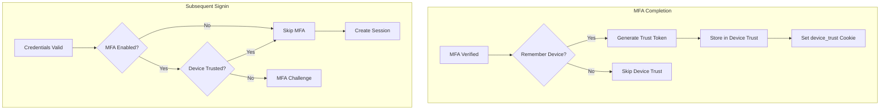

# US-0003-08: Remember Device

## User Story

**As a** customer who frequently signs in from the same device,
**I want** to remember my device and skip MFA verification,
**So that** I can access my account more quickly while maintaining security.

## Story Details

| Field        | Value                                          |
|--------------|------------------------------------------------|
| Story ID     | US-0003-08                                     |
| Epic         | [US-0003: Customer Signin](./README.md)        |
| Priority     | Should Have                                    |
| Phase        | Phase 2 (Enhanced Security)                    |
| Story Points | 5                                              |

## Description

This story implements device trust functionality that allows customers to bypass MFA on trusted devices. When a customer completes MFA verification and opts to "Remember this device", a device trust token is issued that allows MFA bypass for 30 days on subsequent signins from the same device.

## Device Trust Configuration

| Parameter            | Value     |
|----------------------|-----------|
| Trust Duration       | 30 days   |
| Max Devices per User | 10        |
| Trust Token Storage  | HttpOnly Cookie |
| Device Identification| Fingerprint + User Agent |

## Architecture

### Sequence Diagram

```mermaid
sequenceDiagram
    participant CU as Customer
    participant WA as Web Application
    participant IM as Identity Service
    participant DT as Device Trust Store
    participant ES as Event Store
    participant EB as Event Bus

    Note over CU,EB: During MFA verification

    CU->>WA: Complete MFA with "Remember device" checked
    WA->>IM: POST /api/v1/auth/mfa/verify (rememberDevice: true)

    IM->>IM: Verify MFA code
    IM->>IM: Generate device trust token
    IM->>DT: Store trusted device

    Note over DT: {trustId, userId, deviceFingerprint, userAgent, ip, createdAt, expiresAt}

    IM->>ES: Append DeviceRemembered event
    IM->>EB: Publish DeviceRemembered event

    IM-->>WA: 200 OK with device_trust cookie
    Note over WA: Set-Cookie: device_trust=<token>; HttpOnly; Secure; SameSite=Strict; Max-Age=2592000

    Note over CU,EB: On subsequent signin from same device

    CU->>WA: Navigate to signin
    WA->>IM: POST /api/v1/auth/signin (with device_trust cookie)

    IM->>IM: Validate credentials
    IM->>DT: Check device trust token
    DT-->>IM: Device trusted (valid)

    IM->>IM: Skip MFA challenge
    IM->>IM: Create session and tokens
    IM-->>WA: 200 OK (SUCCESS, no MFA)
```

### Device Trust Flow



## API Contract

### Request: MFA Verify with Remember Device

```
POST /api/v1/auth/mfa/verify
Content-Type: application/json

{
  "mfaToken": "mfa_01941234-5678-7abc-def0-123456789abc",
  "code": "123456",
  "method": "TOTP",
  "rememberDevice": true
}
```

### Response: Success with Device Trust

```
HTTP/1.1 200 OK
Content-Type: application/json
Set-Cookie: access_token=<jwt>; HttpOnly; Secure; SameSite=Strict; Path=/; Max-Age=900
Set-Cookie: refresh_token=<jwt>; HttpOnly; Secure; SameSite=Strict; Path=/api/v1/auth/refresh; Max-Age=604800
Set-Cookie: device_trust=<token>; HttpOnly; Secure; SameSite=Strict; Path=/; Max-Age=2592000

{
  "status": "SUCCESS",
  "userId": "01941234-5678-7abc-def0-123456789abc",
  "deviceTrusted": true,
  "expiresIn": 900
}
```

### API: List Trusted Devices

```
GET /api/v1/auth/devices
Authorization: Bearer <access_token>

Response:
{
  "devices": [
    {
      "deviceId": "dt_01941234-5678-7abc-def0-123456789xyz",
      "name": "Chrome on macOS",
      "lastUsed": "2026-01-17T10:30:00Z",
      "createdAt": "2026-01-01T09:00:00Z",
      "expiresAt": "2026-01-31T09:00:00Z",
      "ipAddress": "192.168.1.100",
      "current": true
    },
    {
      "deviceId": "dt_01941234-5678-7abc-def0-123456789abc",
      "name": "Safari on iPhone",
      "lastUsed": "2026-01-15T14:22:00Z",
      "createdAt": "2026-01-10T11:30:00Z",
      "expiresAt": "2026-02-09T11:30:00Z",
      "ipAddress": "192.168.1.50",
      "current": false
    }
  ],
  "maxDevices": 10
}
```

### API: Revoke Device

```
DELETE /api/v1/auth/devices/{deviceId}
Authorization: Bearer <access_token>

Response:
HTTP/1.1 204 No Content
```

### API: Revoke All Devices

```
DELETE /api/v1/auth/devices
Authorization: Bearer <access_token>

Response:
HTTP/1.1 204 No Content
```

### Domain Event: DeviceRemembered

```json
{
  "eventId": "01941234-5678-7abc-def0-123456789100",
  "eventType": "DeviceRemembered",
  "eventVersion": "1.0",
  "timestamp": "2026-01-17T10:30:05Z",
  "aggregateId": "01941234-5678-7abc-def0-123456789abc",
  "aggregateType": "User",
  "payload": {
    "userId": "01941234-5678-7abc-def0-123456789abc",
    "deviceTrustId": "dt_01941234-5678-7abc-def0-123456789xyz",
    "deviceFingerprint": "fp_abc123xyz789",
    "userAgent": "Mozilla/5.0...",
    "ipAddress": "192.168.1.100",
    "trustedUntil": "2026-02-16T10:30:05Z"
  }
}
```

### Domain Event: DeviceRevoked

```json
{
  "eventId": "01941234-5678-7abc-def0-123456789101",
  "eventType": "DeviceRevoked",
  "eventVersion": "1.0",
  "timestamp": "2026-01-17T11:00:00Z",
  "aggregateId": "01941234-5678-7abc-def0-123456789abc",
  "aggregateType": "User",
  "payload": {
    "userId": "01941234-5678-7abc-def0-123456789abc",
    "deviceTrustId": "dt_01941234-5678-7abc-def0-123456789xyz",
    "reason": "USER_REVOKED",
    "revokedAt": "2026-01-17T11:00:00Z"
  }
}
```

## Acceptance Criteria

### AC-0003-08-01: Device Trust Token Generation

**Given** a customer completes MFA verification with "Remember this device" checked
**When** authentication succeeds
**Then** a device trust token is generated
**And** the token is stored with 30-day expiry
**And** a device_trust cookie is set in the response

### AC-0003-08-02: MFA Bypass on Trusted Device

**Given** a customer has a valid device trust token
**When** they sign in with valid credentials
**Then** MFA is bypassed
**And** a session is created immediately
**And** the response status is "SUCCESS" (not "MFA_REQUIRED")

### AC-0003-08-03: Device Trust Expiry

**Given** a device trust token was created 30 days ago
**When** the customer signs in
**Then** the device is no longer trusted
**And** MFA challenge is presented
**And** the expired device_trust cookie is cleared

### AC-0003-08-04: Maximum 10 Trusted Devices

**Given** a customer has 10 trusted devices
**When** they trust an 11th device
**Then** the oldest trusted device is automatically revoked
**And** the new device is trusted
**And** a DeviceRevoked event is published for the evicted device

### AC-0003-08-05: Device Tied to Fingerprint

**Given** a device trust token was issued for device A
**When** the token is used from device B (different fingerprint)
**Then** the trust is not honored
**And** MFA challenge is presented

### AC-0003-08-06: List Trusted Devices

**Given** a customer has multiple trusted devices
**When** they request GET /api/v1/auth/devices
**Then** all trusted devices are listed
**And** each device shows: name, lastUsed, createdAt, expiresAt
**And** the current device is marked with current: true

### AC-0003-08-07: Revoke Individual Device

**Given** a customer has a trusted device
**When** they send DELETE /api/v1/auth/devices/{deviceId}
**Then** the device trust is revoked
**And** a DeviceRevoked event is published
**And** subsequent signins from that device require MFA

### AC-0003-08-08: Revoke All Devices

**Given** a customer has multiple trusted devices
**When** they send DELETE /api/v1/auth/devices
**Then** all device trusts are revoked
**And** DeviceRevoked events are published for each
**And** all subsequent signins require MFA

### AC-0003-08-09: Password Change Revokes All Devices

**Given** a customer has trusted devices
**When** they change their password
**Then** all device trusts are revoked
**And** DeviceRevoked events are published
**And** subsequent signins require MFA

### AC-0003-08-10: Device Trust Audit Trail

**Given** a device trust is created or revoked
**When** the event is published
**Then** it includes: userId, deviceId, fingerprint, IP, userAgent
**And** the event can be used for security audit

## Technical Implementation

### Backend Stack

- **Framework**: Spring Boot 4 with Kotlin 2.2
- **Storage**: Redis for device trust records
- **Events**: Kafka for DeviceRemembered/DeviceRevoked events

### Configuration

```yaml
identity:
  device-trust:
    enabled: true
    duration: 30d
    max-devices-per-user: 10
    cookie-name: device_trust
```

### Device Trust Service (Kotlin)

```kotlin
@Service
class DeviceTrustService(
    private val trustRepository: DeviceTrustRepository,
    private val eventPublisher: DomainEventPublisher,
    private val config: DeviceTrustConfig
) {
    fun createTrust(
        userId: UUID,
        deviceFingerprint: String,
        userAgent: String,
        ipAddress: String
    ): DeviceTrust {
        // Evict oldest if at limit
        evictOldestIfNeeded(userId)

        val trust = DeviceTrust(
            id = "dt_${UUID.randomUUID()}",
            userId = userId,
            deviceFingerprint = deviceFingerprint,
            userAgent = userAgent,
            ipAddress = ipAddress,
            createdAt = Instant.now(),
            expiresAt = Instant.now().plus(config.duration),
            lastUsedAt = Instant.now()
        )

        trustRepository.save(trust)

        eventPublisher.publish(DeviceRemembered(
            userId = userId,
            deviceTrustId = trust.id,
            deviceFingerprint = deviceFingerprint,
            userAgent = userAgent,
            ipAddress = ipAddress,
            trustedUntil = trust.expiresAt
        ))

        return trust
    }

    fun verifyTrust(
        userId: UUID,
        trustToken: String,
        deviceFingerprint: String
    ): Boolean {
        val trust = trustRepository.findByIdAndUserId(trustToken, userId) ?: return false

        // Check expiry
        if (trust.expiresAt.isBefore(Instant.now())) {
            trustRepository.delete(trust)
            return false
        }

        // Check fingerprint match
        if (trust.deviceFingerprint != deviceFingerprint) {
            return false
        }

        // Update last used
        trust.lastUsedAt = Instant.now()
        trustRepository.save(trust)

        return true
    }

    fun listDevices(userId: UUID): List<DeviceTrust> {
        return trustRepository.findByUserId(userId)
            .filter { it.expiresAt.isAfter(Instant.now()) }
            .sortedByDescending { it.lastUsedAt }
    }

    fun revokeDevice(userId: UUID, deviceId: String) {
        val trust = trustRepository.findByIdAndUserId(deviceId, userId)
            ?: throw DeviceNotFoundException(deviceId)

        trustRepository.delete(trust)

        eventPublisher.publish(DeviceRevoked(
            userId = userId,
            deviceTrustId = deviceId,
            reason = "USER_REVOKED",
            revokedAt = Instant.now()
        ))
    }

    fun revokeAllDevices(userId: UUID, reason: String = "USER_REVOKED") {
        val devices = trustRepository.findByUserId(userId)

        devices.forEach { trust ->
            trustRepository.delete(trust)
            eventPublisher.publish(DeviceRevoked(
                userId = userId,
                deviceTrustId = trust.id,
                reason = reason,
                revokedAt = Instant.now()
            ))
        }
    }

    private fun evictOldestIfNeeded(userId: UUID) {
        val devices = trustRepository.findByUserId(userId)
        if (devices.size >= config.maxDevicesPerUser) {
            val oldest = devices.minByOrNull { it.createdAt }!!
            revokeDevice(userId, oldest.id)
        }
    }
}

data class DeviceTrust(
    val id: String,
    val userId: UUID,
    val deviceFingerprint: String,
    val userAgent: String,
    val ipAddress: String,
    val createdAt: Instant,
    val expiresAt: Instant,
    var lastUsedAt: Instant
) {
    fun toDisplayName(): String {
        // Parse user agent to friendly name
        return when {
            userAgent.contains("Chrome") && userAgent.contains("Mac") -> "Chrome on macOS"
            userAgent.contains("Safari") && userAgent.contains("iPhone") -> "Safari on iPhone"
            userAgent.contains("Firefox") -> "Firefox"
            else -> "Unknown Device"
        }
    }
}
```

### Frontend Device Management

```typescript
interface TrustedDevice {
  deviceId: string;
  name: string;
  lastUsed: string;
  createdAt: string;
  expiresAt: string;
  ipAddress: string;
  current: boolean;
}

export function TrustedDevicesPage() {
  const { data: devices, refetch } = useQuery({
    queryKey: ['trusted-devices'],
    queryFn: () => fetchTrustedDevices(),
  });

  const revokeMutation = useMutation({
    mutationFn: (deviceId: string) => revokeDevice(deviceId),
    onSuccess: () => refetch(),
  });

  const revokeAllMutation = useMutation({
    mutationFn: () => revokeAllDevices(),
    onSuccess: () => refetch(),
  });

  return (
    <div className="space-y-6">
      <div className="flex justify-between items-center">
        <h1 className="text-2xl font-bold">Trusted Devices</h1>
        <Button
          variant="destructive"
          onClick={() => revokeAllMutation.mutate()}
        >
          Revoke All
        </Button>
      </div>

      <div className="space-y-4">
        {devices?.map((device) => (
          <Card key={device.deviceId}>
            <CardContent className="flex justify-between items-center py-4">
              <div>
                <p className="font-medium">
                  {device.name}
                  {device.current && (
                    <Badge className="ml-2">Current</Badge>
                  )}
                </p>
                <p className="text-sm text-muted-foreground">
                  Last used: {formatDate(device.lastUsed)}
                </p>
                <p className="text-sm text-muted-foreground">
                  IP: {device.ipAddress}
                </p>
              </div>
              {!device.current && (
                <Button
                  variant="outline"
                  onClick={() => revokeMutation.mutate(device.deviceId)}
                >
                  Revoke
                </Button>
              )}
            </CardContent>
          </Card>
        ))}
      </div>
    </div>
  );
}
```

## Definition of Done

- [ ] Device trust tokens generated with 30-day expiry
- [ ] MFA bypassed for valid trusted devices
- [ ] Device fingerprint validated on trust verification
- [ ] Maximum 10 devices per user enforced
- [ ] Oldest device evicted when limit exceeded
- [ ] List trusted devices API implemented
- [ ] Revoke individual device API implemented
- [ ] Revoke all devices API implemented
- [ ] Password change revokes all device trusts
- [ ] DeviceRemembered events published
- [ ] DeviceRevoked events published
- [ ] Unit tests cover device trust scenarios (>90% coverage)
- [ ] Integration tests verify MFA bypass flow
- [ ] Code reviewed and approved

## Dependencies

- Redis for device trust storage
- Device fingerprint library integrated
- Kafka for event publishing

## Related Documents

- [Journey Step 5: Remember Device](../../journeys/0003-customer-signin.md#step-5-remember-device)
- [US-0003-05: MFA Challenge (TOTP)](./US-0003-05-mfa-totp.md)
- [US-0003-06: MFA Challenge (SMS)](./US-0003-06-mfa-sms.md)
