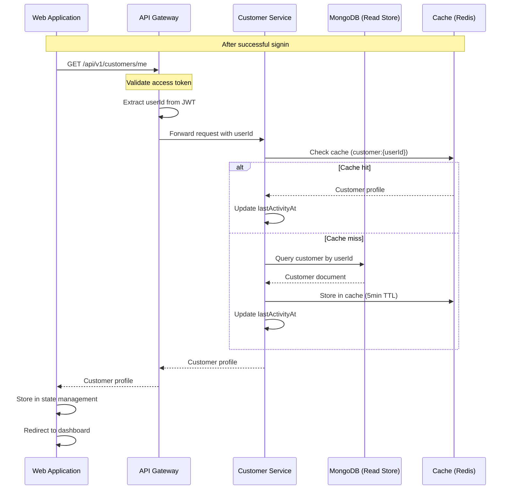
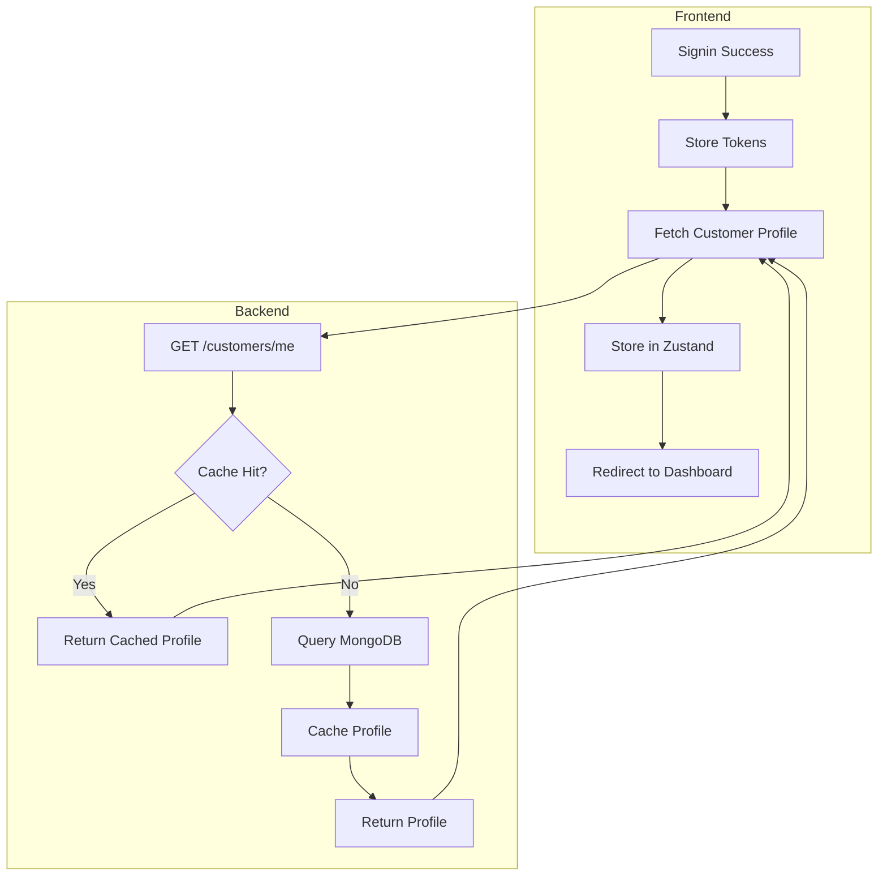

# US-0003-09: Customer Context Loading

## User Story

**As a** signed-in customer,
**I want** my profile and preferences loaded automatically after signin,
**So that** I can see personalized content immediately upon accessing my account.

## Story Details

| Field        | Value                                          |
|--------------|------------------------------------------------|
| Story ID     | US-0003-09                                     |
| Epic         | [US-0003: Customer Signin](./README.md)        |
| Priority     | Must Have                                      |
| Phase        | Phase 1 (MVP)                                  |
| Story Points | 5                                              |

## Description

This story implements customer context loading after successful authentication. The web application fetches the customer profile from the Customer Service, which returns profile data, preferences, and personalization settings. The profile is cached for performance, and the last activity timestamp is updated.

## Architecture

### Sequence Diagram



### Context Loading Flow



## API Contract

### Request: Get Current Customer

```
GET /api/v1/customers/me
Authorization: Bearer <access_token>
```

### Response: Customer Profile

```json
{
  "customerId": "01941234-5678-7abc-def0-123456789020",
  "customerNumber": "ACME-202601-000142",
  "name": {
    "firstName": "Jane",
    "lastName": "Doe",
    "displayName": "Jane Doe"
  },
  "email": {
    "address": "customer@example.com",
    "verified": true
  },
  "status": "ACTIVE",
  "preferences": {
    "communication": {
      "email": true,
      "sms": false,
      "push": true
    },
    "display": {
      "language": "en-US",
      "currency": "USD",
      "timezone": "America/New_York"
    }
  },
  "profileCompleteness": 85,
  "lastActivityAt": "2026-01-17T10:30:00Z"
}
```

### Response: Customer Not Found

```
HTTP/1.1 404 Not Found
Content-Type: application/json

{
  "error": "CUSTOMER_NOT_FOUND",
  "message": "Customer profile not found"
}
```

### Response: Token Invalid

```
HTTP/1.1 401 Unauthorized
Content-Type: application/json

{
  "error": "INVALID_TOKEN",
  "message": "Access token is invalid or expired"
}
```

## Acceptance Criteria

### AC-0003-09-01: Profile Loading After Signin

**Given** a customer has successfully signed in
**When** the web application loads
**Then** the customer profile is fetched from /api/v1/customers/me
**And** the profile is stored in the frontend state management
**And** the dashboard displays personalized content

### AC-0003-09-02: Token Validation

**Given** the access token is included in the request
**When** the API Gateway validates the token
**Then** the userId is extracted from the JWT claims
**And** the request is forwarded to the Customer Service

### AC-0003-09-03: Profile Response Time

**Given** the Customer Service is under normal load
**When** a profile request is made
**Then** the response is returned within 500ms (p95)

### AC-0003-09-04: Profile Caching

**Given** a customer profile exists in the database
**When** it is fetched for the first time
**Then** it is cached in Redis with a 5-minute TTL
**And** subsequent requests within 5 minutes return the cached version

### AC-0003-09-05: Cache Invalidation

**Given** a customer profile is cached
**When** the profile is updated
**Then** the cache entry is invalidated
**And** the next request fetches fresh data from MongoDB

### AC-0003-09-06: Last Activity Update

**Given** a customer fetches their profile
**When** the request is processed
**Then** the lastActivityAt timestamp is updated
**And** the update does not block the response

### AC-0003-09-07: Preferences for Personalization

**Given** a customer profile is loaded
**When** the frontend receives it
**Then** display preferences are applied (language, currency, timezone)
**And** communication preferences are available for notification settings

### AC-0003-09-08: Profile Completeness Display

**Given** a customer profile is loaded
**When** the dashboard renders
**Then** the profile completeness percentage is displayed
**And** incomplete sections are highlighted for completion

### AC-0003-09-09: Redirect After Loading

**Given** profile loading is complete
**When** the context is stored
**Then** the user is redirected to the dashboard
**And** no loading spinner is visible for more than 500ms

### AC-0003-09-10: Error Handling

**Given** the profile loading fails
**When** the error is returned
**Then** an error message is displayed to the user
**And** a retry option is provided

## Technical Implementation

### Backend Stack

- **Framework**: Spring Boot 4 with Kotlin 2.2
- **Database**: MongoDB for customer profile (read store)
- **Cache**: Caffeine (local) + Redis (distributed)
- **Gateway**: API Gateway validates tokens

### Frontend Stack

- **Framework**: TanStack Start with React 19.2
- **State Management**: Zustand
- **Data Fetching**: TanStack Query

### Configuration

```yaml
customer:
  cache:
    profile:
      ttl: 5m
      max-size: 10000
```

### Customer Service (Kotlin)

```kotlin
@RestController
@RequestMapping("/api/v1/customers")
class CustomerController(
    private val getCustomerProfileUseCase: GetCustomerProfileUseCase
) {
    @GetMapping("/me")
    fun getCurrentCustomer(
        @RequestHeader("X-User-Id") userId: UUID
    ): ResponseEntity<CustomerProfileResponse> {
        return getCustomerProfileUseCase.execute(userId).fold(
            ifLeft = { error ->
                when (error) {
                    is CustomerError.NotFound -> ResponseEntity.notFound().build()
                }
            },
            ifRight = { profile ->
                ResponseEntity.ok(profile.toResponse())
            }
        )
    }
}

@Service
class GetCustomerProfileUseCase(
    private val customerRepository: CustomerReadRepository,
    private val cacheService: CustomerCacheService,
    private val activityTracker: CustomerActivityTracker
) {
    fun execute(userId: UUID): Either<CustomerError, CustomerProfile> = either {
        // Try cache first
        val cached = cacheService.get(userId)
        if (cached != null) {
            activityTracker.trackAsync(userId)
            return@either cached
        }

        // Fetch from database
        val customer = ensureNotNull(customerRepository.findByUserId(userId)) {
            CustomerError.NotFound(userId)
        }

        // Cache the profile
        cacheService.put(userId, customer.toProfile())

        // Track activity asynchronously
        activityTracker.trackAsync(userId)

        customer.toProfile()
    }
}

@Service
class CustomerCacheService(
    private val redisTemplate: RedisTemplate<String, CustomerProfile>,
    private val cacheConfig: CustomerCacheConfig
) {
    private val keyPrefix = "customer:profile:"

    fun get(userId: UUID): CustomerProfile? {
        return redisTemplate.opsForValue().get("$keyPrefix$userId")
    }

    fun put(userId: UUID, profile: CustomerProfile) {
        redisTemplate.opsForValue().set(
            "$keyPrefix$userId",
            profile,
            cacheConfig.profileTtl
        )
    }

    fun invalidate(userId: UUID) {
        redisTemplate.delete("$keyPrefix$userId")
    }
}

@Service
class CustomerActivityTracker(
    private val customerRepository: CustomerWriteRepository,
    private val executor: Executor
) {
    fun trackAsync(userId: UUID) {
        CompletableFuture.runAsync({
            customerRepository.updateLastActivity(userId, Instant.now())
        }, executor)
    }
}
```

### Frontend State Management (Zustand)

```typescript
import { create } from 'zustand';
import { persist } from 'zustand/middleware';

interface CustomerProfile {
  customerId: string;
  customerNumber: string;
  name: {
    firstName: string;
    lastName: string;
    displayName: string;
  };
  email: {
    address: string;
    verified: boolean;
  };
  status: string;
  preferences: {
    communication: {
      email: boolean;
      sms: boolean;
      push: boolean;
    };
    display: {
      language: string;
      currency: string;
      timezone: string;
    };
  };
  profileCompleteness: number;
  lastActivityAt: string;
}

interface CustomerStore {
  profile: CustomerProfile | null;
  isLoading: boolean;
  error: string | null;
  setProfile: (profile: CustomerProfile) => void;
  clearProfile: () => void;
  setLoading: (loading: boolean) => void;
  setError: (error: string | null) => void;
}

export const useCustomerStore = create<CustomerStore>()(
  persist(
    (set) => ({
      profile: null,
      isLoading: false,
      error: null,
      setProfile: (profile) => set({ profile, isLoading: false, error: null }),
      clearProfile: () => set({ profile: null }),
      setLoading: (isLoading) => set({ isLoading }),
      setError: (error) => set({ error, isLoading: false }),
    }),
    {
      name: 'customer-storage',
      partialize: (state) => ({ profile: state.profile }),
    }
  )
);
```

### Frontend Profile Loading Hook

```typescript
import { useQuery } from '@tanstack/react-query';
import { useEffect } from 'react';
import { useCustomerStore } from '@/stores/customer';
import { fetchCustomerProfile } from '@/api/customer';

export function useLoadCustomerProfile() {
  const { setProfile, setLoading, setError } = useCustomerStore();

  const query = useQuery({
    queryKey: ['customer', 'profile'],
    queryFn: fetchCustomerProfile,
    staleTime: 5 * 60 * 1000, // 5 minutes
    retry: 2,
  });

  useEffect(() => {
    if (query.isLoading) {
      setLoading(true);
    } else if (query.error) {
      setError(query.error.message);
    } else if (query.data) {
      setProfile(query.data);
    }
  }, [query.isLoading, query.error, query.data, setProfile, setLoading, setError]);

  return query;
}

// Usage in a protected layout
export function AuthenticatedLayout({ children }: { children: React.ReactNode }) {
  const { isLoading, error } = useLoadCustomerProfile();
  const profile = useCustomerStore((state) => state.profile);

  if (isLoading && !profile) {
    return <LoadingSpinner />;
  }

  if (error) {
    return <ErrorDisplay message={error} onRetry={() => window.location.reload()} />;
  }

  return (
    <div>
      <Header displayName={profile?.name.displayName} />
      <main>{children}</main>
    </div>
  );
}
```

## Definition of Done

- [ ] Profile fetched from /api/v1/customers/me after signin
- [ ] Token validation extracts userId from JWT
- [ ] Profile response within 500ms (p95)
- [ ] Profile cached in Redis with 5-minute TTL
- [ ] Cache invalidated on profile update
- [ ] lastActivityAt updated asynchronously
- [ ] Preferences available for personalization
- [ ] Profile completeness displayed
- [ ] Redirect to dashboard after loading
- [ ] Error handling with retry option
- [ ] Unit tests cover profile loading (>90% coverage)
- [ ] Integration tests verify caching
- [ ] Code reviewed and approved

## Dependencies

- Customer Service deployed and accessible
- MongoDB read store populated
- Redis available for caching
- API Gateway configured with token validation

## Related Documents

- [Journey Step 6: Customer Context Loading](../../journeys/0003-customer-signin.md#step-6-customer-context-loading)
- [US-0003-07: Session and Token Creation](./US-0003-07-session-token-creation.md)
