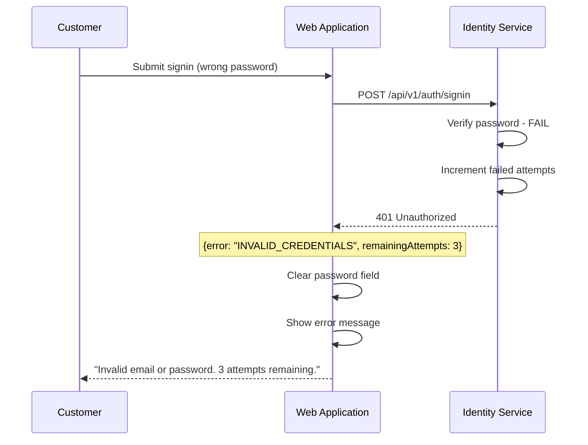
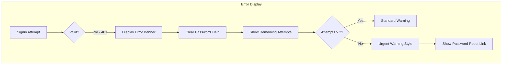

# US-0003-10: Invalid Credentials Handling

## User Story

**As a** customer who enters incorrect credentials,
**I want** clear feedback about my signin attempt failure,
**So that** I understand what went wrong without exposing security information.

## Story Details

| Field        | Value                                          |
|--------------|------------------------------------------------|
| Story ID     | US-0003-10                                     |
| Epic         | [US-0003: Customer Signin](./README.md)        |
| Priority     | Must Have                                      |
| Phase        | Phase 1 (MVP)                                  |
| Story Points | 3                                              |

## Description

This story implements the user experience for invalid credential errors. The frontend displays appropriate error messages that do not reveal whether the email exists in the system, while still being helpful to legitimate users who may have made a typo.

## Security Requirements

| Requirement               | Description                                           |
|---------------------------|-------------------------------------------------------|
| Generic Error Message     | "Invalid email or password" (never reveals email existence) |
| Timing Attack Prevention  | Consistent response time for existing/non-existing emails |
| Attempt Counter Display   | Show remaining attempts before lockout                |
| No Email Enumeration      | Error message identical for wrong password vs unknown email |

## Architecture

### Error Flow



### UI Error States



## UI Specifications

### Error Banner

```
┌─────────────────────────────────────────────────────┐
│ ⚠️ Invalid email or password. 3 attempts remaining. │
│                                                     │
│    Forgot your password? [Reset it here]            │
└─────────────────────────────────────────────────────┘
```

### Low Attempt Warning (1-2 remaining)

```
┌─────────────────────────────────────────────────────┐
│ ⚠️ Invalid email or password.                       │
│    1 attempt remaining before account lockout.      │
│                                                     │
│    [Reset Password] to avoid lockout                │
└─────────────────────────────────────────────────────┘
```

## Acceptance Criteria

### AC-0003-10-01: Generic Error Message

**Given** a customer enters an invalid email or password
**When** the signin fails
**Then** the error message is "Invalid email or password"
**And** the message does not indicate whether the email exists

### AC-0003-10-02: Remaining Attempts Display

**Given** a customer has 3 signin attempts remaining
**When** they see the error message
**Then** the message includes "3 attempts remaining"
**And** the count decreases with each failed attempt

### AC-0003-10-03: Password Field Cleared

**Given** a signin attempt fails
**When** the error is displayed
**Then** the password field is cleared
**And** the email field retains its value
**And** focus moves to the password field

### AC-0003-10-04: Low Attempt Warning Style

**Given** a customer has 1-2 attempts remaining
**When** the error is displayed
**Then** the warning uses an urgent visual style (red/orange)
**And** "before account lockout" text is displayed
**And** password reset link is prominently displayed

### AC-0003-10-05: Forgot Password Link

**Given** an invalid credentials error is displayed
**When** the customer views the error
**Then** a "Forgot your password?" link is visible
**And** clicking it navigates to the password reset page

### AC-0003-10-06: Error Banner Accessibility

**Given** an error message is displayed
**When** screen readers encounter the page
**Then** the error is announced immediately (aria-live="assertive")
**And** the error region has role="alert"

### AC-0003-10-07: Error Message Timing

**Given** a signin request fails
**When** the error response is received
**Then** the error message appears within 100ms of response
**And** no flash of success state occurs

### AC-0003-10-08: Form Re-submission

**Given** an error is displayed
**When** the customer corrects their credentials
**Then** the error banner clears on the next submission
**And** the form shows loading state

### AC-0003-10-09: Analytics Tracking

**Given** an invalid credentials error occurs
**When** the error is displayed
**Then** a SigninFailed event is tracked
**And** the event includes: source (WEB), errorType, attemptNumber

### AC-0003-10-10: Error Persistence

**Given** an error is displayed
**When** the customer navigates away and returns
**Then** the error banner is not displayed
**And** the failed attempt counter remains on the server

## Technical Implementation

### Frontend Stack

- **Framework**: TanStack Start with React 19.2
- **UI Components**: shadcn/ui Alert component
- **Form Library**: React Hook Form

### Error Response Handling

```typescript
interface SigninErrorResponse {
  error: 'INVALID_CREDENTIALS' | 'ACCOUNT_LOCKED' | 'RATE_LIMITED';
  message: string;
  remainingAttempts?: number;
}

async function handleSigninSubmit(data: SigninFormData) {
  try {
    const response = await signinApi.signin(data);
    // Handle success
  } catch (error) {
    if (error.status === 401) {
      const errorData = error.data as SigninErrorResponse;
      setError({
        message: errorData.message,
        remainingAttempts: errorData.remainingAttempts,
      });
      // Clear password field
      form.setValue('password', '');
      form.setFocus('password');
    }
  }
}
```

### Error Banner Component

```typescript
import { Alert, AlertDescription, AlertTitle } from '@/components/ui/alert';
import { AlertTriangle } from 'lucide-react';
import { Link } from '@tanstack/react-router';

interface SigninErrorBannerProps {
  message: string;
  remainingAttempts?: number;
}

export function SigninErrorBanner({
  message,
  remainingAttempts,
}: SigninErrorBannerProps) {
  const isUrgent = remainingAttempts !== undefined && remainingAttempts <= 2;

  return (
    <Alert
      variant={isUrgent ? 'destructive' : 'warning'}
      role="alert"
      aria-live="assertive"
    >
      <AlertTriangle className="h-4 w-4" />
      <AlertTitle>Sign in failed</AlertTitle>
      <AlertDescription>
        <p>{message}</p>

        {remainingAttempts !== undefined && (
          <p className={isUrgent ? 'font-semibold' : ''}>
            {remainingAttempts} attempt{remainingAttempts !== 1 ? 's' : ''} remaining
            {isUrgent && ' before account lockout.'}
          </p>
        )}

        <p className="mt-2">
          Forgot your password?{' '}
          <Link
            to="/forgot-password"
            className="underline font-medium hover:no-underline"
          >
            Reset it here
          </Link>
        </p>
      </AlertDescription>
    </Alert>
  );
}
```

### Signin Form with Error Handling

```typescript
export function SigninForm() {
  const [error, setError] = useState<SigninErrorBannerProps | null>(null);
  const [isSubmitting, setIsSubmitting] = useState(false);

  const form = useForm<SigninFormData>({
    resolver: zodResolver(signinSchema),
    defaultValues: {
      email: '',
      password: '',
      rememberMe: false,
    },
  });

  const onSubmit = async (data: SigninFormData) => {
    setError(null);
    setIsSubmitting(true);

    try {
      const result = await signinMutation.mutateAsync(data);

      if (result.status === 'SUCCESS') {
        // Navigate to dashboard
        router.navigate({ to: '/dashboard' });
      } else if (result.status === 'MFA_REQUIRED') {
        // Navigate to MFA
        router.navigate({ to: '/mfa', search: { token: result.mfaToken } });
      }
    } catch (err) {
      if (err.status === 401) {
        setError({
          message: err.data.message,
          remainingAttempts: err.data.remainingAttempts,
        });
        form.setValue('password', '');
        form.setFocus('password');

        // Track analytics
        trackSigninFailed({
          source: 'WEB',
          errorType: err.data.error,
          attemptNumber: 5 - (err.data.remainingAttempts ?? 0),
        });
      }
    } finally {
      setIsSubmitting(false);
    }
  };

  return (
    <form onSubmit={form.handleSubmit(onSubmit)} className="space-y-6">
      {error && (
        <SigninErrorBanner
          message={error.message}
          remainingAttempts={error.remainingAttempts}
        />
      )}

      {/* Form fields */}
      <FormField
        control={form.control}
        name="email"
        render={({ field }) => (
          <FormItem>
            <FormLabel>Email</FormLabel>
            <FormControl>
              <Input type="email" {...field} />
            </FormControl>
            <FormMessage />
          </FormItem>
        )}
      />

      <FormField
        control={form.control}
        name="password"
        render={({ field }) => (
          <FormItem>
            <FormLabel>Password</FormLabel>
            <FormControl>
              <PasswordInput {...field} />
            </FormControl>
            <FormMessage />
          </FormItem>
        )}
      />

      <Button type="submit" disabled={isSubmitting} className="w-full">
        {isSubmitting ? 'Signing in...' : 'Sign In'}
      </Button>
    </form>
  );
}
```

## Definition of Done

- [ ] Error message is generic "Invalid email or password"
- [ ] Remaining attempts displayed correctly
- [ ] Password field cleared on error
- [ ] Email field retains value
- [ ] Focus moves to password field
- [ ] Urgent warning style for 1-2 remaining attempts
- [ ] Password reset link visible in error banner
- [ ] Error announced by screen readers
- [ ] Error clears on re-submission
- [ ] Analytics event tracked
- [ ] Unit tests cover error states (>90% coverage)
- [ ] Accessibility audit passes
- [ ] Code reviewed and approved

## Dependencies

- shadcn/ui Alert component
- Analytics service configured

## Related Documents

- [Journey Error Scenario E1: Invalid Credentials](../../journeys/0003-customer-signin.md#e1-invalid-credentials)
- [US-0003-02: Credential Validation](./US-0003-02-credential-validation.md)
- [US-0003-04: Account Lockout](./US-0003-04-account-lockout.md)
