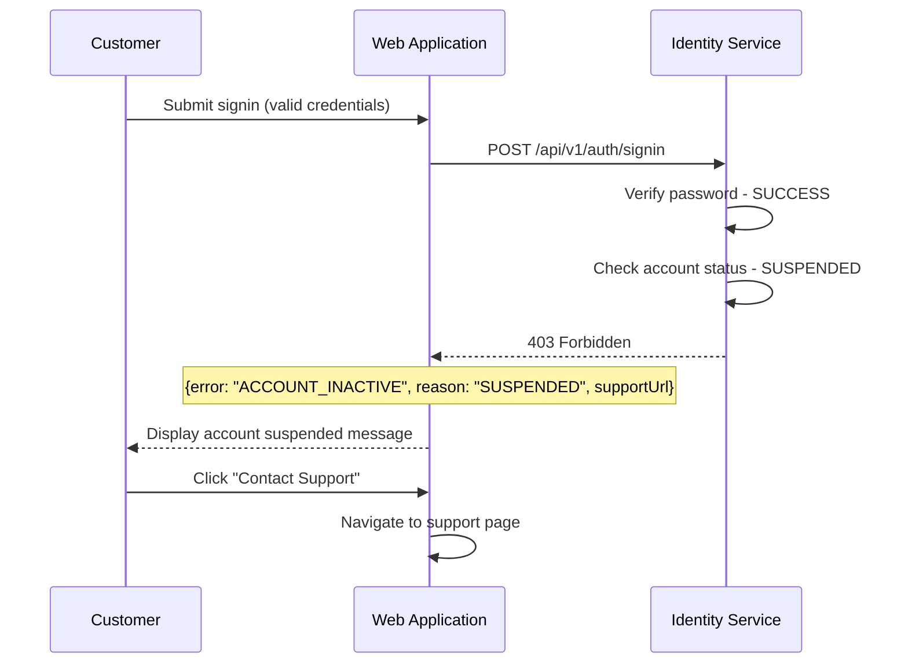
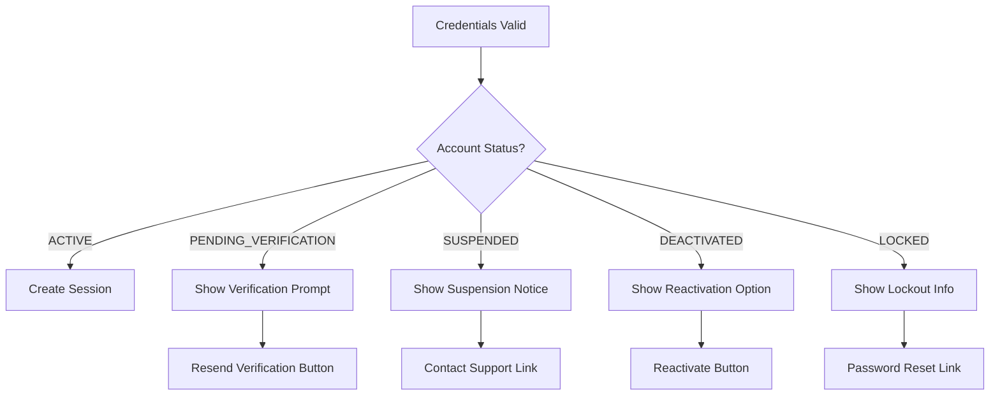

# US-0003-11: Inactive Account Handling

## User Story

**As a** customer with an inactive account,
**I want** clear guidance on why I cannot sign in and what to do next,
**So that** I can resolve the issue and access my account.

## Story Details

| Field        | Value                                          |
|--------------|------------------------------------------------|
| Story ID     | US-0003-11                                     |
| Epic         | [US-0003: Customer Signin](./README.md)        |
| Priority     | Must Have                                      |
| Phase        | Phase 1 (MVP)                                  |
| Story Points | 3                                              |

## Description

This story implements the user experience for customers whose accounts are in an inactive state. Different account statuses require different handling and messaging to guide the customer toward resolution.

## Account Statuses

| Status               | HTTP Code | User Message                                      | Action Required           |
|----------------------|-----------|--------------------------------------------------|---------------------------|
| PENDING_VERIFICATION | 403       | Please verify your email address                 | Resend verification email |
| SUSPENDED            | 403       | Account suspended, contact support               | Contact support           |
| DEACTIVATED          | 403       | Account deactivated, option to reactivate        | Reactivate account        |
| LOCKED               | 423       | Account locked due to failed attempts            | Wait or reset password    |

## Architecture

### Error Flow



### Account Status Decision Flow



## API Contract

### Response: Pending Verification

```
HTTP/1.1 403 Forbidden
Content-Type: application/json

{
  "error": "ACCOUNT_INACTIVE",
  "reason": "PENDING_VERIFICATION",
  "message": "Please verify your email address to continue.",
  "email": "c***r@example.com",
  "verificationEmailSentAt": "2026-01-17T09:00:00Z",
  "resendAvailableIn": 0
}
```

### Response: Suspended

```
HTTP/1.1 403 Forbidden
Content-Type: application/json

{
  "error": "ACCOUNT_INACTIVE",
  "reason": "SUSPENDED",
  "message": "Your account has been suspended. Please contact support for assistance.",
  "supportUrl": "https://www.acme.com/support",
  "supportEmail": "support@acme.com"
}
```

### Response: Deactivated

```
HTTP/1.1 403 Forbidden
Content-Type: application/json

{
  "error": "ACCOUNT_INACTIVE",
  "reason": "DEACTIVATED",
  "message": "Your account has been deactivated. Would you like to reactivate it?",
  "deactivatedAt": "2025-12-01T00:00:00Z",
  "reactivationAvailable": true
}
```

### API: Resend Verification Email

```
POST /api/v1/auth/resend-verification
Content-Type: application/json

{
  "email": "customer@example.com"
}

Response:
HTTP/1.1 200 OK
{
  "message": "Verification email sent",
  "resendAvailableIn": 300
}
```

### API: Request Reactivation

```
POST /api/v1/auth/reactivate
Content-Type: application/json

{
  "email": "customer@example.com",
  "password": "current-password"
}

Response:
HTTP/1.1 200 OK
{
  "message": "Reactivation email sent"
}
```

## Acceptance Criteria

### AC-0003-11-01: Pending Verification Display

**Given** a customer's account has PENDING_VERIFICATION status
**When** they attempt to sign in with valid credentials
**Then** a 403 response is returned
**And** a message "Please verify your email address" is displayed
**And** a "Resend verification email" button is shown
**And** the partially masked email is displayed

### AC-0003-11-02: Resend Verification Email

**Given** a customer sees the pending verification message
**When** they click "Resend verification email"
**Then** a new verification email is sent
**And** a success message is displayed
**And** a 5-minute cooldown is applied to the resend button

### AC-0003-11-03: Suspended Account Display

**Given** a customer's account has SUSPENDED status
**When** they attempt to sign in with valid credentials
**Then** a 403 response is returned
**And** a message "Your account has been suspended" is displayed
**And** support contact options are shown
**And** no self-service resolution is offered

### AC-0003-11-04: Deactivated Account Display

**Given** a customer's account has DEACTIVATED status
**When** they attempt to sign in with valid credentials
**Then** a 403 response is returned
**And** a message "Your account has been deactivated" is displayed
**And** a "Reactivate account" button is shown
**And** the deactivation date is displayed

### AC-0003-11-05: Account Reactivation Flow

**Given** a customer sees the deactivated account message
**When** they click "Reactivate account"
**Then** they are prompted to confirm their identity
**And** a reactivation email is sent
**And** they can complete reactivation through the email link

### AC-0003-11-06: Error Message Does Not Leak Status

**Given** a signin request is made with invalid credentials
**When** the account happens to be inactive
**Then** the error message is still "Invalid email or password"
**And** the inactive status is NOT revealed

### AC-0003-11-07: Support Contact Options

**Given** a suspended account message is displayed
**When** the customer views the support options
**Then** a link to the support page is provided
**And** a support email is displayed
**And** phone support hours may be shown

### AC-0003-11-08: Verification Resend Rate Limit

**Given** a verification email was resent less than 5 minutes ago
**When** the customer tries to resend again
**Then** the button is disabled
**And** a countdown shows time until resend is available

### AC-0003-11-09: Analytics Tracking

**Given** an inactive account error is displayed
**When** the error is shown
**Then** an analytics event is tracked
**And** the event includes: accountStatus, resolutionOffered

### AC-0003-11-10: Accessibility

**Given** an inactive account message is displayed
**When** screen readers encounter the page
**Then** the error and available actions are announced
**And** all interactive elements are keyboard accessible

## Technical Implementation

### Inactive Account Components

```typescript
interface InactiveAccountProps {
  reason: 'PENDING_VERIFICATION' | 'SUSPENDED' | 'DEACTIVATED';
  email?: string;
  supportUrl?: string;
  supportEmail?: string;
  deactivatedAt?: string;
  resendAvailableIn?: number;
}

export function InactiveAccountMessage({
  reason,
  email,
  supportUrl,
  supportEmail,
  deactivatedAt,
  resendAvailableIn: initialCooldown = 0,
}: InactiveAccountProps) {
  const [cooldown, setCooldown] = useState(initialCooldown);

  useEffect(() => {
    if (cooldown > 0) {
      const timer = setInterval(() => setCooldown((c) => c - 1), 1000);
      return () => clearInterval(timer);
    }
  }, [cooldown]);

  const resendMutation = useMutation({
    mutationFn: () => resendVerificationEmail(email!),
    onSuccess: (data) => setCooldown(data.resendAvailableIn),
  });

  return (
    <Card className="max-w-md mx-auto">
      <CardHeader>
        <CardTitle className="flex items-center gap-2">
          <AlertTriangle className="h-5 w-5 text-warning" />
          Account Issue
        </CardTitle>
      </CardHeader>
      <CardContent className="space-y-4">
        {reason === 'PENDING_VERIFICATION' && (
          <>
            <p>Please verify your email address to continue.</p>
            <p className="text-muted-foreground text-sm">
              A verification email was sent to {email}
            </p>
            <Button
              onClick={() => resendMutation.mutate()}
              disabled={cooldown > 0 || resendMutation.isPending}
            >
              {cooldown > 0
                ? `Resend in ${cooldown}s`
                : 'Resend verification email'}
            </Button>
          </>
        )}

        {reason === 'SUSPENDED' && (
          <>
            <p>Your account has been suspended.</p>
            <p className="text-muted-foreground">
              Please contact support for assistance.
            </p>
            <div className="flex flex-col gap-2">
              <Button asChild>
                <a href={supportUrl}>Contact Support</a>
              </Button>
              <p className="text-sm text-muted-foreground">
                Or email: {supportEmail}
              </p>
            </div>
          </>
        )}

        {reason === 'DEACTIVATED' && (
          <>
            <p>Your account was deactivated on {formatDate(deactivatedAt)}.</p>
            <p className="text-muted-foreground">
              Would you like to reactivate your account?
            </p>
            <Button asChild>
              <Link to="/reactivate">Reactivate Account</Link>
            </Button>
          </>
        )}
      </CardContent>
    </Card>
  );
}
```

### Signin Form Integration

```typescript
const onSubmit = async (data: SigninFormData) => {
  try {
    const result = await signinMutation.mutateAsync(data);
    // Handle success
  } catch (error) {
    if (error.status === 403) {
      const errorData = error.data;
      if (errorData.error === 'ACCOUNT_INACTIVE') {
        setInactiveAccount({
          reason: errorData.reason,
          email: errorData.email,
          supportUrl: errorData.supportUrl,
          supportEmail: errorData.supportEmail,
          deactivatedAt: errorData.deactivatedAt,
          resendAvailableIn: errorData.resendAvailableIn,
        });
      }
    } else if (error.status === 401) {
      // Handle invalid credentials (never reveals inactive status)
      setError({
        message: 'Invalid email or password',
        remainingAttempts: error.data.remainingAttempts,
      });
    }
  }
};
```

## Definition of Done

- [ ] Pending verification shows resend button
- [ ] Suspended shows support contact options
- [ ] Deactivated shows reactivation option
- [ ] Resend verification rate limited (5 min cooldown)
- [ ] Invalid credentials never reveals inactive status
- [ ] Support URL and email displayed for suspended
- [ ] Reactivation flow implemented
- [ ] Analytics events tracked
- [ ] Accessibility requirements met
- [ ] Unit tests cover all status types (>90% coverage)
- [ ] Code reviewed and approved

## Dependencies

- Identity Service returns appropriate status codes
- Support URL configured
- Email service for resending verification

## Related Documents

- [Journey Error Scenario E3: Inactive Account](../../journeys/0003-customer-signin.md#e3-inactive-account)
- [US-0003-02: Credential Validation](./US-0003-02-credential-validation.md)
