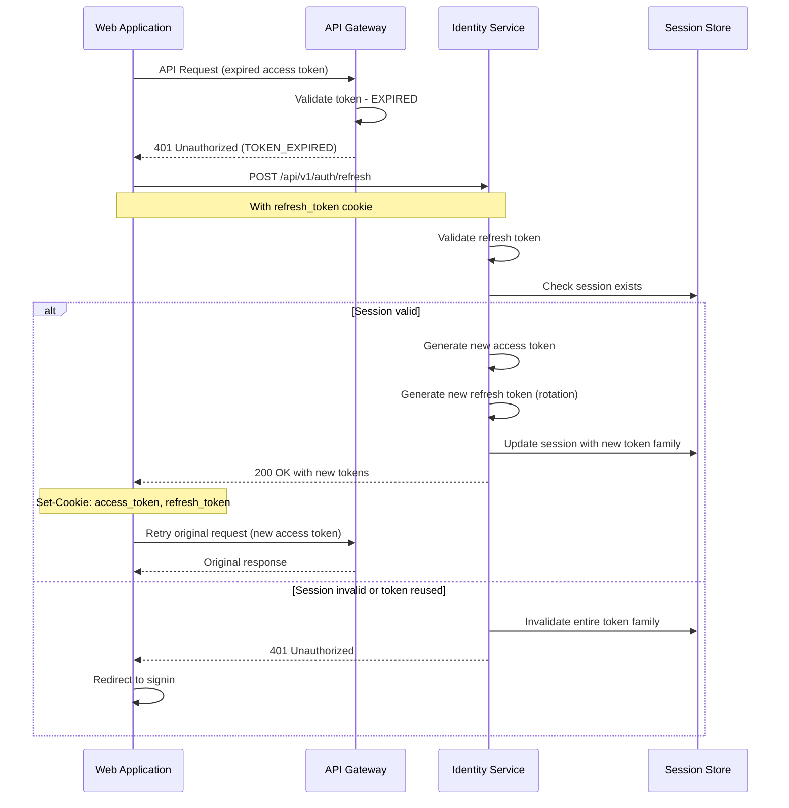
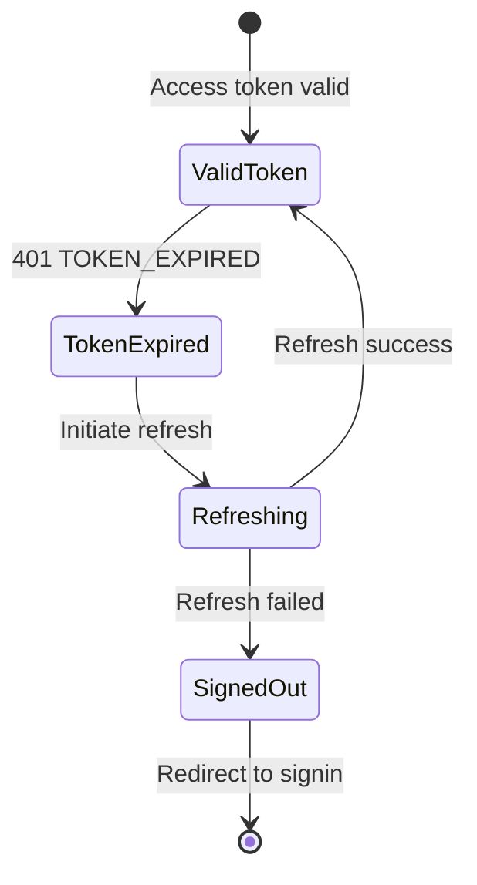
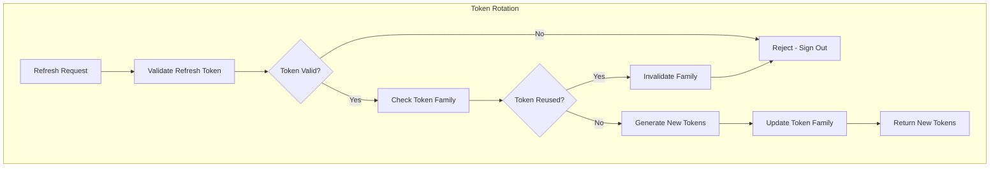

# US-0003-12: Token Refresh Flow

## User Story

**As a** signed-in customer,
**I want** my session to be seamlessly refreshed when my access token expires,
**So that** I can continue using the application without being unexpectedly logged out.

## Story Details

| Field        | Value                                          |
|--------------|------------------------------------------------|
| Story ID     | US-0003-12                                     |
| Epic         | [US-0003: Customer Signin](./README.md)        |
| Priority     | Must Have                                      |
| Phase        | Phase 1 (MVP)                                  |
| Story Points | 5                                              |

## Description

This story implements automatic token refresh when the access token expires. The frontend intercepts 401 responses, attempts to refresh the token using the refresh token cookie, and retries the original request. Token rotation ensures that refresh tokens are single-use, with reuse detection invalidating the entire token family.

## Token Refresh Configuration

| Parameter            | Value          |
|----------------------|----------------|
| Access Token Expiry  | 15 minutes     |
| Refresh Token Expiry | 7 days         |
| Refresh Window       | Before expiry  |
| Token Rotation       | On each refresh|
| Reuse Detection      | Invalidate family |

## Architecture

### Sequence Diagram



### Token Refresh State Machine



### Token Rotation Flow



## API Contract

### Request: Refresh Token

```
POST /api/v1/auth/refresh
Cookie: refresh_token=<jwt>
```

### Response: Refresh Success

```
HTTP/1.1 200 OK
Content-Type: application/json
Set-Cookie: access_token=<new-jwt>; HttpOnly; Secure; SameSite=Strict; Path=/; Max-Age=900
Set-Cookie: refresh_token=<new-jwt>; HttpOnly; Secure; SameSite=Strict; Path=/api/v1/auth/refresh; Max-Age=604800

{
  "status": "SUCCESS",
  "expiresIn": 900
}
```

### Response: Refresh Failed

```
HTTP/1.1 401 Unauthorized
Content-Type: application/json
Set-Cookie: access_token=; Max-Age=0
Set-Cookie: refresh_token=; Max-Age=0

{
  "error": "REFRESH_FAILED",
  "message": "Session expired. Please sign in again."
}
```

### Response: Token Reuse Detected

```
HTTP/1.1 401 Unauthorized
Content-Type: application/json
Set-Cookie: access_token=; Max-Age=0
Set-Cookie: refresh_token=; Max-Age=0

{
  "error": "TOKEN_REUSE_DETECTED",
  "message": "Security alert: Your session was invalidated due to suspicious activity."
}
```

## Acceptance Criteria

### AC-0003-12-01: Automatic Token Refresh

**Given** a customer's access token has expired
**When** they make an API request
**Then** the 401 response triggers automatic refresh
**And** the original request is retried with the new token
**And** the customer experiences no interruption

### AC-0003-12-02: Token Rotation

**Given** a refresh token is used
**When** new tokens are issued
**Then** a new refresh token is generated
**And** the old refresh token is invalidated
**And** both tokens are set in secure cookies

### AC-0003-12-03: Refresh Token Reuse Detection

**Given** a refresh token has already been used
**When** the same token is used again
**Then** the entire token family is invalidated
**And** all sessions in that family are terminated
**And** the user must sign in again

### AC-0003-12-04: Request Queuing During Refresh

**Given** multiple API requests are made with an expired token
**When** refresh is in progress
**Then** subsequent requests are queued
**And** all queued requests are retried after refresh completes
**And** no duplicate refresh requests are made

### AC-0003-12-05: Refresh Failure Handling

**Given** a refresh request fails
**When** the response is received
**Then** tokens are cleared from cookies
**And** the customer is redirected to signin
**And** a message explains the session expiry

### AC-0003-12-06: Session Store Validation

**Given** a refresh token is presented
**When** the Identity Service processes it
**Then** the session is validated in Redis
**And** expired sessions result in refresh failure

### AC-0003-12-07: Security Alert on Reuse

**Given** token reuse is detected
**When** the security alert is shown
**Then** the message warns about suspicious activity
**And** the customer is advised to change their password

### AC-0003-12-08: Transparent to User

**Given** automatic refresh succeeds
**When** the customer continues using the app
**Then** no loading spinner or interruption is visible
**And** the original action completes as expected

### AC-0003-12-09: Refresh Endpoint Security

**Given** the refresh endpoint is called
**When** the request is processed
**Then** only the HttpOnly cookie is accepted
**And** no refresh token in request body is accepted
**And** CORS restrictions are enforced

### AC-0003-12-10: Refresh Performance

**Given** a refresh request is made
**When** the Identity Service processes it
**Then** the response is returned within 100ms (p95)

## Technical Implementation

### Backend Stack

- **Framework**: Spring Boot 4 with Kotlin 2.2
- **JWT Library**: Nimbus JOSE + JWT
- **Session Store**: Redis

### Token Refresh Service (Kotlin)

```kotlin
@Service
class TokenRefreshService(
    private val tokenService: TokenService,
    private val sessionRepository: SessionRepository,
    private val eventPublisher: DomainEventPublisher
) {
    fun refresh(refreshToken: String): Either<RefreshError, TokenPair> = either {
        // Validate and parse refresh token
        val claims = ensureNotNull(tokenService.validateToken(refreshToken)) {
            RefreshError.InvalidToken
        }

        val sessionId = claims.getStringClaim("sessionId")
        val tokenFamily = claims.getStringClaim("tokenFamily")

        // Get session from store
        val session = ensureNotNull(sessionRepository.findById(sessionId)) {
            RefreshError.SessionExpired
        }

        // Check token family matches (reuse detection)
        ensure(session.tokenFamily == tokenFamily) {
            // Token reuse detected - invalidate entire family
            invalidateTokenFamily(session.userId, tokenFamily)
            eventPublisher.publish(TokenReuseDetected(
                userId = session.userId,
                sessionId = sessionId,
                tokenFamily = tokenFamily
            ))
            RefreshError.TokenReused
        }

        // Generate new token family
        val newTokenFamily = "fam_${UUID.randomUUID()}"

        // Update session with new family
        session.tokenFamily = newTokenFamily
        session.lastRefreshedAt = Instant.now()
        sessionRepository.save(session)

        // Generate new tokens
        val user = userRepository.findById(session.userId)!!
        tokenService.createTokens(
            user = user,
            sessionId = sessionId,
            tokenFamily = newTokenFamily
        )
    }

    private fun invalidateTokenFamily(userId: UUID, tokenFamily: String) {
        // Find all sessions with this token family and invalidate them
        val sessions = sessionRepository.findByUserIdAndTokenFamily(userId, tokenFamily)
        sessions.forEach { session ->
            sessionRepository.delete(session)
            eventPublisher.publish(SessionInvalidated(
                sessionId = session.id,
                userId = userId,
                reason = "TOKEN_REUSE_DETECTED",
                invalidatedAt = Instant.now()
            ))
        }
    }
}

sealed interface RefreshError {
    data object InvalidToken : RefreshError
    data object SessionExpired : RefreshError
    data object TokenReused : RefreshError
}
```

### Frontend Token Refresh Interceptor

```typescript
import axios, { AxiosError, AxiosInstance, AxiosRequestConfig } from 'axios';

let isRefreshing = false;
let refreshSubscribers: ((success: boolean) => void)[] = [];

function subscribeTokenRefresh(callback: (success: boolean) => void) {
  refreshSubscribers.push(callback);
}

function onRefreshComplete(success: boolean) {
  refreshSubscribers.forEach((callback) => callback(success));
  refreshSubscribers = [];
}

export function setupTokenRefreshInterceptor(api: AxiosInstance) {
  api.interceptors.response.use(
    (response) => response,
    async (error: AxiosError) => {
      const originalRequest = error.config as AxiosRequestConfig & { _retry?: boolean };

      // Check if it's a token expiry error
      if (
        error.response?.status === 401 &&
        error.response?.data?.error === 'TOKEN_EXPIRED' &&
        !originalRequest._retry
      ) {
        if (isRefreshing) {
          // Wait for refresh to complete
          return new Promise((resolve, reject) => {
            subscribeTokenRefresh((success) => {
              if (success) {
                resolve(api(originalRequest));
              } else {
                reject(error);
              }
            });
          });
        }

        originalRequest._retry = true;
        isRefreshing = true;

        try {
          await api.post('/api/v1/auth/refresh');
          isRefreshing = false;
          onRefreshComplete(true);

          // Retry the original request
          return api(originalRequest);
        } catch (refreshError) {
          isRefreshing = false;
          onRefreshComplete(false);

          // Handle refresh failure
          const refreshData = (refreshError as AxiosError).response?.data;

          if (refreshData?.error === 'TOKEN_REUSE_DETECTED') {
            // Show security alert
            showSecurityAlert('Your session was invalidated due to suspicious activity.');
          }

          // Clear auth state and redirect to signin
          clearAuthState();
          window.location.href = '/signin?expired=true';

          return Promise.reject(refreshError);
        }
      }

      return Promise.reject(error);
    }
  );
}

function clearAuthState() {
  // Clear Zustand store
  useAuthStore.getState().signOut();
  useCustomerStore.getState().clearProfile();
}
```

### Frontend Auth Provider

```typescript
export function AuthProvider({ children }: { children: React.ReactNode }) {
  const api = useApiClient();

  useEffect(() => {
    setupTokenRefreshInterceptor(api);
  }, [api]);

  return <>{children}</>;
}
```

## Definition of Done

- [ ] Automatic token refresh on 401 TOKEN_EXPIRED
- [ ] Token rotation generates new refresh token
- [ ] Token reuse detection invalidates family
- [ ] Request queuing prevents duplicate refreshes
- [ ] Failed refresh redirects to signin
- [ ] Session validated in Redis
- [ ] Security alert shown on token reuse
- [ ] Refresh is transparent to user
- [ ] Refresh endpoint accepts only HttpOnly cookie
- [ ] Refresh completes within 100ms (p95)
- [ ] Unit tests cover refresh scenarios (>90% coverage)
- [ ] Integration tests verify rotation
- [ ] Code reviewed and approved

## Dependencies

- Redis for session storage
- JWT library for token validation
- Axios interceptors configured

## Related Documents

- [Journey Error Scenario E4: Expired Session](../../journeys/0003-customer-signin.md#e4-expired-session)
- [US-0003-07: Session and Token Creation](./US-0003-07-session-token-creation.md)
