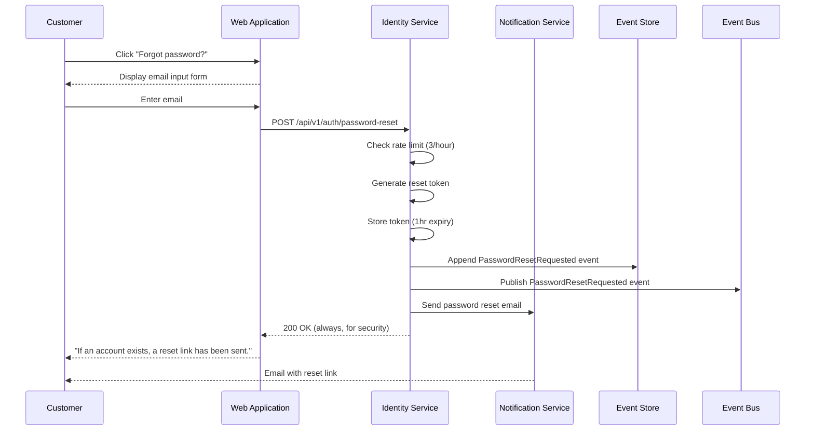
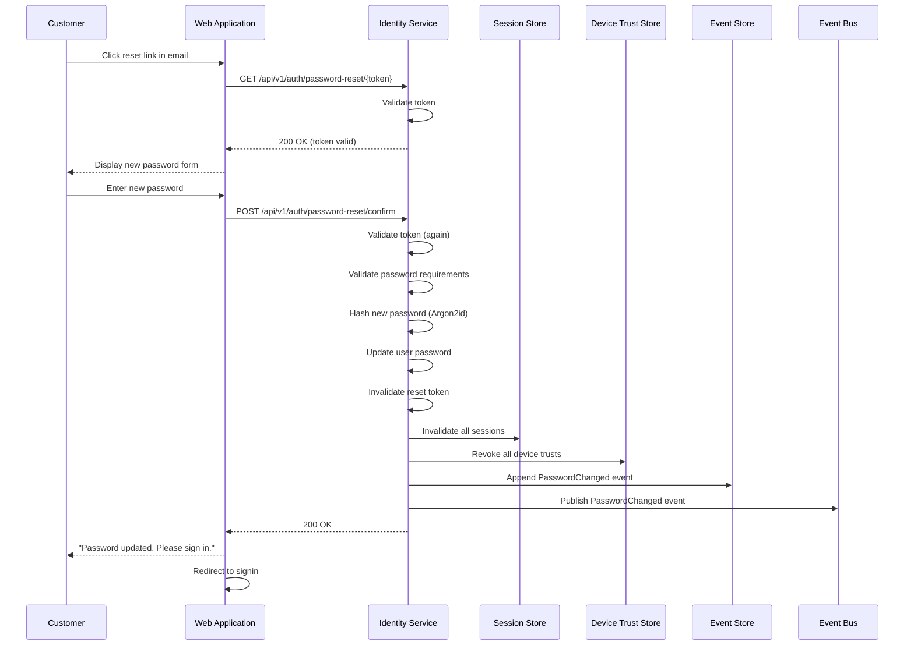
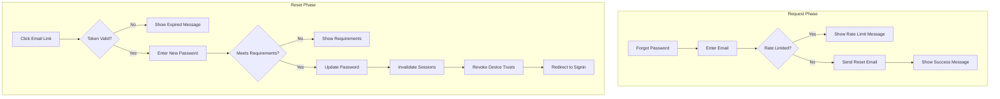

# US-0003-13: Password Reset Flow

## User Story

**As a** customer who has forgotten my password,
**I want** to securely reset my password via email,
**So that** I can regain access to my account.

## Story Details

| Field        | Value                                          |
|--------------|------------------------------------------------|
| Story ID     | US-0003-13                                     |
| Epic         | [US-0003: Customer Signin](./README.md)        |
| Priority     | Must Have                                      |
| Phase        | Phase 1 (MVP)                                  |
| Story Points | 8                                              |

## Description

This story implements the complete password reset flow, including requesting a reset email, validating the reset token, setting a new password, and handling security implications such as session invalidation and device trust revocation.

## Password Reset Configuration

| Parameter           | Value              |
|---------------------|---------------------|
| Reset Token Expiry  | 1 hour              |
| Token Usage         | Single use          |
| Rate Limit          | 3 emails per hour   |
| Session Invalidation| All sessions        |
| Device Trust        | All revoked         |

## Architecture

### Sequence Diagram: Request Reset



### Sequence Diagram: Complete Reset



### Password Reset Flow



## API Contract

### Request: Initiate Password Reset

```
POST /api/v1/auth/password-reset
Content-Type: application/json

{
  "email": "customer@example.com"
}
```

### Response: Reset Request (Always 200)

```
HTTP/1.1 200 OK
Content-Type: application/json

{
  "message": "If an account exists with this email, a password reset link has been sent."
}
```

### Request: Validate Reset Token

```
GET /api/v1/auth/password-reset/{token}
```

### Response: Token Valid

```
HTTP/1.1 200 OK
Content-Type: application/json

{
  "valid": true,
  "expiresIn": 3540
}
```

### Response: Token Invalid

```
HTTP/1.1 400 Bad Request
Content-Type: application/json

{
  "error": "INVALID_RESET_TOKEN",
  "message": "This password reset link is invalid or has expired.",
  "requestNewUrl": "/forgot-password"
}
```

### Request: Complete Password Reset

```
POST /api/v1/auth/password-reset/confirm
Content-Type: application/json

{
  "token": "rst_01941234-5678-7abc-def0-123456789jkl",
  "newPassword": "NewSecureP@ss123"
}
```

### Response: Reset Success

```
HTTP/1.1 200 OK
Content-Type: application/json

{
  "message": "Your password has been updated. Please sign in with your new password.",
  "sessionsInvalidated": 3,
  "deviceTrustsRevoked": 2
}
```

### Response: Password Requirements Not Met

```
HTTP/1.1 400 Bad Request
Content-Type: application/json

{
  "error": "PASSWORD_REQUIREMENTS_NOT_MET",
  "message": "Password does not meet requirements",
  "requirements": [
    {"rule": "MIN_LENGTH", "met": true, "detail": "At least 8 characters"},
    {"rule": "UPPERCASE", "met": false, "detail": "At least one uppercase letter"},
    {"rule": "LOWERCASE", "met": true, "detail": "At least one lowercase letter"},
    {"rule": "DIGIT", "met": true, "detail": "At least one digit"},
    {"rule": "SPECIAL", "met": false, "detail": "At least one special character"}
  ]
}
```

### Domain Event: PasswordResetRequested

```json
{
  "eventId": "01941234-5678-7abc-def0-123456789209",
  "eventType": "PasswordResetRequested",
  "eventVersion": "1.0",
  "timestamp": "2026-01-17T10:30:00Z",
  "aggregateId": "01941234-5678-7abc-def0-123456789abc",
  "aggregateType": "User",
  "payload": {
    "userId": "01941234-5678-7abc-def0-123456789abc",
    "email": "customer@example.com",
    "resetToken": "rst_01941234-5678-7abc-def0-123456789jkl",
    "expiresAt": "2026-01-17T11:30:00Z",
    "ipAddress": "192.168.1.100"
  }
}
```

### Domain Event: PasswordChanged

```json
{
  "eventId": "01941234-5678-7abc-def0-123456789210",
  "eventType": "PasswordChanged",
  "eventVersion": "1.0",
  "timestamp": "2026-01-17T10:35:00Z",
  "aggregateId": "01941234-5678-7abc-def0-123456789abc",
  "aggregateType": "User",
  "payload": {
    "userId": "01941234-5678-7abc-def0-123456789abc",
    "reason": "PASSWORD_RESET",
    "sessionsInvalidated": 3,
    "deviceTrustsRevoked": 2,
    "ipAddress": "192.168.1.100"
  }
}
```

## Acceptance Criteria

### AC-0003-13-01: Request Reset Email

**Given** a customer clicks "Forgot password?"
**When** they enter their email and submit
**Then** a password reset email is sent (if account exists)
**And** the response message does not reveal if the email exists
**And** the message says "If an account exists..."

### AC-0003-13-02: Rate Limiting

**Given** 3 password reset requests have been made for an email in the last hour
**When** a 4th request is made
**Then** the request is rate limited
**And** the response message is the same as success (no enumeration)
**And** no additional email is sent

### AC-0003-13-03: Reset Token Expiry

**Given** a reset token was issued 1 hour ago
**When** the customer clicks the reset link
**Then** the token is rejected as expired
**And** a message prompts them to request a new link

### AC-0003-13-04: Single Use Token

**Given** a reset token has been successfully used
**When** the same link is clicked again
**Then** the token is rejected as invalid
**And** a message indicates the link has already been used

### AC-0003-13-05: Password Requirements Validation

**Given** the customer enters a new password
**When** it does not meet the requirements
**Then** the specific unmet requirements are displayed
**And** the form is not submitted

### AC-0003-13-06: All Sessions Invalidated

**Given** a password reset is completed
**When** the password is updated
**Then** all active sessions are invalidated
**And** SessionInvalidated events are published for each

### AC-0003-13-07: All Device Trusts Revoked

**Given** a password reset is completed
**When** the password is updated
**Then** all trusted devices are revoked
**And** DeviceRevoked events are published for each

### AC-0003-13-08: Account Lockout Cleared

**Given** an account is currently locked
**When** a password reset is completed
**Then** the lockout is cleared
**And** the failed attempts counter is reset

### AC-0003-13-09: Email Contains Secure Link

**Given** a reset email is sent
**When** the customer receives it
**Then** the link uses HTTPS
**And** the token is cryptographically random
**And** the link expires in 1 hour

### AC-0003-13-10: Redirect After Reset

**Given** a password reset is completed
**When** the success message is shown
**Then** the customer is redirected to signin after 3 seconds
**And** a "Sign in now" button is also available

## Technical Implementation

### Backend Stack

- **Framework**: Spring Boot 4 with Kotlin 2.2
- **Token Storage**: Redis with TTL
- **Email**: Notification Service
- **Password Hashing**: Argon2id

### Password Reset Service (Kotlin)

```kotlin
@Service
class PasswordResetService(
    private val userRepository: UserRepository,
    private val resetTokenRepository: ResetTokenRepository,
    private val sessionRepository: SessionRepository,
    private val deviceTrustRepository: DeviceTrustRepository,
    private val notificationService: NotificationService,
    private val passwordEncoder: PasswordEncoder,
    private val eventPublisher: DomainEventPublisher,
    private val rateLimiter: PasswordResetRateLimiter
) {
    private val tokenExpiry = Duration.ofHours(1)

    fun requestReset(email: String, ipAddress: String): Unit {
        // Always return success for security (no email enumeration)
        if (rateLimiter.isLimited(email)) {
            return // Rate limited, but don't tell the user
        }

        val user = userRepository.findByEmail(email) ?: return

        // Generate secure token
        val token = "rst_${UUID.randomUUID()}"

        // Store token
        resetTokenRepository.save(ResetToken(
            token = token,
            userId = user.id,
            expiresAt = Instant.now().plus(tokenExpiry),
            used = false
        ))

        // Record rate limit
        rateLimiter.record(email)

        // Publish event
        eventPublisher.publish(PasswordResetRequested(
            userId = user.id,
            email = email,
            resetToken = token,
            expiresAt = Instant.now().plus(tokenExpiry),
            ipAddress = ipAddress
        ))

        // Send email
        notificationService.sendPasswordResetEmail(
            to = email,
            resetLink = "https://www.acme.com/reset-password?token=$token",
            expiresIn = tokenExpiry
        )
    }

    fun validateToken(token: String): Either<ResetError, TokenValidation> = either {
        val resetToken = ensureNotNull(resetTokenRepository.findByToken(token)) {
            ResetError.InvalidToken
        }

        ensure(!resetToken.used) {
            ResetError.TokenAlreadyUsed
        }

        ensure(resetToken.expiresAt.isAfter(Instant.now())) {
            ResetError.TokenExpired
        }

        TokenValidation(
            valid = true,
            expiresIn = Duration.between(Instant.now(), resetToken.expiresAt).seconds
        )
    }

    fun completeReset(
        token: String,
        newPassword: String,
        ipAddress: String
    ): Either<ResetError, ResetResult> = either {
        // Validate token
        val resetToken = ensureNotNull(resetTokenRepository.findByToken(token)) {
            ResetError.InvalidToken
        }

        ensure(!resetToken.used) {
            ResetError.TokenAlreadyUsed
        }

        ensure(resetToken.expiresAt.isAfter(Instant.now())) {
            ResetError.TokenExpired
        }

        // Get user
        val user = ensureNotNull(userRepository.findById(resetToken.userId)) {
            ResetError.InvalidToken
        }

        // Update password
        user.passwordHash = passwordEncoder.encode(newPassword)
        user.failedAttempts = 0
        user.lockedUntil = null
        userRepository.save(user)

        // Mark token as used
        resetToken.used = true
        resetTokenRepository.save(resetToken)

        // Invalidate all sessions
        val sessions = sessionRepository.findByUserId(user.id)
        sessions.forEach { session ->
            sessionRepository.delete(session)
            eventPublisher.publish(SessionInvalidated(
                sessionId = session.id,
                userId = user.id,
                reason = "PASSWORD_RESET",
                invalidatedAt = Instant.now()
            ))
        }

        // Revoke all device trusts
        val deviceTrusts = deviceTrustRepository.findByUserId(user.id)
        deviceTrusts.forEach { trust ->
            deviceTrustRepository.delete(trust)
            eventPublisher.publish(DeviceRevoked(
                userId = user.id,
                deviceTrustId = trust.id,
                reason = "PASSWORD_RESET",
                revokedAt = Instant.now()
            ))
        }

        // Publish password changed event
        eventPublisher.publish(PasswordChanged(
            userId = user.id,
            reason = "PASSWORD_RESET",
            sessionsInvalidated = sessions.size,
            deviceTrustsRevoked = deviceTrusts.size,
            ipAddress = ipAddress
        ))

        ResetResult(
            sessionsInvalidated = sessions.size,
            deviceTrustsRevoked = deviceTrusts.size
        )
    }
}

sealed interface ResetError {
    data object InvalidToken : ResetError
    data object TokenExpired : ResetError
    data object TokenAlreadyUsed : ResetError
    data object PasswordRequirementsNotMet : ResetError
}
```

### Frontend Password Reset Pages

```typescript
// Request Reset Page
export function ForgotPasswordPage() {
  const [submitted, setSubmitted] = useState(false);

  const mutation = useMutation({
    mutationFn: (email: string) => requestPasswordReset(email),
    onSuccess: () => setSubmitted(true),
  });

  if (submitted) {
    return (
      <Card>
        <CardContent className="text-center py-8">
          <CheckCircle className="h-12 w-12 text-green-500 mx-auto mb-4" />
          <h2 className="text-xl font-semibold mb-2">Check your email</h2>
          <p className="text-muted-foreground">
            If an account exists with this email, a password reset link has been sent.
          </p>
        </CardContent>
      </Card>
    );
  }

  return (
    <Card>
      <CardHeader>
        <CardTitle>Forgot Password</CardTitle>
        <CardDescription>
          Enter your email and we'll send you a reset link.
        </CardDescription>
      </CardHeader>
      <CardContent>
        <form onSubmit={(e) => {
          e.preventDefault();
          const email = new FormData(e.currentTarget).get('email') as string;
          mutation.mutate(email);
        }}>
          <Input name="email" type="email" placeholder="Email" required />
          <Button type="submit" className="w-full mt-4" disabled={mutation.isPending}>
            {mutation.isPending ? 'Sending...' : 'Send Reset Link'}
          </Button>
        </form>
      </CardContent>
    </Card>
  );
}

// Reset Password Page
export function ResetPasswordPage() {
  const { token } = Route.useSearch();
  const [completed, setCompleted] = useState(false);

  const validation = useQuery({
    queryKey: ['reset-token', token],
    queryFn: () => validateResetToken(token),
  });

  const mutation = useMutation({
    mutationFn: (password: string) => completePasswordReset(token, password),
    onSuccess: () => setCompleted(true),
  });

  if (validation.isLoading) {
    return <LoadingSpinner />;
  }

  if (validation.error || !validation.data?.valid) {
    return (
      <Card>
        <CardContent className="text-center py-8">
          <XCircle className="h-12 w-12 text-destructive mx-auto mb-4" />
          <h2 className="text-xl font-semibold mb-2">Link Expired</h2>
          <p className="text-muted-foreground mb-4">
            This password reset link is invalid or has expired.
          </p>
          <Button asChild>
            <Link to="/forgot-password">Request New Link</Link>
          </Button>
        </CardContent>
      </Card>
    );
  }

  if (completed) {
    return (
      <Card>
        <CardContent className="text-center py-8">
          <CheckCircle className="h-12 w-12 text-green-500 mx-auto mb-4" />
          <h2 className="text-xl font-semibold mb-2">Password Updated</h2>
          <p className="text-muted-foreground mb-4">
            Your password has been updated. Please sign in with your new password.
          </p>
          <Button asChild>
            <Link to="/signin">Sign In</Link>
          </Button>
        </CardContent>
      </Card>
    );
  }

  return <ResetPasswordForm onSubmit={mutation.mutate} isPending={mutation.isPending} />;
}
```

## Definition of Done

- [ ] Reset request sends email (if account exists)
- [ ] Response message does not reveal email existence
- [ ] Rate limiting enforces 3 emails per hour
- [ ] Reset token expires after 1 hour
- [ ] Reset token is single-use
- [ ] Password requirements validated before reset
- [ ] All sessions invalidated on reset
- [ ] All device trusts revoked on reset
- [ ] Account lockout cleared on reset
- [ ] Email contains secure HTTPS link
- [ ] Redirect to signin after reset
- [ ] Unit tests cover reset flow (>90% coverage)
- [ ] Integration tests verify session/device invalidation
- [ ] Code reviewed and approved

## Dependencies

- Redis for reset token storage
- Notification Service for email delivery
- Email templates configured

## Related Documents

- [Journey Error Scenario E5: Password Reset Flow](../../journeys/0003-customer-signin.md#e5-password-reset-flow)
- [US-0003-04: Account Lockout](./US-0003-04-account-lockout.md)
- [US-0003-08: Remember Device](./US-0003-08-remember-device.md)
