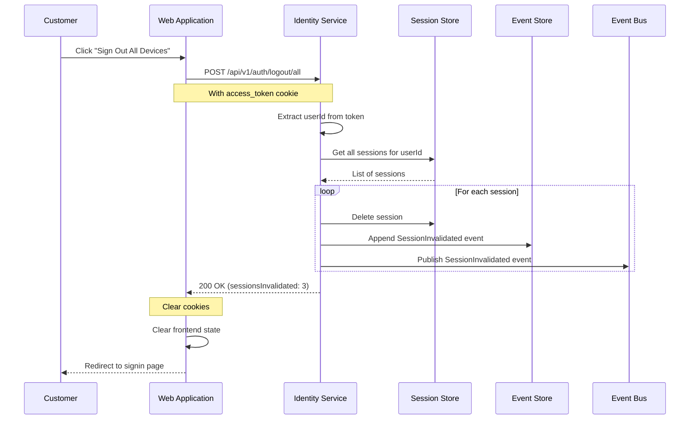
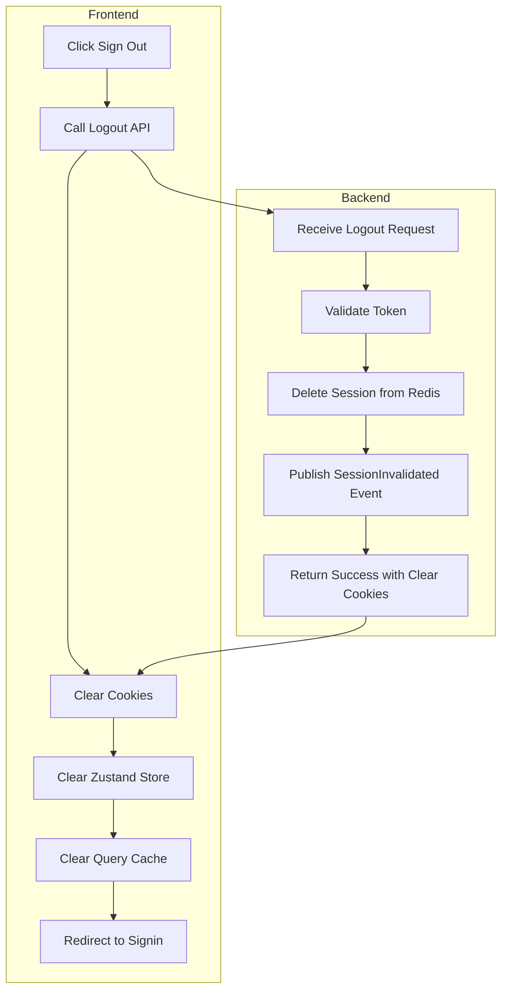

# US-0003-14: Customer Logout

## User Story

**As a** signed-in customer,
**I want** to securely log out of my account,
**So that** my session is ended and my account is protected on shared devices.

## Story Details

| Field        | Value                                          |
|--------------|------------------------------------------------|
| Story ID     | US-0003-14                                     |
| Epic         | [US-0003: Customer Signin](./README.md)        |
| Priority     | Must Have                                      |
| Phase        | Phase 1 (MVP)                                  |
| Story Points | 3                                              |

## Description

This story implements the logout functionality that allows customers to securely end their session. The logout process invalidates the session on the server, clears authentication tokens from cookies, clears frontend state, and publishes appropriate events for analytics and security tracking.

## Logout Options

| Option                | Scope                            |
|-----------------------|----------------------------------|
| Standard Logout       | Current session only             |
| Logout All Devices    | All sessions for the user        |

## Architecture

### Sequence Diagram: Standard Logout

```mermaid
sequenceDiagram
    participant CU as Customer
    participant WA as Web Application
    participant IM as Identity Service
    participant SS as Session Store
    participant ES as Event Store
    participant EB as Event Bus

    CU->>WA: Click "Sign Out"
    WA->>IM: POST /api/v1/auth/logout
    Note over WA,IM: With access_token cookie

    IM->>IM: Extract sessionId from token
    IM->>SS: Delete session
    IM->>ES: Append SessionInvalidated event
    IM->>EB: Publish SessionInvalidated event

    IM-->>WA: 200 OK
    Note over WA: Set-Cookie: access_token=; Max-Age=0
    Note over WA: Set-Cookie: refresh_token=; Max-Age=0

    WA->>WA: Clear frontend state
    WA-->>CU: Redirect to signin page
```

### Sequence Diagram: Logout All Devices



### Logout Flow



## API Contract

### Request: Logout Current Session

```
POST /api/v1/auth/logout
Cookie: access_token=<jwt>
```

### Response: Logout Success

```
HTTP/1.1 200 OK
Content-Type: application/json
Set-Cookie: access_token=; HttpOnly; Secure; SameSite=Strict; Path=/; Max-Age=0
Set-Cookie: refresh_token=; HttpOnly; Secure; SameSite=Strict; Path=/api/v1/auth/refresh; Max-Age=0
Set-Cookie: device_trust=; HttpOnly; Secure; SameSite=Strict; Path=/; Max-Age=0

{
  "status": "SUCCESS",
  "message": "You have been signed out."
}
```

### Request: Logout All Sessions

```
POST /api/v1/auth/logout/all
Cookie: access_token=<jwt>
```

### Response: Logout All Success

```
HTTP/1.1 200 OK
Content-Type: application/json
Set-Cookie: access_token=; Max-Age=0
Set-Cookie: refresh_token=; Max-Age=0
Set-Cookie: device_trust=; Max-Age=0

{
  "status": "SUCCESS",
  "message": "You have been signed out from all devices.",
  "sessionsInvalidated": 3
}
```

### Domain Event: SessionInvalidated

```json
{
  "eventId": "01941234-5678-7abc-def0-123456789206",
  "eventType": "SessionInvalidated",
  "eventVersion": "1.0",
  "timestamp": "2026-01-17T11:30:00Z",
  "aggregateId": "sess_01941234-5678-7abc-def0-123456789def",
  "aggregateType": "Session",
  "payload": {
    "sessionId": "sess_01941234-5678-7abc-def0-123456789def",
    "userId": "01941234-5678-7abc-def0-123456789abc",
    "reason": "USER_LOGOUT",
    "invalidatedAt": "2026-01-17T11:30:00Z"
  }
}
```

## Acceptance Criteria

### AC-0003-14-01: Standard Logout

**Given** a customer is signed in
**When** they click "Sign Out"
**Then** their current session is invalidated
**And** authentication cookies are cleared
**And** they are redirected to the signin page

### AC-0003-14-02: Session Removed from Store

**Given** a customer logs out
**When** the logout is processed
**Then** the session is removed from Redis
**And** subsequent requests with the old token are rejected

### AC-0003-14-03: Cookies Cleared

**Given** a customer logs out
**When** the response is received
**Then** access_token cookie is cleared (Max-Age=0)
**And** refresh_token cookie is cleared
**And** device_trust cookie is cleared

### AC-0003-14-04: Frontend State Cleared

**Given** a customer logs out
**When** the frontend processes the logout
**Then** Zustand auth state is cleared
**And** Zustand customer profile is cleared
**And** TanStack Query cache is cleared

### AC-0003-14-05: Logout All Sessions

**Given** a customer has 3 active sessions
**When** they click "Sign Out All Devices"
**Then** all 3 sessions are invalidated
**And** the response includes sessionsInvalidated: 3
**And** all sessions are removed from Redis

### AC-0003-14-06: SessionInvalidated Event

**Given** a logout occurs
**When** the session is invalidated
**Then** a SessionInvalidated event is published
**And** the event includes: sessionId, userId, reason ("USER_LOGOUT")

### AC-0003-14-07: Logout Without Valid Token

**Given** a logout request is made without a valid token
**When** the Identity Service receives it
**Then** a 200 OK is returned (no error)
**And** cookies are cleared anyway
**And** no server-side session invalidation is attempted

### AC-0003-14-08: Confirmation for Logout All

**Given** the customer clicks "Sign Out All Devices"
**When** the UI processes the click
**Then** a confirmation dialog is shown
**And** the dialog shows the number of active sessions
**And** the customer must confirm before proceeding

### AC-0003-14-09: Redirect After Logout

**Given** logout completes successfully
**When** the frontend processes the response
**Then** the customer is redirected to /signin
**And** a query parameter ?logout=true is included
**And** the signin page may show "You have been signed out"

### AC-0003-14-10: Analytics Tracking

**Given** a logout occurs
**When** the session is invalidated
**Then** a logout analytics event is tracked
**And** the event includes: source (WEB), logoutType (single/all)

## Technical Implementation

### Backend Stack

- **Framework**: Spring Boot 4 with Kotlin 2.2
- **Session Store**: Redis
- **Events**: Kafka

### Logout Controller (Kotlin)

```kotlin
@RestController
@RequestMapping("/api/v1/auth")
class LogoutController(
    private val logoutService: LogoutService,
    private val cookieBuilder: AuthCookieBuilder
) {
    @PostMapping("/logout")
    fun logout(
        @CookieValue(name = "access_token", required = false) accessToken: String?,
        response: HttpServletResponse
    ): ResponseEntity<LogoutResponse> {
        accessToken?.let { token ->
            logoutService.logout(token)
        }

        // Always clear cookies
        cookieBuilder.buildClearCookies().forEach { cookie ->
            response.addHeader(HttpHeaders.SET_COOKIE, cookie.toString())
        }

        return ResponseEntity.ok(LogoutResponse(
            status = "SUCCESS",
            message = "You have been signed out."
        ))
    }

    @PostMapping("/logout/all")
    fun logoutAll(
        @CookieValue(name = "access_token") accessToken: String,
        response: HttpServletResponse
    ): ResponseEntity<LogoutAllResponse> {
        val result = logoutService.logoutAll(accessToken)

        // Clear cookies
        cookieBuilder.buildClearCookies().forEach { cookie ->
            response.addHeader(HttpHeaders.SET_COOKIE, cookie.toString())
        }

        return ResponseEntity.ok(LogoutAllResponse(
            status = "SUCCESS",
            message = "You have been signed out from all devices.",
            sessionsInvalidated = result.sessionsInvalidated
        ))
    }
}
```

### Logout Service (Kotlin)

```kotlin
@Service
class LogoutService(
    private val tokenService: TokenService,
    private val sessionRepository: SessionRepository,
    private val eventPublisher: DomainEventPublisher
) {
    fun logout(accessToken: String) {
        val claims = tokenService.validateToken(accessToken) ?: return

        val sessionId = claims.getStringClaim("sessionId")
        val userId = UUID.fromString(claims.subject)

        sessionRepository.findById(sessionId)?.let { session ->
            sessionRepository.delete(session)

            eventPublisher.publish(SessionInvalidated(
                sessionId = sessionId,
                userId = userId,
                reason = "USER_LOGOUT",
                invalidatedAt = Instant.now()
            ))
        }
    }

    fun logoutAll(accessToken: String): LogoutAllResult {
        val claims = tokenService.validateToken(accessToken)
            ?: throw UnauthorizedException("Invalid token")

        val userId = UUID.fromString(claims.subject)
        val sessions = sessionRepository.findByUserId(userId)

        sessions.forEach { session ->
            sessionRepository.delete(session)

            eventPublisher.publish(SessionInvalidated(
                sessionId = session.id,
                userId = userId,
                reason = "USER_LOGOUT_ALL",
                invalidatedAt = Instant.now()
            ))
        }

        return LogoutAllResult(sessionsInvalidated = sessions.size)
    }
}

data class LogoutAllResult(
    val sessionsInvalidated: Int
)
```

### Frontend Logout Hook

```typescript
import { useMutation, useQueryClient } from '@tanstack/react-query';
import { useNavigate } from '@tanstack/react-router';
import { useAuthStore } from '@/stores/auth';
import { useCustomerStore } from '@/stores/customer';

export function useLogout() {
  const navigate = useNavigate();
  const queryClient = useQueryClient();
  const clearAuth = useAuthStore((state) => state.signOut);
  const clearProfile = useCustomerStore((state) => state.clearProfile);

  return useMutation({
    mutationFn: async (logoutAll: boolean = false) => {
      const endpoint = logoutAll ? '/api/v1/auth/logout/all' : '/api/v1/auth/logout';
      const response = await fetch(endpoint, { method: 'POST', credentials: 'include' });
      return response.json();
    },
    onSuccess: () => {
      // Clear all frontend state
      clearAuth();
      clearProfile();
      queryClient.clear();

      // Track analytics
      trackEvent('user_logout', { source: 'WEB' });

      // Redirect to signin
      navigate({ to: '/signin', search: { logout: 'true' } });
    },
    onError: () => {
      // Still clear state and redirect on error
      clearAuth();
      clearProfile();
      queryClient.clear();
      navigate({ to: '/signin', search: { logout: 'true' } });
    },
  });
}
```

### Logout UI Components

```typescript
export function UserMenu() {
  const { mutate: logout, isPending } = useLogout();
  const [showConfirm, setShowConfirm] = useState(false);

  return (
    <DropdownMenu>
      <DropdownMenuTrigger>
        <Avatar />
      </DropdownMenuTrigger>
      <DropdownMenuContent>
        <DropdownMenuItem onClick={() => logout(false)} disabled={isPending}>
          Sign Out
        </DropdownMenuItem>
        <DropdownMenuItem onClick={() => setShowConfirm(true)}>
          Sign Out All Devices
        </DropdownMenuItem>
      </DropdownMenuContent>

      <AlertDialog open={showConfirm} onOpenChange={setShowConfirm}>
        <AlertDialogContent>
          <AlertDialogHeader>
            <AlertDialogTitle>Sign out all devices?</AlertDialogTitle>
            <AlertDialogDescription>
              This will sign you out from all devices where you're currently signed in.
            </AlertDialogDescription>
          </AlertDialogHeader>
          <AlertDialogFooter>
            <AlertDialogCancel>Cancel</AlertDialogCancel>
            <AlertDialogAction onClick={() => logout(true)}>
              Sign Out All
            </AlertDialogAction>
          </AlertDialogFooter>
        </AlertDialogContent>
      </AlertDialog>
    </DropdownMenu>
  );
}
```

## Definition of Done

- [ ] Standard logout invalidates current session
- [ ] Session removed from Redis
- [ ] All auth cookies cleared with Max-Age=0
- [ ] Frontend Zustand stores cleared
- [ ] TanStack Query cache cleared
- [ ] Logout all sessions invalidates all user sessions
- [ ] SessionInvalidated events published
- [ ] Logout without valid token still clears cookies
- [ ] Confirmation dialog for logout all devices
- [ ] Redirect to /signin?logout=true
- [ ] Analytics event tracked
- [ ] Unit tests cover logout scenarios (>90% coverage)
- [ ] Integration tests verify session removal
- [ ] Code reviewed and approved

## Dependencies

- Redis for session storage
- Authentication cookies configured
- Zustand stores implemented
- TanStack Query configured

## Related Documents

- [Journey Domain Events: SessionInvalidated](../../journeys/0003-customer-signin.md#sessioninvalidated)
- [US-0003-07: Session and Token Creation](./US-0003-07-session-token-creation.md)
