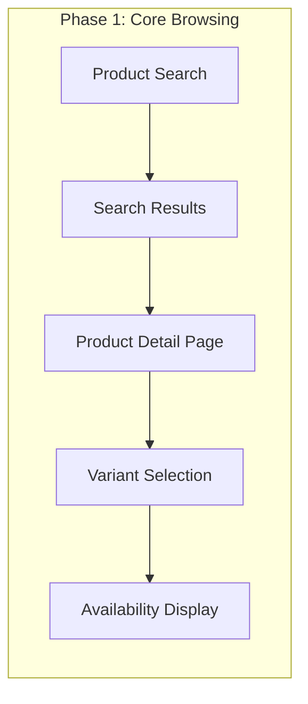
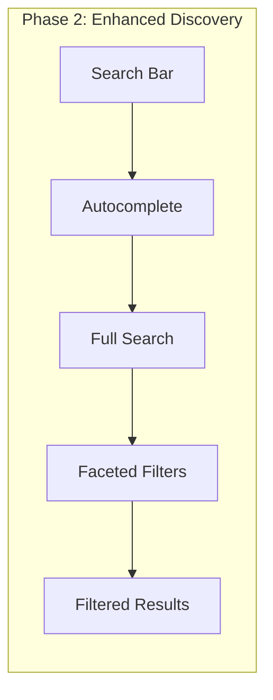
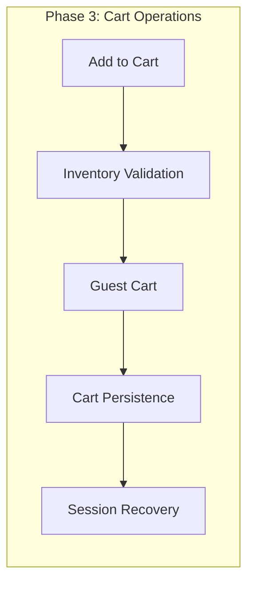
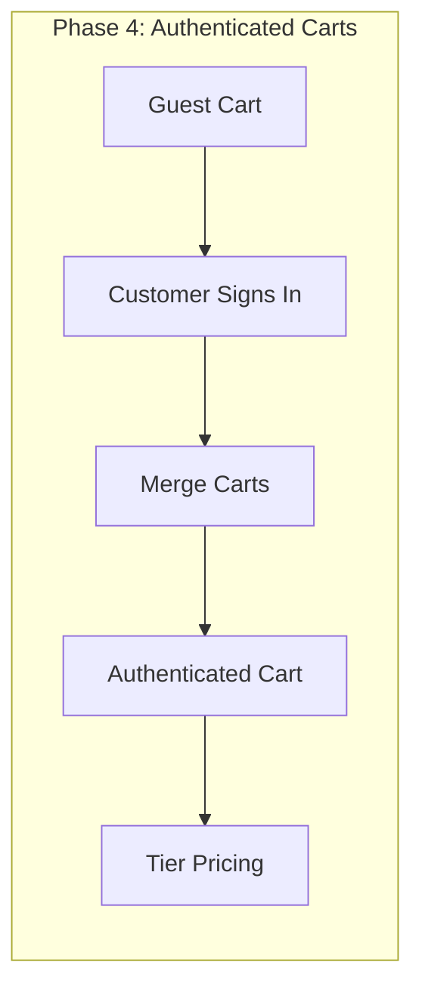
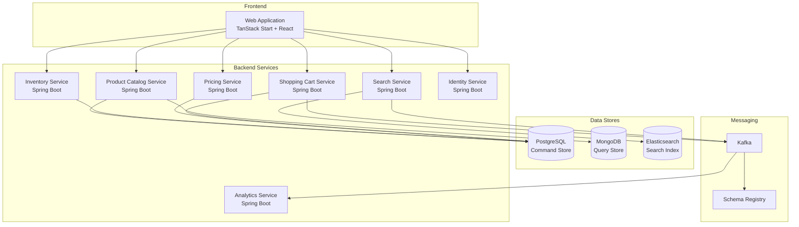

# User Story Epic: Customer Shopping Experience

**Epic ID:** US-0004
**Source Journey:** [UJ-0003: Customer Shopping Experience](../../journeys/0004-customer-shopping-experience.md)
**Status:** Draft
**Created:** 2026-05-24

## Overview

This epic contains user stories derived from the Customer Shopping Experience user journey. The stories implement the complete product discovery and cart management flow, including product search, autocomplete, faceted filtering, product detail viewing, variant selection, and adding items to cart for both guest and authenticated customers.

## Business Value

- **Revenue Generation**: Enable customers to find and purchase products efficiently, driving sales conversion
- **Conversion Optimization**: Reduce friction in the product discovery and cart addition process
- **Customer Experience**: Provide intuitive search, filtering, and browsing capabilities
- **Inventory Accuracy**: Ensure real-time availability information prevents customer disappointment
- **Personalization Foundation**: Capture shopping behavior data for personalized recommendations
- **Cart Recovery**: Persist cart state to support abandoned cart recovery campaigns

## User Stories

| Story ID | Title | Priority | Phase |
|----------|-------|----------|-------|
| [US-0004-01](./US-0004-01-product-search.md) | Product Search | Must Have | Phase 1 |
| [US-0004-02](./US-0004-02-search-autocomplete.md) | Search Autocomplete | Must Have | Phase 2 |
| [US-0004-03](./US-0004-03-search-results-filtering.md) | Search Results Filtering | Must Have | Phase 2 |
| [US-0004-04](./US-0004-04-product-detail-page.md) | Product Detail Page | Must Have | Phase 1 |
| [US-0004-05](./US-0004-05-product-variant-selection.md) | Product Variant Selection | Must Have | Phase 1 |
| [US-0004-06](./US-0004-06-add-item-to-cart.md) | Add Item to Cart | Must Have | Phase 3 |
| [US-0004-07](./US-0004-07-guest-cart-persistence.md) | Guest Cart Persistence | Must Have | Phase 3 |
| [US-0004-08](./US-0004-08-cart-merge-on-authentication.md) | Cart Merge on Authentication | Must Have | Phase 4 |
| [US-0004-09](./US-0004-09-search-service-resilience.md) | Search Service Resilience | Must Have | Phase 1 |
| [US-0004-10](./US-0004-10-out-of-stock-handling.md) | Out of Stock Handling | Must Have | Phase 3 |
| [US-0004-11](./US-0004-11-price-change-handling.md) | Price Change Handling | Should Have | Phase 3 |
| [US-0004-12](./US-0004-12-cart-session-recovery.md) | Cart Session Recovery | Must Have | Phase 3 |
| [US-0004-13](./US-0004-13-inventory-service-resilience.md) | Inventory Service Resilience | Should Have | Phase 3 |

## Implementation Phases

### Phase 1: MVP Search and Browse

**Included in Phase 1:**
- Basic full-text search with results page
- Product detail page with images, descriptions, and attributes
- Product variant selection with real-time price and availability
- Basic availability display
- Search service circuit breaker resilience

### Phase 2: Enhanced Search

**Included in Phase 2:**
- Autocomplete suggestions with debouncing
- Faceted filtering by category, brand, price, color
- Filter state preservation in URL
- Spelling suggestions
- Search result sorting

### Phase 3: Cart Foundation

**Included in Phase 3:**
- Add to cart with real-time inventory validation
- Guest cart creation and session-based persistence
- Cart item quantity management
- Product snapshot capture at time of add
- Out of stock handling and notifications
- Price change detection during cart operations
- Cart session recovery on expiry
- Optimistic inventory fallback

### Phase 4: Cart Enhancement

**Included in Phase 4:**
- Authenticated customer cart association
- Guest-to-customer cart merge on authentication
- Tier pricing support
- Cart expiration and low stock warnings

## Architecture Overview

## Domain Events

| Event | Producer | Consumers |
|-------|----------|-----------|
| SearchExecuted | Search Service | Analytics |
| FiltersApplied | Search Service | Analytics |
| ProductViewed | Web Application | Analytics, Recommendations |
| CartCreated | Shopping Cart Service | Analytics |
| ItemAddedToCart | Shopping Cart Service | Analytics, Inventory |
| CartItemQuantityUpdated | Shopping Cart Service | Analytics |
| CartItemRemoved | Shopping Cart Service | Analytics |
| CartMerged | Shopping Cart Service | Analytics |
| CartAbandoned | Shopping Cart Service | Notifications, Marketing |
| LowStockWarningDisplayed | Web Application | Analytics |
| OutOfStockEncountered | Web Application | Analytics, Notifications |

## Security Considerations

| Concern | Mitigation |
|---------|------------|
| Search injection | Sanitize and escape search queries before processing |
| Cart manipulation | Validate cart ownership via session ID or customer ID |
| Price tampering | Server-side price lookup; never trust client-provided prices |
| Inventory bypass | Server-side inventory validation before adding to cart |
| Session hijacking | Secure, HttpOnly, SameSite cookies for session management |
| Rate limiting | Limit search and add to cart requests per session/IP |
| CSRF protection | CSRF tokens on all cart modification operations |

## Performance Requirements

| Operation | Target | Measurement |
|-----------|--------|-------------|
| Search query execution | p95 < 200ms | Time from request to response |
| Autocomplete response | < 150ms | Time from keystroke to suggestions |
| Filter application | p95 < 300ms | Time to return filtered results |
| Product detail page load | p95 < 500ms | Time to render complete page |
| Availability check | p99 < 100ms | Time to return stock status |
| Price resolution | p99 < 100ms | Time to return current price |
| Add to cart | p95 < 200ms | Time to complete cart operation |
| Cart read | p95 < 100ms | Time to retrieve cart contents |

## Related Documents

- [User Journey: Customer Shopping Experience](../../journeys/0004-customer-shopping-experience.md)
- [Implementation Guidelines](../../IMPLEMENTATION.md)
- [Product Catalog Epic](../../epics/002-product-catalog.md)
- [Product Inventory Epic](../../epics/003-product-inventory.md)
- [Shopping Cart Management Epic](../../epics/009-shopping-cart-management.md)
- [User Journey: Customer Signin](../../journeys/0003-customer-signin.md)
