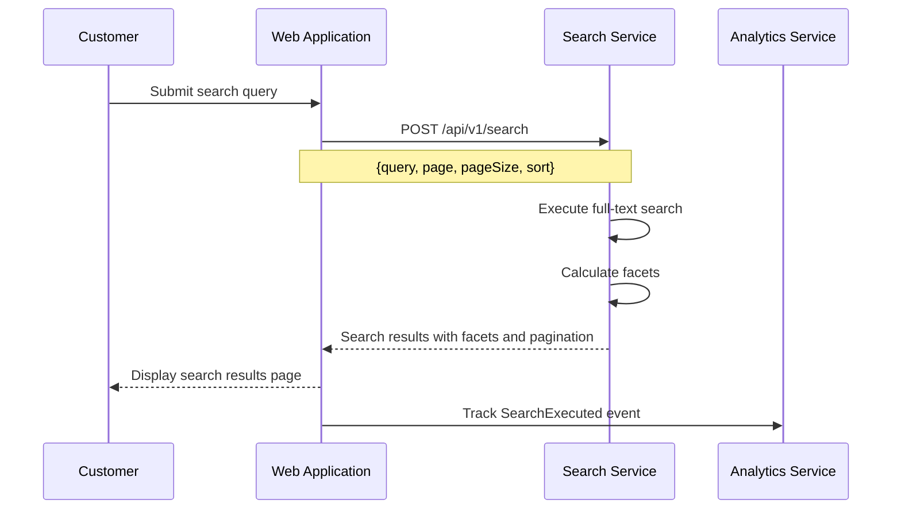

# US-0004-01: Product Search

## User Story

**As a** customer browsing the ACME platform,
**I want** to search for products using a search bar,
**So that** I can quickly find products I am interested in purchasing.

## Story Details

| Field | Value |
|-------|-------|
| Story ID | US-0004-01 |
| Epic | [US-0004: Customer Shopping Experience](./README.md) |
| Priority | Must Have |
| Phase | Phase 1 (MVP) |
| Story Points | 8 |

## Description

This story implements the core product search functionality across the web application. When a customer types a query and submits it, the application calls the Search Service to execute a full-text search and return a results page with paginated products and facet metadata. Analytics events are published upon each search execution.

## UI Requirements

- Search input field with descriptive placeholder text ("Search products…")
- Clear search button to reset the input
- Loading indicator while the search request is in flight
- Result count displayed prominently above the product grid
- Pagination controls at the bottom of the results
- Sort selector (Relevance, Price: Low–High, Price: High–Low, Newest)
- Empty state message with helpful alternatives when no results are found
- "Did you mean: …" spelling suggestion displayed when applicable

## Sequence Diagram



## Acceptance Criteria

### AC-0004-01-01: Search Results Returned (from AC-1.1)

**Given** I am on any page of the ACME platform
**When** I enter a search query and submit it
**Then** search results are displayed within 200ms (p95) of the request being sent
**And** the number of matching results is shown prominently

### AC-0004-01-02: Result Count Display

**Given** a search has been executed
**When** results are returned
**Then** I should see "X results for 'query'" above the product grid
**And** results count is updated if filters are later applied

### AC-0004-01-03: Empty Search Results

**Given** I submit a search query that matches no products
**When** the response returns with zero results
**Then** I should see a helpful empty-state message
**And** the message suggests alternative categories or popular products
**And** no error is displayed (AC-1.5)

### AC-0004-01-04: Unpublished Products Hidden (from AC-1.6)

**Given** the product catalog contains unpublished or archived products
**When** I search for a term that would match those products
**Then** unpublished products do not appear in search results
**And** only active, published products are returned

### AC-0004-01-05: Bookmarkable Search URL (from AC-1.7)

**Given** I have submitted a search query
**When** the results page loads
**Then** the URL contains the query parameter (e.g., `?q=wireless+mouse`)
**And** copying the URL and opening it in a new browser tab shows the same results

### AC-0004-01-06: Pagination

**Given** a search returns more results than the configured page size (24)
**When** I view the results page
**Then** pagination controls are displayed at the bottom
**And** I can navigate to subsequent pages and the URL updates with the page parameter
**And** each page load completes within 200ms (p95)

### AC-0004-01-07: Result Sort Order

**Given** I am on the search results page
**When** I change the sort selector to "Price: Low–High"
**Then** results are re-fetched and displayed in ascending price order
**And** the selected sort option is preserved in the URL

### AC-0004-01-08: Clear Search

**Given** I have typed a query in the search input
**When** I click the clear button (×)
**Then** the input field is cleared
**And** no automatic search is submitted until I type a new query

### AC-0004-01-09: SearchExecuted Analytics Event

**Given** I have submitted a search query
**When** results are returned
**Then** a `SearchExecuted` domain event is published to the Analytics Service containing the session ID, query, result count, and execution time

### AC-0004-01-10: Spelling Suggestion Displayed

**Given** I submit a query with a common misspelling (e.g., "wirelss mouse")
**When** the Search Service returns a spelling suggestion
**Then** I see "Did you mean: wireless mouse?" above the results
**And** clicking the suggestion re-runs the search with the corrected query (AC-1.4)

## Technical Implementation

### Frontend Stack

- **Framework**: TanStack Start with React 19.2
- **State Management**: Zustand for search state
- **Data Fetching**: TanStack Query
- **Routing**: TanStack Router (URL sync for `q`, `page`, `sort` params)
- **UI Components**: shadcn/ui
- **Styling**: Tailwind CSS 4
- **Validation**: Zod for query parameters

### Component Structure

```
frontend-apps/customer/src/
├── components/
│   └── search/
│       ├── SearchBar.tsx
│       ├── SearchResults.tsx
│       ├── SearchResultCard.tsx
│       ├── SearchEmptyState.tsx
│       ├── SearchPagination.tsx
│       └── SearchSortSelector.tsx
├── hooks/
│   └── useSearch.ts
├── stores/
│   └── searchStore.ts
└── routes/
    └── search.tsx
```

### API Contract: Search Request

```typescript
interface SearchRequest {
  query: string;
  page: number;        // 1-indexed
  pageSize: number;    // default 24
  sort: 'relevance' | 'price_asc' | 'price_desc' | 'newest';
  filters: Record<string, unknown>;
}

// POST /api/v1/search
```

### API Contract: Search Response

```typescript
interface SearchResponse {
  query: string;
  totalResults: number;
  page: number;
  pageSize: number;
  totalPages: number;
  results: ProductSummary[];
  facets: SearchFacets;
  spellingSuggestion: string | null;
  executionTimeMs: number;
}
```

### Backend Stack

- **Service**: Search Service (`/backend-services/product`)
- **Language**: Kotlin 2.3 / Java 25
- **Framework**: Spring Boot 4, Spring MVC
- **Search Engine**: Full-text search with facet calculation
- **Error Handling**: Arrow Kotlin `Either` for typed errors
- **Caching**: Caffeine for popular query caching

### Domain Event: SearchExecuted

```json
{
  "eventType": "SearchExecuted",
  "eventVersion": "1.0",
  "payload": {
    "sessionId": "sess_...",
    "customerId": null,
    "query": "wireless mouse",
    "totalResults": 47,
    "page": 1,
    "executionTimeMs": 45,
    "filters": {},
    "source": "SEARCH_BAR"
  }
}
```

## Accessibility Requirements

- Search input has an accessible `aria-label="Search products"`
- Result count is announced to screen readers via `aria-live="polite"`
- Pagination controls use appropriate `aria-label` values (e.g., "Go to page 2")
- Loading spinner has `aria-busy="true"` on the results container
- Spelling suggestion link is focusable and keyboard-accessible

## Definition of Done

- [ ] Search bar renders and accepts text input
- [ ] Submitting a query navigates to the search results page with URL params
- [ ] Results are displayed with product cards and result count
- [ ] Pagination works and updates URL
- [ ] Sort selector works and updates results
- [ ] Empty state displays for zero-result queries
- [ ] Spelling suggestions render and are clickable
- [ ] `SearchExecuted` event is published on each search
- [ ] Unpublished products are excluded from results
- [ ] Unit tests cover query building and result rendering (> 90% coverage)
- [ ] Acceptance tests verify the search happy path
- [ ] Performance: p95 < 200ms verified under load
- [ ] Responsive layout on mobile, tablet, and desktop
- [ ] Code reviewed and approved

## Dependencies

- Search Service backend deployed and accessible
- TanStack Router configured with `/search` route
- API client configured for Search Service

## Related Documents

- [Journey Step 1: Customer Searches for Products](../../journeys/0004-customer-shopping-experience.md#step-1-customer-searches-for-products)
- [US-0004-02: Search Autocomplete](./US-0004-02-search-autocomplete.md)
- [US-0004-03: Search Results Filtering](./US-0004-03-search-results-filtering.md)
- [US-0004-09: Search Service Resilience](./US-0004-09-search-service-resilience.md)
