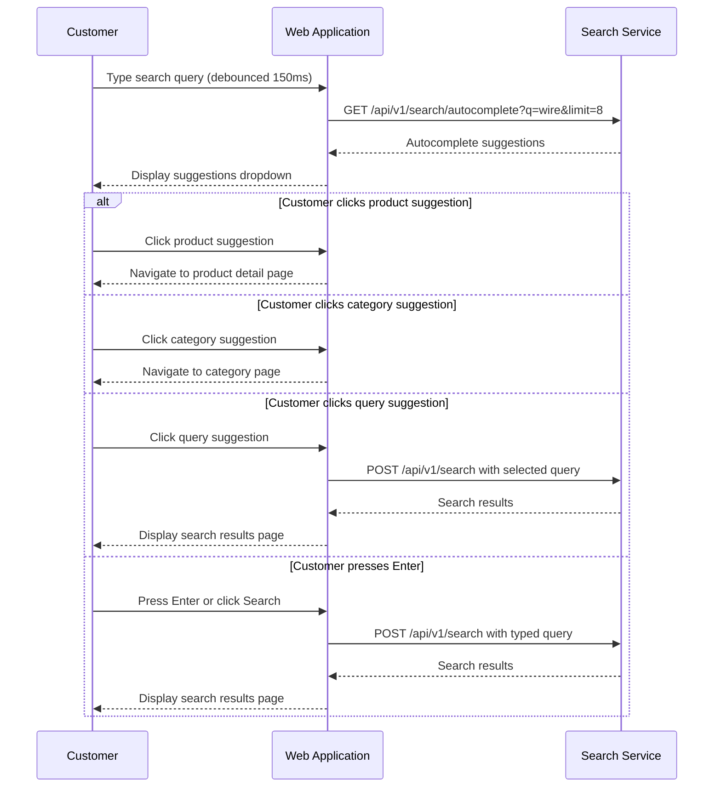

# US-0004-02: Search Autocomplete

## User Story

**As a** customer typing a search query,
**I want** to see autocomplete suggestions as I type,
**So that** I can discover products and categories faster without completing my full query.

## Story Details

| Field | Value |
|-------|-------|
| Story ID | US-0004-02 |
| Epic | [US-0004: Customer Shopping Experience](./README.md) |
| Priority | Must Have |
| Phase | Phase 2 (Enhanced Search) |
| Story Points | 5 |

## Description

This story implements real-time autocomplete suggestions that appear in a dropdown below the search input as the customer types. Suggestions include product names, category names, and recent search queries. The request is debounced to avoid excessive API calls. For authenticated users, recent personal searches are also included. Clicking a suggestion either executes a search or navigates directly to the product.

## UI Requirements

- Suggestions dropdown appears within 150ms of a 150ms typing pause (debounce)
- Maximum 8 suggestions displayed
- Suggestions grouped by type: Products, Categories, Recent Searches
- Each product suggestion includes thumbnail image, product name, and price
- Each category suggestion includes category name and icon
- Keyboard navigation (↑ / ↓ to highlight, Enter to select, Esc to close)
- Clicking a product suggestion navigates directly to the product detail page
- Clicking a category suggestion navigates to the category browse page
- Clicking a query suggestion executes a full search with that query
- Close dropdown when focus leaves the search bar
- "Recent searches" section only shown for authenticated users

## Sequence Diagram



## Acceptance Criteria

### AC-0004-02-01: Autocomplete Timing (from AC-1.2)

**Given** I am typing in the search input
**When** I pause typing for 150ms
**Then** autocomplete suggestions appear within 150ms of the pause
**And** the total time from pause to displayed suggestions is under 150ms (p95)

### AC-0004-02-02: Suggestion Types

**Given** I type "wire" in the search input
**When** autocomplete suggestions load
**Then** suggestions include matching product names, category names, and query suggestions
**And** each type is visually distinguishable in the dropdown

### AC-0004-02-03: Product Suggestion Navigation

**Given** autocomplete suggestions are displayed
**When** I click on a product suggestion
**Then** I am navigated directly to that product's detail page
**And** the search input is not changed

### AC-0004-02-04: Category Suggestion Navigation

**Given** autocomplete suggestions are displayed
**When** I click on a category suggestion
**Then** I am navigated to the category browse page for that category

### AC-0004-02-05: Query Suggestion Navigation

**Given** autocomplete suggestions are displayed
**When** I click on a query suggestion
**Then** the search input is populated with the selected query text
**And** a full search is executed with that query

### AC-0004-02-06: Keyboard Navigation

**Given** autocomplete suggestions are visible
**When** I press the down arrow key
**Then** the first suggestion is highlighted
**And** pressing down again highlights the next suggestion

**Given** a suggestion is highlighted
**When** I press Enter
**Then** the action for that suggestion type is performed (navigate or search)

**Given** autocomplete suggestions are visible
**When** I press Escape
**Then** the dropdown closes and focus returns to the search input

### AC-0004-02-07: Dropdown Close on Focus Loss

**Given** autocomplete suggestions are visible
**When** I click outside the search bar or dropdown
**Then** the dropdown closes without executing a search

### AC-0004-02-08: Minimum Query Length

**Given** I type only one character in the search input
**When** the debounce timer fires
**Then** no autocomplete request is made
**And** suggestions do not appear (minimum 2 characters required)

### AC-0004-02-09: Recent Searches for Authenticated Users (from AC-1.8)

**Given** I am signed in and have previously searched for "gaming keyboard"
**When** I open the search bar or type a matching prefix
**Then** my recent searches are shown in the dropdown under a "Recent Searches" section

### AC-0004-02-10: No Suggestions Graceful State

**Given** I type a query for which no autocomplete suggestions are returned
**When** the response comes back with an empty suggestion list
**Then** the dropdown does not display (no empty dropdown shown)
**And** no error state is presented to the user

### AC-0004-02-11: Loading Indicator

**Given** I have typed a query and the debounce timer has fired
**When** the autocomplete request is in flight
**Then** a subtle loading indicator (spinner or shimmer) is shown in the dropdown area

## Technical Implementation

### Frontend Stack

- **Framework**: TanStack Start with React 19.2
- **Data Fetching**: TanStack Query with debounced query key
- **UI Components**: shadcn/ui Combobox / Command
- **Styling**: Tailwind CSS 4

### Debounce Implementation

```typescript
import { useDebouncedValue } from '@/hooks/useDebouncedValue';
import { useQuery } from '@tanstack/react-query';

function useAutocomplete(query: string) {
  const debouncedQuery = useDebouncedValue(query, 150);

  return useQuery({
    queryKey: ['autocomplete', debouncedQuery],
    queryFn: () => fetchAutocomplete(debouncedQuery),
    enabled: debouncedQuery.length >= 2,
    staleTime: 30_000,
  });
}
```

### Component Structure

```
frontend-apps/customer/src/
├── components/
│   └── search/
│       ├── SearchBar.tsx
│       ├── AutocompleteDropdown.tsx
│       ├── AutocompleteProductItem.tsx
│       ├── AutocompleteCategoryItem.tsx
│       └── AutocompleteQueryItem.tsx
├── hooks/
│   ├── useAutocomplete.ts
│   └── useDebouncedValue.ts
└── api/
    └── searchApi.ts
```

### API Contract: Autocomplete

```
GET /api/v1/search/autocomplete?q=wire&limit=8
Accept: application/json
```

```typescript
interface AutocompleteSuggestion {
  type: 'product' | 'category' | 'query';
  text: string;
  productId?: string;
  imageUrl?: string;
  categorySlug?: string;
}

interface AutocompleteResponse {
  query: string;
  suggestions: AutocompleteSuggestion[];
}
```

## Accessibility Requirements

- Dropdown uses `role="listbox"` with `role="option"` for each item
- Search input has `aria-autocomplete="list"` and `aria-controls` pointing to the listbox
- Active suggestion is announced via `aria-activedescendant`
- Product images in suggestions have meaningful alt text

## Definition of Done

- [ ] Autocomplete dropdown appears after 150ms debounce pause
- [ ] Minimum 2 characters required before request fires
- [ ] Product, category, and query suggestion types render correctly
- [ ] Clicking product suggestion navigates to PDP
- [ ] Clicking category suggestion navigates to category page
- [ ] Clicking query suggestion executes search
- [ ] Keyboard navigation (↑/↓/Enter/Esc) works correctly
- [ ] Dropdown closes on outside click and on Esc
- [ ] Recent searches shown for authenticated users
- [ ] Empty dropdown state not shown when no suggestions
- [ ] Loading indicator shows during in-flight requests
- [ ] Unit tests cover debounce logic and suggestion rendering
- [ ] Performance: suggestions appear within 150ms (p95)
- [ ] Accessibility audit passes (WCAG 2.1 AA)
- [ ] Code reviewed and approved

## Dependencies

- Search Service autocomplete endpoint deployed
- [US-0004-01: Product Search](./US-0004-01-product-search.md) — search bar component
- Authentication state available via Identity Service context

## Related Documents

- [Journey Step 1: Customer Searches for Products](../../journeys/0004-customer-shopping-experience.md#step-1-customer-searches-for-products)
- [US-0004-01: Product Search](./US-0004-01-product-search.md)
