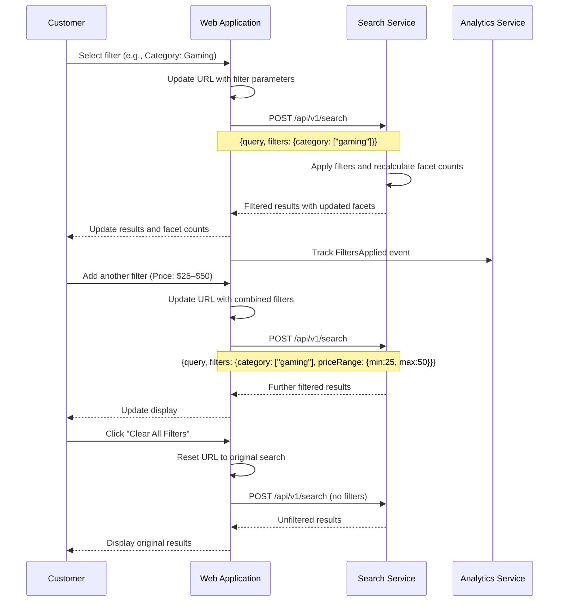

# US-0004-03: Search Results Filtering

## User Story

**As a** customer viewing search results,
**I want** to filter results by category, brand, price range, color, and availability,
**So that** I can narrow down the product list to items that match my specific requirements.

## Story Details

| Field | Value |
|-------|-------|
| Story ID | US-0004-03 |
| Epic | [US-0004: Customer Shopping Experience](./README.md) |
| Priority | Must Have |
| Phase | Phase 2 (Enhanced Search) |
| Story Points | 8 |

## Description

This story implements faceted filtering on the search results page. Customers can apply one or more filters from the filter panel on the left side (desktop) or a drawer (mobile). Applying or removing filters updates the URL, re-fetches results from the Search Service, and recalculates facet counts. Active filters are displayed as dismissible badges above the results. A "Clear All Filters" button resets to the unfiltered state.

## UI Requirements

- Filter panel with collapsible sections per facet type
- Checkbox filters for multi-select options (category, brand, color)
- Price range selector with predefined ranges and manual min/max inputs
- Availability toggle (In Stock / All)
- Active filter badges above the results grid with individual remove buttons
- "Clear All Filters" button visible only when at least one filter is active
- Facet counts update to reflect how many products match within the current filter context
- Mobile-friendly filter drawer (slide-in panel triggered by a "Filters" button)
- URL parameters reflect all applied filters for bookmarking and sharing

## Sequence Diagram



## Acceptance Criteria

### AC-0004-03-01: Filter Application Performance (from AC-2.1)

**Given** I am on the search results page
**When** I apply a filter
**Then** filtered results are returned within 300ms (p95)
**And** the facet counts in the filter panel update to reflect the new context

### AC-0004-03-02: URL Parameter Preservation (from AC-2.2)

**Given** I have applied one or more filters
**When** I copy the current URL and open it in a new tab
**Then** the same filters are applied and the same results are shown

### AC-0004-03-03: Individual Filter Removal (from AC-2.3)

**Given** I have applied multiple filters (e.g., Category: Gaming, Brand: ACME)
**When** I click the remove button on the "Brand: ACME" active filter badge
**Then** only the Brand filter is removed
**And** the Category: Gaming filter remains active
**And** results update to reflect only the remaining filters

### AC-0004-03-04: Clear All Filters (from AC-2.4)

**Given** at least one filter is active
**When** I click the "Clear All Filters" button
**Then** all filters are removed
**And** the URL is reset to the base search query
**And** the unfiltered results and original facet counts are displayed

### AC-0004-03-05: Facet Count Updates (from AC-2.5)

**Given** I apply a filter
**When** results update
**Then** all visible facet counts reflect the number of results within the current filter context
**And** selected facets show a checkmark or highlighted state

### AC-0004-03-06: Zero-Result Filters Disabled (from AC-2.8)

**Given** a filter option would return zero results given the current active filters
**When** the filter panel renders
**Then** that filter option is visually disabled or hidden
**And** hovering over it shows a tooltip indicating no matching products

### AC-0004-03-07: Multi-Select Category Filter

**Given** I apply "Category: Gaming"
**When** I also check "Category: Computer Accessories"
**Then** results from both categories are shown (OR logic within same facet)
**And** both categories are shown as active in the filter badges

### AC-0004-03-08: Price Range Filter

**Given** I expand the Price section of the filter panel
**When** I select the "$25 – $50" predefined range
**Then** only products priced between $25 and $50 are returned
**And** an active filter badge "Price: $25 – $50" is shown

**Given** I want a custom price range
**When** I enter a minimum and maximum value manually
**Then** the results update to show only products within that custom range (AC-2.7)

### AC-0004-03-09: Mobile Filter Drawer

**Given** I am viewing the search results page on a mobile device
**When** I tap the "Filters" button
**Then** a filter drawer slides in from the left
**And** all filter options are accessible within the drawer
**And** a "Apply Filters" button closes the drawer and applies the selected filters

### AC-0004-03-10: FiltersApplied Analytics Event

**Given** I apply at least one filter
**When** the filtered results are returned
**Then** a `FiltersApplied` event is published to the Analytics Service containing session ID, query, applied filters, and result count

### AC-0004-03-11: Filter State on Page Reload

**Given** I have applied filters and the URL reflects them
**When** I reload the page
**Then** the same filters are re-applied and results are correct
**And** the active filter badges and facet selections are restored from URL state

## Technical Implementation

### Frontend Stack

- **Framework**: TanStack Start with React 19.2
- **State Management**: Zustand for filter state; URL-synchronized via TanStack Router
- **Data Fetching**: TanStack Query
- **UI Components**: shadcn/ui Checkbox, Slider, Collapsible
- **Styling**: Tailwind CSS 4

### Component Structure

```
frontend-apps/customer/src/
├── components/
│   └── search/
│       ├── FilterPanel.tsx
│       ├── FilterSection.tsx
│       ├── CheckboxFilter.tsx
│       ├── PriceRangeFilter.tsx
│       ├── ActiveFilterBadge.tsx
│       ├── ActiveFiltersBar.tsx
│       └── MobileFilterDrawer.tsx
├── hooks/
│   └── useSearchFilters.ts
└── stores/
    └── filterStore.ts
```

### URL Parameter Schema

```
/search?q=wireless+mouse&category=gaming&brand=ACME&brand=TechPro&priceMin=25&priceMax=75&color=Black&availability=IN_STOCK&page=1&sort=relevance
```

### API Contract: Search with Filters

```typescript
interface SearchFilters {
  category?: string[];
  brand?: string[];
  priceRange?: { min: number; max: number };
  color?: string[];
  availability?: ('IN_STOCK' | 'OUT_OF_STOCK')[];
}

interface SearchRequest {
  query: string;
  page: number;
  pageSize: number;
  sort: string;
  filters: SearchFilters;
}
```

### Domain Event: FiltersApplied

```json
{
  "eventType": "FiltersApplied",
  "eventVersion": "1.0",
  "payload": {
    "sessionId": "sess_...",
    "customerId": null,
    "query": "wireless mouse",
    "filters": {
      "category": ["gaming"],
      "brand": ["ACME", "TechPro"],
      "priceRange": {"min": 25, "max": 75}
    },
    "resultCount": 8
  }
}
```

## Accessibility Requirements

- Filter checkboxes use standard `<input type="checkbox">` with visible labels
- Price range inputs have accessible `aria-label="Minimum price"` / `aria-label="Maximum price"`
- Active filter remove buttons have `aria-label="Remove filter: Brand ACME"`
- Mobile drawer has `role="dialog"` with appropriate `aria-label`
- Disabled filter options have `aria-disabled="true"`

## Definition of Done

- [ ] Filter panel renders with all facet sections from search response
- [ ] Selecting a filter updates URL and re-fetches results
- [ ] Facet counts update after filter application
- [ ] Individual filter badges render with remove buttons
- [ ] Removing individual filters updates results correctly
- [ ] "Clear All Filters" resets all state
- [ ] Price range filter works with predefined and custom ranges
- [ ] Zero-result filter options are disabled
- [ ] URL filter state survives page reload
- [ ] Mobile filter drawer is functional and accessible
- [ ] `FiltersApplied` event published on filter application
- [ ] Unit tests cover filter state management and URL sync
- [ ] Performance: filtered results within 300ms (p95)
- [ ] Responsive design on mobile, tablet, and desktop
- [ ] Code reviewed and approved

## Dependencies

- [US-0004-01: Product Search](./US-0004-01-product-search.md) — search results page
- Search Service supports `POST /api/v1/search` with filters and facets

## Related Documents

- [Journey Step 2: Customer Filters Search Results](../../journeys/0004-customer-shopping-experience.md#step-2-customer-filters-search-results)
- [US-0004-01: Product Search](./US-0004-01-product-search.md)
