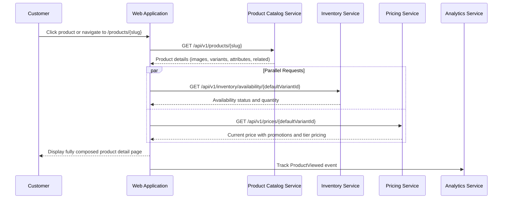

# US-0004-04: Product Detail Page

## User Story

**As a** customer who has found a product I am interested in,
**I want** to view complete product information on a dedicated product detail page,
**So that** I can make an informed purchase decision.

## Story Details

| Field | Value |
|-------|-------|
| Story ID | US-0004-04 |
| Epic | [US-0004: Customer Shopping Experience](./README.md) |
| Priority | Must Have |
| Phase | Phase 1 (MVP) |
| Story Points | 8 |

## Description

This story implements the product detail page (PDP). When a customer navigates to a product, the web application fetches full product data from the Product Catalog Service and concurrently requests availability from the Inventory Service and current pricing from the Pricing Service. The page displays images, descriptions, attributes, ratings, breadcrumb navigation, and a related products section. A `ProductViewed` analytics event is published on each page load.

## UI Requirements

- Product image gallery with primary image, thumbnails, and zoom on hover/click
- Product name, brand, and SKU
- Short description and full description (expandable)
- Price display — current price highlighted, original price struck through when on sale
- Promotional badge showing discount percentage and sale end date
- Real-time availability indicator: "In Stock", "Low Stock (X remaining)", "Out of Stock"
- Quantity selector respecting `maxOrderQuantity`
- Add to Cart button (disabled when out of stock)
- Variant selectors (see US-0004-05)
- Breadcrumb navigation reflecting category hierarchy
- Product attributes table (DPI, buttons, connectivity, etc.)
- Customer reviews summary with star rating and distribution
- Related products carousel
- "Notify When Available" option for out-of-stock products

## Sequence Diagram



## Acceptance Criteria

### AC-0004-04-01: Page Load Performance (from AC-3.1)

**Given** I click on a product from search results
**When** the product detail page loads
**Then** the page is fully rendered within 500ms (p95)
**And** the availability status and current price are displayed without a secondary loading state

### AC-0004-04-02: Product Information Displayed

**Given** I navigate to a product detail page
**When** the page renders
**Then** I see the product name, brand, description, images, and attributes
**And** the breadcrumb trail shows the full category hierarchy (AC-3.7)

### AC-0004-04-03: Sale Price Display

**Given** a product has an active promotion with a discounted price
**When** I view the product detail page
**Then** the current (discounted) price is prominently displayed
**And** the original price is shown struck through
**And** a discount percentage badge (e.g., "22% Off") is visible
**And** the promotion end date is displayed if available

### AC-0004-04-04: In Stock Availability Display

**Given** the Inventory Service reports the default variant as `IN_STOCK` with quantity >= low stock threshold
**When** I view the product detail page
**Then** I see "In Stock" in a positive/green indicator
**And** the Add to Cart button is enabled

### AC-0004-04-05: Low Stock Warning (from AC-3.4)

**Given** the Inventory Service reports the variant quantity is below the low stock threshold
**When** I view the product detail page
**Then** I see "Only X left in stock" in an amber/warning indicator
**And** the Add to Cart button is still enabled

### AC-0004-04-06: Out of Stock Indicator (from AC-3.5)

**Given** the Inventory Service reports the variant as `OUT_OF_STOCK`
**When** I view the product detail page
**Then** I see "Out of Stock" in a negative/red indicator
**And** the Add to Cart button is disabled
**And** a "Notify When Available" option is shown

### AC-0004-04-07: Quantity Selector Constraints

**Given** a product has `maxOrderQuantity: 5`
**When** I interact with the quantity selector
**Then** I cannot select a quantity greater than 5
**And** an error message is shown if I attempt to exceed the maximum

### AC-0004-04-08: Image Gallery

**Given** a product has multiple images
**When** I view the product detail page
**Then** the primary image is displayed prominently
**And** thumbnail images are displayed below (or beside on desktop)
**And** clicking a thumbnail updates the main image
**And** the main image can be zoomed on hover or click (AC-3.6)

### AC-0004-04-09: Breadcrumb Navigation (from AC-3.7)

**Given** I am on a product detail page
**When** I view the breadcrumb
**Then** the breadcrumb shows the full hierarchy (e.g., Electronics > Computer Accessories > Gaming)
**And** each breadcrumb item is a clickable link to that category page

### AC-0004-04-10: Related Products Section (from AC-3.8)

**Given** the product has related products configured
**When** the product detail page loads
**Then** a "Related Products" section displays at least 2 related items
**And** each related product shows its name, primary image, and price
**And** clicking a related product navigates to its detail page

### AC-0004-04-11: ProductViewed Analytics Event

**Given** I navigate to a product detail page
**When** the page has fully rendered
**Then** a `ProductViewed` event is published containing session ID, product ID, variant ID, source, and search query (if navigated from search results)

### AC-0004-04-12: Customer Reviews Summary

**Given** a product has customer reviews
**When** I view the product detail page
**Then** I see the average star rating and total review count
**And** I can see the rating distribution (how many 5-star, 4-star, etc.)

## Technical Implementation

### Frontend Stack

- **Framework**: TanStack Start with React 19.2
- **Data Fetching**: TanStack Query (parallel queries for price + availability)
- **Routing**: TanStack Router (`/products/$slug`)
- **UI Components**: shadcn/ui
- **Styling**: Tailwind CSS 4

### Component Structure

```
frontend-apps/customer/src/
├── components/
│   └── product/
│       ├── ProductDetailPage.tsx
│       ├── ProductImageGallery.tsx
│       ├── ProductPriceDisplay.tsx
│       ├── ProductAvailabilityBadge.tsx
│       ├── QuantitySelector.tsx
│       ├── ProductAttributes.tsx
│       ├── ProductBreadcrumb.tsx
│       ├── RelatedProducts.tsx
│       └── NotifyWhenAvailable.tsx
├── hooks/
│   ├── useProductDetail.ts
│   ├── useProductAvailability.ts
│   └── useProductPrice.ts
└── routes/
    └── products.$slug.tsx
```

### Data Fetching

```typescript
function useProductDetailPage(slug: string) {
  const productQuery = useQuery({
    queryKey: ['product', slug],
    queryFn: () => fetchProduct(slug),
  });

  const defaultVariantId = productQuery.data?.variants.find(v => v.isDefault)?.variantId;

  const availabilityQuery = useQuery({
    queryKey: ['availability', defaultVariantId],
    queryFn: () => fetchAvailability(defaultVariantId!),
    enabled: !!defaultVariantId,
  });

  const priceQuery = useQuery({
    queryKey: ['price', defaultVariantId],
    queryFn: () => fetchPrice(defaultVariantId!),
    enabled: !!defaultVariantId,
  });

  return { productQuery, availabilityQuery, priceQuery };
}
```

### Backend: Product Catalog Service

- **Service**: `/backend-services/product`
- **Language**: Kotlin 2.2 / Java 24
- **Framework**: Spring Boot 4, Spring MVC
- **Endpoint**: `GET /api/v1/products/{slug}`
- **Caching**: Caffeine cache for product data (5-minute TTL)
- **Error Handling**: Arrow Kotlin `Either<ProductError, Product>`

### Domain Event: ProductViewed

```json
{
  "eventType": "ProductViewed",
  "eventVersion": "1.0",
  "payload": {
    "sessionId": "sess_...",
    "customerId": null,
    "productId": "01941234-...",
    "variantId": "01941234-...",
    "source": "SEARCH_RESULTS",
    "searchQuery": "wireless mouse",
    "position": 3
  }
}
```

## Accessibility Requirements

- Images have descriptive alt text derived from the `altText` field
- Price changes (after variant selection) are announced via `aria-live="polite"`
- Availability status uses appropriate color and a text label (not color alone)
- Zoom functionality is keyboard-accessible
- Quantity selector has accessible increment/decrement controls with `aria-label`
- Tab focus is managed when variant selection updates availability

## Definition of Done

- [ ] Product detail page renders from `GET /api/v1/products/{slug}`
- [ ] Availability and price fetched concurrently on page load
- [ ] Sale price display with original price struck through
- [ ] Image gallery with thumbnail selection and zoom
- [ ] Breadcrumb navigation rendered and linked
- [ ] Availability indicator (In Stock / Low Stock / Out of Stock)
- [ ] Add to Cart button disabled when Out of Stock
- [ ] Quantity selector enforces `maxOrderQuantity`
- [ ] Related products section renders
- [ ] `ProductViewed` analytics event published on load
- [ ] Unit tests cover page composition and edge cases (>90% coverage)
- [ ] Performance: p95 < 500ms verified
- [ ] Responsive design on mobile, tablet, and desktop
- [ ] Accessibility audit passes (WCAG 2.1 AA)
- [ ] Code reviewed and approved

## Dependencies

- Product Catalog Service deployed with `GET /api/v1/products/{slug}`
- Inventory Service deployed with `GET /api/v1/inventory/availability/{variantId}`
- Pricing Service deployed with `GET /api/v1/prices/{variantId}`
- TanStack Router configured with `/products/$slug` route

## Related Documents

- [Journey Step 3: Customer Views Product Details](../../journeys/0004-customer-shopping-experience.md#step-3-customer-views-product-details)
- [US-0004-05: Product Variant Selection](./US-0004-05-product-variant-selection.md)
- [US-0004-06: Add Item to Cart](./US-0004-06-add-item-to-cart.md)
- [US-0004-10: Out of Stock Handling](./US-0004-10-out-of-stock-handling.md)
