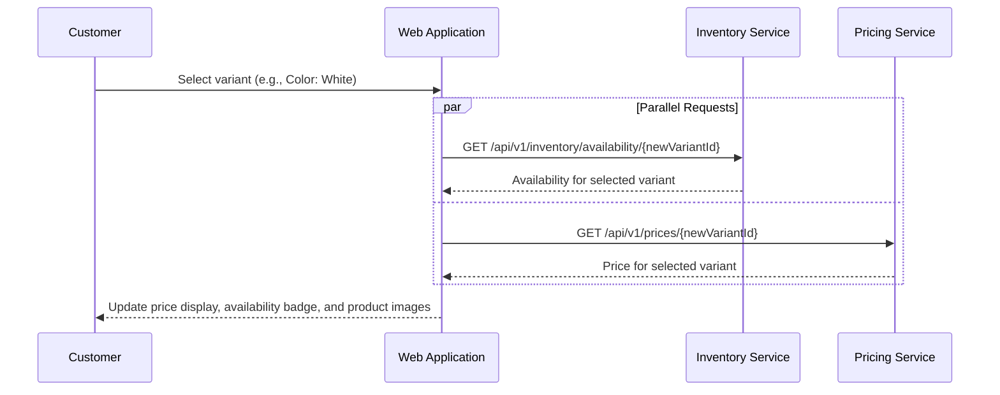

# US-0004-05: Product Variant Selection

## User Story

**As a** customer viewing a product detail page,
**I want** to select product variants such as color or size,
**So that** I can see the correct price, availability, and images for the specific version of the product I want to purchase.

## Story Details

| Field | Value |
|-------|-------|
| Story ID | US-0004-05 |
| Epic | [US-0004: Customer Shopping Experience](./README.md) |
| Priority | Must Have |
| Phase | Phase 1 (MVP) |
| Story Points | 5 |

## Description

This story implements product variant selection on the product detail page. When a customer selects a different variant (e.g., changes color from Black to White), the application fetches updated availability and pricing for that variant and refreshes the displayed price, availability indicator, and product images. Out-of-stock variants remain selectable but are visually indicated as unavailable, and the Add to Cart button is disabled.

## UI Requirements

- Variant selector rendered per option type (color swatches for color, button group for size)
- Currently selected variant is highlighted/active
- Out-of-stock variants are visually crossed out or grayed, but still selectable
- Selecting a variant triggers loading indicators on price and availability sections
- Price, availability, and images update without a full page reload
- Selected variant SKU is displayed for customer reference

## Sequence Diagram



## Acceptance Criteria

### AC-0004-05-01: Real-time Price and Availability Update (from AC-3.2)

**Given** I am viewing the default variant of a product
**When** I select a different variant
**Then** the price and availability are updated in real time within 200ms of the response
**And** no full page reload occurs

### AC-0004-05-02: Availability Check Timing (from AC-3.3)

**Given** I select a different variant
**When** the availability request is sent to the Inventory Service
**Then** the availability response is returned within 100ms (p99)

### AC-0004-05-03: Out-of-Stock Variant Selectable but Indicated (from AC-3.5)

**Given** a variant is out of stock
**When** I view the variant selectors
**Then** the out-of-stock variant is visually indicated (grayed out / strikethrough)
**And** I can still click it to select it
**When** I select an out-of-stock variant
**Then** the availability indicator changes to "Out of Stock"
**And** the Add to Cart button becomes disabled

### AC-0004-05-04: Image Gallery Update on Variant Selection

**Given** I select a variant that has different images from the current selection
**When** the variant selection completes
**Then** the product image gallery updates to show the images for the selected variant
**And** the primary image displayed is the first image of the new variant

### AC-0004-05-05: Loading State During Variant Switch

**Given** I click a different variant selector
**When** the availability and price requests are in flight
**Then** a loading skeleton or spinner is shown over the price and availability sections
**And** the Add to Cart button is temporarily disabled during the fetch

### AC-0004-05-06: Default Variant Pre-selected

**Given** I navigate to a product detail page
**When** the page loads
**Then** the default variant (as indicated by `isDefault: true` in the product data) is pre-selected
**And** its availability and price are already loaded

### AC-0004-05-07: Variant SKU Display

**Given** I have selected a variant
**When** the page updates
**Then** the selected variant SKU is displayed (e.g., "SKU: ACME-GM-PRO-WHT")

### AC-0004-05-08: Tier Pricing Shown for Selected Variant

**Given** the selected variant has tier pricing configured
**When** I view the price section
**Then** the tier pricing table is displayed (e.g., "Buy 3+ for $64.99 each")

### AC-0004-05-09: VariantSelected Analytics Event

**Given** I select a variant that is different from the default
**When** the variant selection is applied
**Then** a `VariantSelected` analytics event is published with the product ID and selected variant ID

### AC-0004-05-10: Keyboard-Accessible Variant Selection

**Given** I am navigating the product detail page with a keyboard
**When** I focus on the variant selector group
**Then** I can select different variants using arrow keys or Enter
**And** the screen reader announces the selected variant and its availability

## Technical Implementation

### Frontend Stack

- **Framework**: TanStack Start with React 19.2
- **Data Fetching**: TanStack Query (re-query on variant change)
- **UI Components**: shadcn/ui ToggleGroup for variant selectors
- **Styling**: Tailwind CSS 4

### Component Structure

```
frontend-apps/customer/src/
├── components/
│   └── product/
│       ├── VariantSelector.tsx
│       ├── ColorSwatchSelector.tsx
│       └── SizeButtonSelector.tsx
├── hooks/
│   └── useVariantSelection.ts
```

### Variant Selection Hook

```typescript
function useVariantSelection(product: Product) {
  const [selectedVariantId, setSelectedVariantId] = useState(
    product.variants.find(v => v.isDefault)?.variantId ?? product.variants[0].variantId
  );

  const availabilityQuery = useQuery({
    queryKey: ['availability', selectedVariantId],
    queryFn: () => fetchAvailability(selectedVariantId),
  });

  const priceQuery = useQuery({
    queryKey: ['price', selectedVariantId],
    queryFn: () => fetchPrice(selectedVariantId),
  });

  return {
    selectedVariantId,
    setSelectedVariantId,
    availability: availabilityQuery.data,
    price: priceQuery.data,
    isLoading: availabilityQuery.isLoading || priceQuery.isLoading,
  };
}
```

### Backend Services

Both Inventory Service and Pricing Service endpoints are called per variant ID:

```
GET /api/v1/inventory/availability/{variantId}
GET /api/v1/prices/{variantId}
```

Both services must respond within 100ms (p99) per the performance requirements.

## Accessibility Requirements

- Color swatches have `aria-label="Color: Black"` (not just visual color)
- Selected swatch has `aria-pressed="true"`
- Out-of-stock swatches have `aria-disabled="true"` and a tooltip
- Price update is announced via `aria-live="polite"` on the price container
- Availability update is announced via `aria-live="assertive"` when it changes to Out of Stock

## Definition of Done

- [ ] Variant selectors render for all option types (color, size, etc.)
- [ ] Default variant is pre-selected on page load
- [ ] Selecting a variant fetches updated price and availability in parallel
- [ ] Price and availability update without page reload
- [ ] Image gallery updates on variant change
- [ ] Out-of-stock variants are visually indicated but selectable
- [ ] Add to Cart button disabled for out-of-stock selections
- [ ] Loading states shown during in-flight requests
- [ ] SKU of selected variant is displayed
- [ ] Tier pricing shown when applicable
- [ ] `VariantSelected` analytics event published
- [ ] Keyboard and screen reader accessibility verified
- [ ] Unit tests cover variant selection state management
- [ ] Performance: availability p99 < 100ms verified
- [ ] Code reviewed and approved

## Dependencies

- [US-0004-04: Product Detail Page](./US-0004-04-product-detail-page.md) — page scaffold
- Inventory Service `GET /api/v1/inventory/availability/{variantId}`
- Pricing Service `GET /api/v1/prices/{variantId}`

## Related Documents

- [Journey Step 3: Customer Views Product Details](../../journeys/0004-customer-shopping-experience.md#step-3-customer-views-product-details)
- [US-0004-04: Product Detail Page](./US-0004-04-product-detail-page.md)
- [US-0004-06: Add Item to Cart](./US-0004-06-add-item-to-cart.md)
