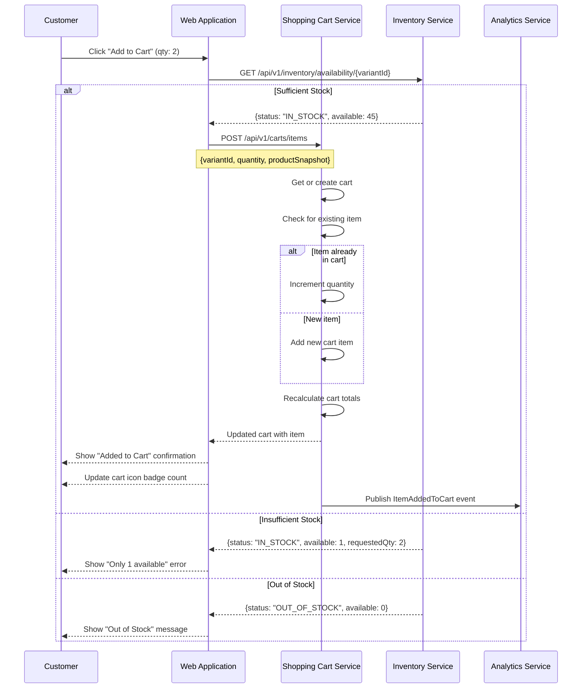

# US-0004-06: Add Item to Cart

## User Story

**As a** customer who has chosen a product and variant,
**I want** to add the item to my shopping cart,
**So that** I can proceed to purchase it along with other items I have selected.

## Story Details

| Field | Value |
|-------|-------|
| Story ID | US-0004-06 |
| Epic | [US-0004: Customer Shopping Experience](./README.md) |
| Priority | Must Have |
| Phase | Phase 3 (Cart Foundation) |
| Story Points | 8 |

## Description

This story implements the "Add to Cart" operation. When a customer clicks the Add to Cart button, the application first validates inventory with the Inventory Service. If stock is available, the Shopping Cart Service adds the item to the cart (creating the cart if necessary) and captures a product snapshot at the time of addition. If the item already exists in the cart, the quantity is incremented. The cart icon badge updates immediately. Duplicate items are combined rather than creating separate line items. Tier pricing is applied automatically when quantity thresholds are met.

## UI Requirements

- Quantity selector allowing 1 to `maxOrderQuantity` items
- "Add to Cart" button with a loading state during the operation
- Success confirmation displayed as a mini-cart preview or toast notification
- Cart icon in the header updates its badge count immediately
- Quick "View Cart" link displayed after a successful add
- Clear indication of which product and variant are being added
- Error state displayed inline if the operation fails

## Sequence Diagram



## Acceptance Criteria

### AC-0004-06-01: Add to Cart Performance (from AC-4.1)

**Given** I click "Add to Cart" for an in-stock item
**When** the cart operation completes
**Then** the success confirmation is displayed within 200ms (p95) of the button click

### AC-0004-06-02: Inventory Validated Before Add (from AC-4.2)

**Given** I click "Add to Cart"
**When** the add to cart flow begins
**Then** the Inventory Service is queried to confirm availability before the cart operation is attempted
**And** the add to cart operation only proceeds if stock is confirmed available

### AC-0004-06-03: Product Snapshot Captured (from AC-4.3)

**Given** I add an item to my cart
**When** the Shopping Cart Service stores the cart item
**Then** a product snapshot is captured at that moment including: product ID, product name, SKU, variant name, image URL, and attributes
**And** the snapshot is stored with the cart item so that price or catalog changes do not alter the cart display

### AC-0004-06-04: Duplicate Item Increments Quantity (from AC-4.4)

**Given** I already have 2 units of "ACME Gaming Mouse Pro (Black)" in my cart
**When** I add 1 more unit of the same product and variant
**Then** the cart shows 3 units on a single line item
**And** no duplicate line items are created

### AC-0004-06-05: Maximum Order Quantity Enforced (from AC-4.5)

**Given** a product has `maxOrderQuantity: 5`
**When** I attempt to add a quantity that would bring the cart total above 5 for that variant
**Then** an error message is shown: "Maximum order quantity is 5 for this item"
**And** the item is not added beyond the maximum

### AC-0004-06-06: Cart Icon Badge Update (from AC-4.9)

**Given** a successful add to cart operation
**When** the response is received
**Then** the cart icon badge in the header updates to reflect the new total item count
**And** the update happens immediately without requiring a page reload

### AC-0004-06-07: Success Confirmation

**Given** I successfully add an item to my cart
**When** the operation completes
**Then** a confirmation message is displayed (mini-cart preview or toast)
**And** the confirmation includes the product name, variant, quantity, and line total
**And** a "View Cart" link is available in the confirmation

### AC-0004-06-08: Loading State During Add

**Given** I click "Add to Cart"
**When** the operation is in progress
**Then** the Add to Cart button shows a loading spinner
**And** the button is disabled to prevent duplicate submissions

### AC-0004-06-09: Tier Pricing Applied (from AC-4.10)

**Given** a product has tier pricing (e.g., $64.99 for 3 or more)
**When** I add a quantity that meets or exceeds the tier threshold
**Then** the cart line total reflects the tier unit price
**And** the confirmation message shows the tier-discounted unit price

### AC-0004-06-10: CartCreated and ItemAddedToCart Events

**Given** I add an item to a cart for the first time (new cart)
**When** the Shopping Cart Service processes the request
**Then** a `CartCreated` event and an `ItemAddedToCart` event are both published
**And** the events contain cart ID, item details, session ID, and customer ID (if authenticated)

### AC-0004-06-11: Insufficient Stock Error

**Given** I select a quantity of 5 but only 3 units are available
**When** I click "Add to Cart"
**Then** an error message is displayed: "Only 3 items available"
**And** the quantity selector is updated to show the maximum available quantity

## Technical Implementation

### Frontend Stack

- **Framework**: TanStack Start with React 19.2
- **State Management**: Zustand for cart badge count
- **Data Fetching**: TanStack Query mutation for add to cart
- **UI Components**: shadcn/ui Toast for confirmation
- **Styling**: Tailwind CSS 4

### Component Structure

```
frontend-apps/customer/src/
├── components/
│   └── cart/
│       ├── AddToCartButton.tsx
│       ├── CartConfirmationToast.tsx
│       └── CartBadge.tsx
├── hooks/
│   └── useAddToCart.ts
├── stores/
│   └── cartStore.ts
└── api/
    └── cartApi.ts
```

### Add to Cart Hook

```typescript
function useAddToCart() {
  const mutation = useMutation({
    mutationFn: async (params: AddToCartParams) => {
      // 1. Validate inventory
      const availability = await fetchAvailability(params.variantId);
      if (availability.status === 'OUT_OF_STOCK') {
        throw new CartError('OUT_OF_STOCK', 'This item is out of stock');
      }
      if (availability.quantityAvailable < params.quantity) {
        throw new CartError('INSUFFICIENT_STOCK', `Only ${availability.quantityAvailable} available`);
      }

      // 2. Add to cart
      return addToCart({
        variantId: params.variantId,
        quantity: params.quantity,
        productSnapshot: params.productSnapshot,
      });
    },
    onSuccess: (cart) => {
      cartStore.updateItemCount(cart.summary.itemCount);
      toast.success('Added to cart');
    },
  });

  return mutation;
}
```

### API Contract: Add to Cart

```typescript
interface AddToCartRequest {
  variantId: string;
  quantity: number;
  productSnapshot: {
    productId: string;
    name: string;
    sku: string;
    variantName: string;
    imageUrl: string;
    attributes: Record<string, string>;
  };
}

// POST /api/v1/carts/items
// Headers: X-Session-ID, Authorization (optional)
```

### Backend: Shopping Cart Service

- **Service**: `/backend-services/shopping-cart`
- **Language**: Kotlin 2.3 / Java 25
- **Framework**: Spring Boot 4, Spring MVC
- **Store**: PostgreSQL (command store)
- **Error Handling**: Arrow Kotlin `Either<CartError, Cart>`

### Domain Events

```json
{
  "eventType": "CartCreated",
  "payload": {
    "cartId": "...",
    "sessionId": "sess_...",
    "customerId": null
  }
}
```

```json
{
  "eventType": "ItemAddedToCart",
  "payload": {
    "cartId": "...",
    "cartItemId": "...",
    "productId": "...",
    "variantId": "...",
    "sku": "ACME-GM-PRO-BLK",
    "productName": "ACME Gaming Mouse Pro",
    "quantity": 2,
    "unitPrice": {"amount": 69.99, "currency": "USD"},
    "sessionId": "sess_...",
    "customerId": null
  }
}
```

## Accessibility Requirements

- Add to Cart button has `aria-label="Add ACME Gaming Mouse Pro (Black) to cart"`
- Loading state sets `aria-busy="true"` on the button
- Success confirmation toast is announced via `aria-live="assertive"`
- Error messages are associated with the quantity input via `aria-describedby`

## Definition of Done

- [ ] Add to Cart button triggers inventory check before cart operation
- [ ] Cart created automatically if none exists for the session
- [ ] Duplicate items increment quantity on the existing line item
- [ ] Product snapshot captured at time of add
- [ ] Maximum order quantity enforced
- [ ] Loading state shown during operation; button disabled
- [ ] Success toast/preview shown with item details and "View Cart" link
- [ ] Cart badge count updates immediately on success
- [ ] Tier pricing applied when quantity threshold met
- [ ] `CartCreated` and `ItemAddedToCart` events published
- [ ] Insufficient stock error shown with available quantity
- [ ] Unit tests cover cart operations and error handling (>90% coverage)
- [ ] Performance: p95 < 200ms verified
- [ ] Accessibility: button has meaningful aria-label
- [ ] Code reviewed and approved

## Dependencies

- [US-0004-04: Product Detail Page](./US-0004-04-product-detail-page.md)
- [US-0004-05: Product Variant Selection](./US-0004-05-product-variant-selection.md)
- [US-0004-07: Guest Cart Persistence](./US-0004-07-guest-cart-persistence.md)
- Shopping Cart Service `POST /api/v1/carts/items`
- Inventory Service `GET /api/v1/inventory/availability/{variantId}`

## Related Documents

- [Journey Step 4: Customer Adds Item to Cart](../../journeys/0004-customer-shopping-experience.md#step-4-customer-adds-item-to-cart)
- [US-0004-07: Guest Cart Persistence](./US-0004-07-guest-cart-persistence.md)
- [US-0004-08: Cart Merge on Authentication](./US-0004-08-cart-merge-on-authentication.md)
- [US-0004-10: Out of Stock Handling](./US-0004-10-out-of-stock-handling.md)
- [US-0004-11: Price Change Handling](./US-0004-11-price-change-handling.md)
- [US-0004-13: Inventory Service Resilience](./US-0004-13-inventory-service-resilience.md)
