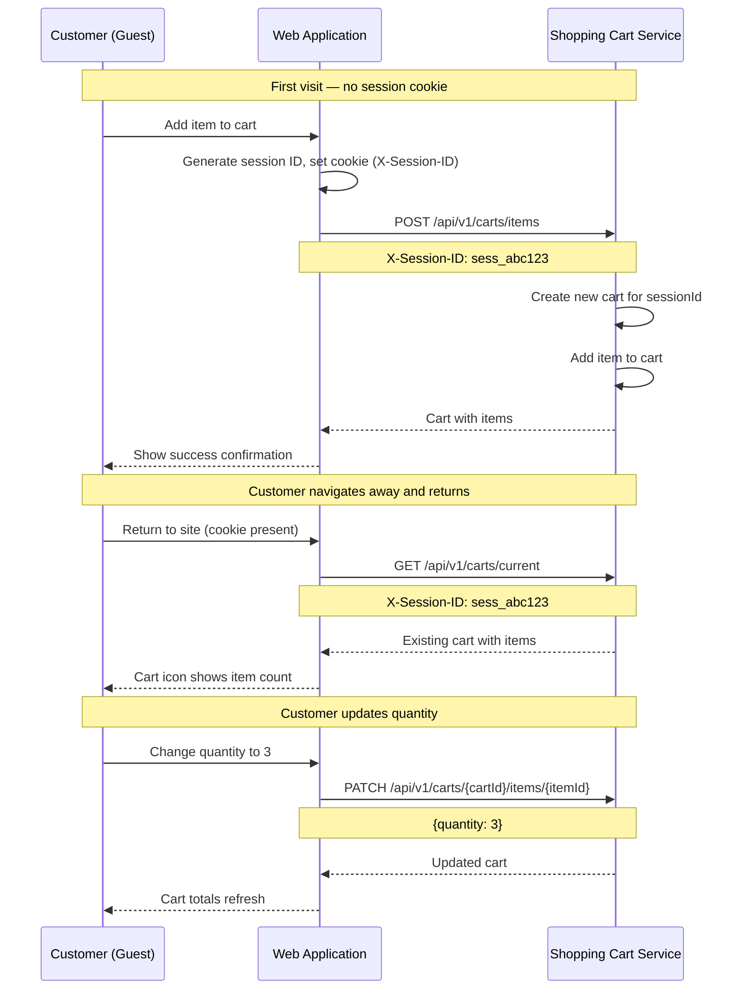

# US-0004-07: Guest Cart Persistence

## User Story

**As a** guest customer browsing without an account,
**I want** my shopping cart to be saved across page navigations and browser sessions,
**So that** I do not lose my selected items if I leave and return to the site.

## Story Details

| Field | Value |
|-------|-------|
| Story ID | US-0004-07 |
| Epic | [US-0004: Customer Shopping Experience](./README.md) |
| Priority | Must Have |
| Phase | Phase 3 (Cart Foundation) |
| Story Points | 5 |

## Description

This story implements guest cart persistence using a session ID stored in a browser cookie. When a guest customer adds an item to their cart, the Shopping Cart Service creates a cart associated with the session ID. The session cookie persists across page loads so that the cart remains intact. Cart item quantity can be updated or removed. When the session expires, a new cart is created transparently (see US-0004-12). This foundation enables the guest-to-authenticated cart merge flow in US-0004-08.

## UI Requirements

- Cart contents displayed in a cart drawer or dedicated cart page
- Quantity update controls (increment, decrement, manual input) per line item
- Remove item button per line item
- Cart subtotal and estimated total displayed
- Empty cart state with a call-to-action to browse products
- Cart persists across page refreshes and browser tab restores

## Sequence Diagram



## Acceptance Criteria

### AC-0004-07-01: Guest Cart Created with Session Cookie (from AC-4.6)

**Given** I am a guest customer with no active cart
**When** I add an item to my cart
**Then** a session ID cookie is set on my browser (HttpOnly, Secure, SameSite=Lax)
**And** a new cart is created in the Shopping Cart Service associated with that session ID

### AC-0004-07-02: Cart Persists Across Page Navigation

**Given** I have added items to my guest cart
**When** I navigate to a different page and then return
**Then** the cart icon badge still shows the correct item count
**And** my cart items are still present

### AC-0004-07-03: Cart Persists Across Browser Tab Restores

**Given** I have added items to my guest cart and the session cookie is still valid
**When** I close the browser tab and reopen the same URL
**Then** the cart contents are restored from the session cookie

### AC-0004-07-04: Update Cart Item Quantity

**Given** I have items in my guest cart
**When** I change the quantity of an item using the quantity controls
**Then** the Shopping Cart Service updates the line item quantity
**And** the cart subtotal recalculates immediately
**And** a `CartItemQuantityUpdated` event is published

### AC-0004-07-05: Remove Cart Item

**Given** I have items in my guest cart
**When** I click the remove button for a line item
**Then** the item is removed from the cart
**And** the cart totals recalculate
**And** a `CartItemRemoved` event is published

### AC-0004-07-06: Empty Cart State

**Given** I have removed all items from my cart
**When** the cart is empty
**Then** an empty cart message is displayed
**And** a call-to-action button links to the product catalog or home page
**And** the cart badge shows 0 or is hidden

### AC-0004-07-07: Cart Total Calculation

**Given** I have multiple items in my cart
**When** I view the cart
**Then** the subtotal is the sum of all line totals
**And** an estimated total is displayed
**And** all monetary values display in the correct currency with 2 decimal places

### AC-0004-07-08: Maximum Quantity Enforced on Update

**Given** a product has `maxOrderQuantity: 5`
**When** I try to update the quantity to 6 via the quantity input
**Then** the quantity is clamped to 5
**And** an error message is shown: "Maximum order quantity is 5 for this item"

### AC-0004-07-09: Session Cookie Properties

**Given** the session cookie is set
**When** I inspect the cookie
**Then** it is marked `HttpOnly` (not accessible via JavaScript)
**And** it is marked `Secure` (only sent over HTTPS)
**And** it has `SameSite=Lax` to prevent CSRF
**And** it has an appropriate expiry (e.g., 30 days)

### AC-0004-07-10: Cart Loaded on Return Visit

**Given** I have an active session cookie with a valid cart
**When** I navigate to any page of the site
**Then** the cart badge in the header shows the correct item count from my persisted cart

## Technical Implementation

### Frontend Stack

- **Framework**: TanStack Start with React 19.2
- **State Management**: Zustand for cart state
- **Data Fetching**: TanStack Query
- **Cookie Management**: js-cookie or native document.cookie
- **UI Components**: shadcn/ui Sheet for cart drawer
- **Styling**: Tailwind CSS 4

### Component Structure

```
frontend-apps/customer/src/
├── components/
│   └── cart/
│       ├── CartDrawer.tsx
│       ├── CartLineItem.tsx
│       ├── CartSummary.tsx
│       ├── CartEmptyState.tsx
│       └── QuantityControl.tsx
├── hooks/
│   ├── useCart.ts
│   ├── useCartItem.ts
│   └── useSessionId.ts
├── stores/
│   └── cartStore.ts
└── api/
    └── cartApi.ts
```

### Session ID Management

```typescript
const SESSION_COOKIE = 'acme_session_id';

function getOrCreateSessionId(): string {
  let sessionId = Cookies.get(SESSION_COOKIE);
  if (!sessionId) {
    sessionId = crypto.randomUUID();
    Cookies.set(SESSION_COOKIE, sessionId, {
      expires: 30,        // 30 days
      secure: true,
      sameSite: 'lax',
    });
  }
  return sessionId;
}
```

### API Contracts

**Get Current Cart:**
```
GET /api/v1/carts/current
X-Session-ID: sess_abc123
```

**Update Item Quantity:**
```
PATCH /api/v1/carts/{cartId}/items/{cartItemId}
Content-Type: application/json
{ "quantity": 3 }
```

**Remove Item:**
```
DELETE /api/v1/carts/{cartId}/items/{cartItemId}
```

### Backend: Shopping Cart Service

- **Service**: `/backend-services/shopping-cart`
- **Cart identification**: session ID from `X-Session-ID` header
- **Cart expiry**: configurable TTL (default 30 days)
- **Error Handling**: Arrow Kotlin `Either<CartError, Cart>`

### Domain Events

```json
{
  "eventType": "CartItemQuantityUpdated",
  "payload": {
    "cartId": "...",
    "cartItemId": "...",
    "variantId": "...",
    "previousQuantity": 2,
    "newQuantity": 3,
    "reason": "CUSTOMER_UPDATE"
  }
}
```

## Definition of Done

- [ ] Session ID cookie is created on first add to cart
- [ ] Cookie has correct security attributes (HttpOnly, Secure, SameSite=Lax)
- [ ] Cart is fetched and displayed on every page load
- [ ] Cart badge shows correct count
- [ ] Cart persists across page navigation
- [ ] Quantity update works and recalculates totals
- [ ] Item removal works and recalculates totals
- [ ] Maximum quantity enforced on update
- [ ] Empty cart state displays with CTA
- [ ] `CartItemQuantityUpdated` and `CartItemRemoved` events published
- [ ] Unit tests cover session ID creation and cart state management
- [ ] Integration tests verify cart CRUD operations
- [ ] Code reviewed and approved

## Dependencies

- [US-0004-06: Add Item to Cart](./US-0004-06-add-item-to-cart.md)
- Shopping Cart Service with `GET /api/v1/carts/current`, `PATCH`, and `DELETE` endpoints
- Session cookie infrastructure

## Related Documents

- [Journey Step 4: Customer Adds Item to Cart](../../journeys/0004-customer-shopping-experience.md#step-4-customer-adds-item-to-cart)
- [US-0004-06: Add Item to Cart](./US-0004-06-add-item-to-cart.md)
- [US-0004-08: Cart Merge on Authentication](./US-0004-08-cart-merge-on-authentication.md)
- [US-0004-12: Cart Session Recovery](./US-0004-12-cart-session-recovery.md)
