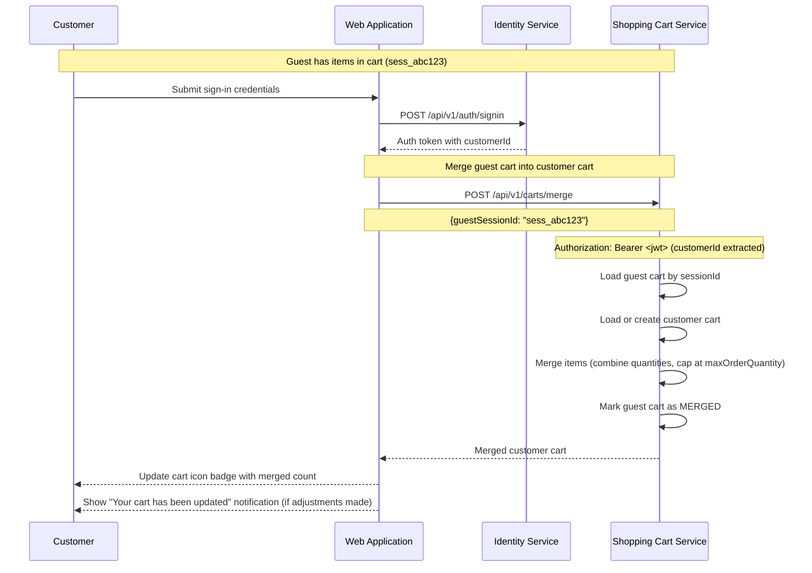

# US-0004-08: Cart Merge on Authentication

## User Story

**As a** guest customer who has added items to my cart and then signs in,
**I want** my guest cart to be merged with my existing account cart,
**So that** I do not lose the items I added before authenticating.

## Story Details

| Field | Value |
|-------|-------|
| Story ID | US-0004-08 |
| Epic | [US-0004: Customer Shopping Experience](./README.md) |
| Priority | Must Have |
| Phase | Phase 4 (Cart Enhancement) |
| Story Points | 5 |

## Description

This story implements cart merging when a guest customer authenticates. After a successful sign-in, the web application calls the Shopping Cart Service merge endpoint, passing the guest session ID and the authenticated customer ID. The Shopping Cart Service combines items from both carts — if the same variant appears in both, quantities are summed (capped at `maxOrderQuantity`). The guest cart is then marked as merged. The customer sees the unified cart containing all items. A `CartMerged` event is published for analytics.

## UI Requirements

- No explicit merge UI — the merge is transparent to the customer
- After sign-in the cart icon badge updates to reflect the merged item count
- If quantity capping occurs during merge, the customer is notified (e.g., "Some quantities were adjusted due to maximum order limits")
- Cart drawer or cart page shows all merged items

## Sequence Diagram



## Acceptance Criteria

### AC-0004-08-01: Guest Cart Merges on Sign-in (from AC-4.8)

**Given** I am a guest customer with items in my cart
**And** I sign in to my account
**When** authentication succeeds
**Then** my guest cart items are merged into my account cart automatically
**And** I do not need to take any explicit action to trigger the merge

### AC-0004-08-02: Customer Cart Items Preserved

**Given** I have "ACME Keyboard" in my authenticated account cart
**And** I add "ACME Gaming Mouse Pro" as a guest
**When** I sign in
**Then** my cart contains both "ACME Keyboard" and "ACME Gaming Mouse Pro"

### AC-0004-08-03: Duplicate Items Combined

**Given** my account cart contains 2 units of "ACME Gaming Mouse Pro (Black)"
**And** my guest cart contains 1 unit of "ACME Gaming Mouse Pro (Black)"
**When** I sign in and the carts merge
**Then** my cart shows 3 units of "ACME Gaming Mouse Pro (Black)" on a single line

### AC-0004-08-04: Maximum Quantity Capping During Merge

**Given** my account cart has 3 units of a product with `maxOrderQuantity: 5`
**And** my guest cart has 4 units of the same product
**When** the carts merge (combined would be 7)
**Then** the resulting quantity is capped at 5
**And** a notification informs me: "Quantity for [product name] was adjusted to the maximum of 5"

### AC-0004-08-05: Guest Cart Marked as Merged

**Given** a successful cart merge
**When** the merge operation completes
**Then** the guest cart is marked with status `MERGED` in the Shopping Cart Service
**And** subsequent requests with the old session ID return an empty or merged status response

### AC-0004-08-06: Cart Badge Updated After Merge

**Given** the cart merge completes
**When** I view the header
**Then** the cart icon badge reflects the total item count of the merged customer cart

### AC-0004-08-07: Authenticated Cart Association (from AC-4.7)

**Given** I am a signed-in customer
**When** I add items to my cart or view my cart
**Then** cart operations use the customer ID (from the JWT) rather than the session ID
**And** my cart is retrievable from any device after signing in

### AC-0004-08-08: Empty Guest Cart Merge

**Given** I sign in as a customer with no items in my guest cart
**And** I have items in my account cart
**When** the merge operation is called
**Then** no changes are made to my account cart
**And** no error is shown

### AC-0004-08-09: No Guest Cart Merge

**Given** I sign in as a customer with no guest cart at all (first sign-in, no prior browsing)
**When** authentication completes
**Then** no merge request is made to the Shopping Cart Service
**And** the customer's existing account cart (if any) is loaded normally

### AC-0004-08-10: CartMerged Event Published

**Given** a merge operation completes with at least one item transferred
**When** the merge is processed
**Then** a `CartMerged` event is published containing target cart ID, source cart ID, customer ID, items merged count, and any quantity adjustments

## Technical Implementation

### Frontend Stack

- **Framework**: TanStack Start with React 19.2
- **Authentication**: Identity Service JWT stored in memory / HttpOnly cookie
- **Cart State**: Zustand store updated post-merge
- **Data Fetching**: TanStack Query mutation for merge

### Merge Flow Hook

```typescript
async function onSigninSuccess(authToken: AuthToken) {
  // Store auth token
  setAuthToken(authToken);

  // Check if there's a guest session to merge
  const guestSessionId = getSessionCookieValue();
  if (guestSessionId) {
    try {
      const mergedCart = await mergeCart({ guestSessionId });
      cartStore.setCart(mergedCart);

      if (mergedCart.mergeResult?.quantitiesAdjusted.length > 0) {
        toast.info('Some cart quantities were adjusted due to maximum order limits.');
      }
    } catch (err) {
      // Merge failure is non-blocking; log and continue
      logger.warn('Cart merge failed', err);
    }
  }
}
```

### API Contract: Merge Carts

```
POST /api/v1/carts/merge
Content-Type: application/json
Authorization: Bearer <jwt>

{
  "guestSessionId": "sess_abc123"
}
```

```typescript
interface MergeResult {
  cartId: string;
  status: 'ACTIVE';
  mergeResult: {
    itemsMerged: number;
    quantitiesAdjusted: Array<{
      variantId: string;
      requestedTotal: number;
      adjustedTo: number;
      reason: 'MAX_ORDER_QUANTITY';
    }>;
  };
  items: CartItem[];
  summary: CartSummary;
}
```

### Backend: Shopping Cart Service

- **Service**: `/backend-services/shopping-cart`
- **Endpoint**: `POST /api/v1/carts/merge`
- **Auth**: Customer ID extracted from JWT
- **Idempotency**: Re-merging an already-merged guest cart is a no-op
- **Error Handling**: Arrow Kotlin `Either<MergeError, MergedCart>`

### Domain Event: CartMerged

```json
{
  "eventType": "CartMerged",
  "eventVersion": "1.0",
  "payload": {
    "targetCartId": "...",
    "sourceCartId": "...",
    "customerId": "...",
    "itemsMerged": 2,
    "quantitiesAdjusted": 1
  }
}
```

## Definition of Done

- [ ] Cart merge called automatically after successful sign-in (when guest session exists)
- [ ] Items from guest cart appear in authenticated cart
- [ ] Duplicate items have quantities combined
- [ ] Quantities capped at `maxOrderQuantity` with notification
- [ ] Guest cart marked as MERGED after successful merge
- [ ] Cart badge updates to merged count
- [ ] Authenticated cart operations use customer ID from JWT
- [ ] Merge failure is non-blocking (user can continue)
- [ ] Empty guest cart and no-guest-cart scenarios handled gracefully
- [ ] `CartMerged` event published
- [ ] Unit tests cover merge logic including capping
- [ ] Integration test for full sign-in + merge flow
- [ ] Code reviewed and approved

## Dependencies

- [US-0004-07: Guest Cart Persistence](./US-0004-07-guest-cart-persistence.md)
- [User Story: Customer Signin (US-0003)](../0003-customer-signin/README.md)
- Shopping Cart Service `POST /api/v1/carts/merge`
- Identity Service for JWT and customer ID

## Related Documents

- [Journey Step 4: Customer Adds Item to Cart — Guest vs Authenticated](../../journeys/0004-customer-shopping-experience.md#sequence-diagram-guest-vs-authenticated-cart)
- [US-0004-07: Guest Cart Persistence](./US-0004-07-guest-cart-persistence.md)
