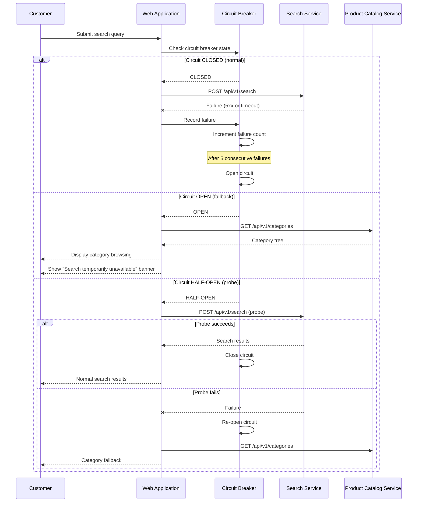

# US-0004-09: Search Service Resilience

## User Story

**As a** customer attempting to search for products,
**I want** to be able to browse products even when the Search Service is temporarily unavailable,
**So that** I can still discover and purchase products without being blocked by a service outage.

## Story Details

| Field | Value |
|-------|-------|
| Story ID | US-0004-09 |
| Epic | [US-0004: Customer Shopping Experience](./README.md) |
| Priority | Must Have |
| Phase | Phase 1 (MVP) |
| Story Points | 5 |

## Description

This story implements the circuit breaker and fallback strategy for the Search Service. When the Search Service fails or becomes unresponsive, a circuit breaker opens and the application falls back to category-based product browsing via the Product Catalog Service. A banner informs the customer that search is temporarily unavailable. The circuit breaker automatically attempts a recovery probe after a configured interval.

## Implementation Notes

Added during implementation (PIN-265); the sections below are the story as originally written.

**There is no standalone Search Service or Product Catalog Service.** Both are the
**product service** (`backend-services/product`, port 10303): search is `POST /api/v1/search`,
and the category endpoints below were added by this story. The fallback's value depends on
this distinction — the two are separate code paths (PostgreSQL full-text search versus a
direct read of the `products` table), so category browsing survives a search failure.

**The category endpoints did not exist and were built here**: `GET /api/v1/categories` and
`GET /api/v1/categories/{name}/products`. No migration was needed — `category` is an existing
nullable column on `products`. There is no categories table, so the "category tree" in the
sequence diagram is a flat, alphabetical list.

**AC-0004-09-08 (Prometheus metrics) is deferred to [PIN-270](https://linear.app/pintail-consulting/issue/PIN-270/ac-0004-09-08-expose-search-circuit-breaker-metrics-via-prometheus).**
No service declares `micrometer-registry-prometheus`, Prometheus scrapes no application
services, and the frontend has no telemetry transport, so exporting a browser-held value is
cross-cutting observability work rather than search work. AC-01 through AC-07 are implemented.

**Deviations from the Technical Implementation sketch below**, each deliberate:

- `execute` rethrows instead of returning a fallback value. The fallback renders a different
  component tree from a different endpoint, so returning it as a `SearchResponse` would
  misrepresent it; callers catch and decide what to render.
- A 4xx does not count toward opening the circuit — the service rejecting one bad request
  says nothing about its health. Only 5xx, timeouts and network errors count.
- `HALF_OPEN` probes are single-flight, so concurrent searches do not stampede a service
  that may not have recovered.
- The fallback renders from the **first** failure rather than the fifth. The breaker still
  opens on the fifth (AC-01), which governs when the app stops *calling* search; gating the
  UI on it would leave the customer with a blank results area for four searches, which is
  what AC-06 forbids.
- The banner carries an explicit **retry control**. React Query serves a cached failure for
  an unchanged query key, so a customer re-submitting the same term would otherwise never
  trigger the recovery probe.
- The search input is left visible and enabled (the UI Requirements below allow hiding or
  disabling it), so the page is never a dead end and normal search resumes in place.

## UI Requirements

- Informational banner: "Search is temporarily unavailable. Browse by category instead."
- Fallback category navigation visible when search is unavailable
- Search input is either hidden, disabled, or shows an informative tooltip
- Normal search UI resumes automatically when the circuit breaker closes
- No hard error page — the customer can always browse by category

## Sequence Diagram



## Acceptance Criteria

### AC-0004-09-01: Circuit Breaker Opens After Consecutive Failures (from AC-E1.1)

**Given** the Search Service is unavailable
**When** 5 consecutive search requests fail (5xx response or timeout)
**Then** the circuit breaker opens
**And** subsequent search requests bypass the Search Service immediately without waiting for a timeout

### AC-0004-09-02: Fallback to Category Browsing (from AC-E1.2)

**Given** the circuit breaker is open
**When** a customer submits a search query
**Then** the application fetches the category tree from the Product Catalog Service
**And** the customer is shown a category browsing view
**And** clicking a category shows products in that category

### AC-0004-09-03: Search Unavailable Banner (from AC-E1.3)

**Given** the circuit breaker is open and the fallback is active
**When** the customer views the search results area
**Then** a clearly visible banner reads "Search is temporarily unavailable. Browse by category instead."
**And** the banner includes a link or guidance to use category navigation

### AC-0004-09-04: Circuit Breaker Attempts Recovery (from AC-E1.4)

**Given** the circuit breaker has been open
**When** 30 seconds have elapsed since the circuit opened
**Then** the circuit breaker transitions to HALF-OPEN
**And** the next search request is forwarded as a probe to the Search Service

**Given** the probe request succeeds
**Then** the circuit breaker closes and normal search resumes
**And** the "search unavailable" banner disappears

### AC-0004-09-05: Partial Search Degradation

**Given** the Search Service responds but with elevated latency (> 5 seconds)
**When** the request exceeds the configured timeout (2 seconds)
**Then** the request is treated as a failure and counted toward the circuit breaker threshold
**And** the fallback is used for that request

### AC-0004-09-06: No Full-Page Error

**Given** the Search Service is down
**When** a customer attempts to search
**Then** the customer is NOT shown a generic error page or unhandled exception
**And** the customer can continue to browse and add items to their cart

### AC-0004-09-07: Category Fallback Products Load

**Given** the fallback category browsing is active
**When** a customer clicks a category
**Then** products in that category are loaded from the Product Catalog Service
**And** the customer can view product details and add items to their cart

### AC-0004-09-08: Circuit Breaker Metrics

**Given** the circuit breaker is in any state
**When** the observability system queries health metrics
**Then** metrics for circuit state (open/closed/half-open) and failure counts are exposed via Prometheus
**And** an alert fires if the circuit has been open for more than 5 minutes

## Technical Implementation

### Frontend Circuit Breaker

The circuit breaker pattern is implemented at the API client layer using a state machine:

```typescript
type CircuitState = 'CLOSED' | 'OPEN' | 'HALF_OPEN';

class SearchCircuitBreaker {
  private state: CircuitState = 'CLOSED';
  private failureCount = 0;
  private readonly threshold = 5;
  private readonly resetTimeoutMs = 30_000;
  private nextProbeAt?: number;

  async execute<T>(fn: () => Promise<T>, fallback: () => Promise<T>): Promise<T> {
    if (this.state === 'OPEN') {
      if (Date.now() >= (this.nextProbeAt ?? 0)) {
        this.state = 'HALF_OPEN';
      } else {
        return fallback();
      }
    }

    try {
      const result = await fn();
      this.onSuccess();
      return result;
    } catch (err) {
      this.onFailure();
      return fallback();
    }
  }

  private onSuccess() {
    this.failureCount = 0;
    this.state = 'CLOSED';
  }

  private onFailure() {
    this.failureCount++;
    if (this.failureCount >= this.threshold || this.state === 'HALF_OPEN') {
      this.state = 'OPEN';
      this.nextProbeAt = Date.now() + this.resetTimeoutMs;
    }
  }
}
```

### Backend Resilience

The Search Service backend also implements Resilience4j circuit breaker patterns for downstream dependencies.

### Component Structure

```
frontend-apps/customer/src/
├── components/
│   └── search/
│       ├── SearchUnavailableBanner.tsx
│       └── CategoryFallbackBrowse.tsx
├── lib/
│   └── searchCircuitBreaker.ts
└── hooks/
    └── useSearchWithFallback.ts
```

### Observability

| Metric | Type | Description |
|--------|------|-------------|
| `search_circuit_state` | Gauge | 0=CLOSED, 1=HALF_OPEN, 2=OPEN |
| `search_circuit_failure_total` | Counter | Cumulative failures |
| `search_circuit_open_duration_seconds` | Histogram | Duration circuit stays open |

## Definition of Done

- [ ] Circuit breaker opens after 5 consecutive search failures
- [ ] Fallback to category browsing activates when circuit is open
- [ ] "Search temporarily unavailable" banner displayed
- [ ] Circuit transitions to HALF-OPEN after 30 seconds
- [ ] Successful probe closes circuit and resumes normal search
- [ ] Failed probe re-opens circuit
- [ ] Customer can browse and purchase products during search outage
- [ ] No full-page error or unhandled exception shown
- [ ] Circuit breaker state metrics exposed via Prometheus
- [ ] Unit tests cover all circuit breaker state transitions
- [ ] Integration test simulates search service failure
- [ ] Code reviewed and approved

## Dependencies

- [US-0004-01: Product Search](./US-0004-01-product-search.md)
- Product Catalog Service category browsing endpoints
- Prometheus metrics infrastructure

## Related Documents

- [Journey Error Scenario E1: Search Service Unavailable](../../journeys/0004-customer-shopping-experience.md#e1-search-service-unavailable)
- [US-0004-01: Product Search](./US-0004-01-product-search.md)
