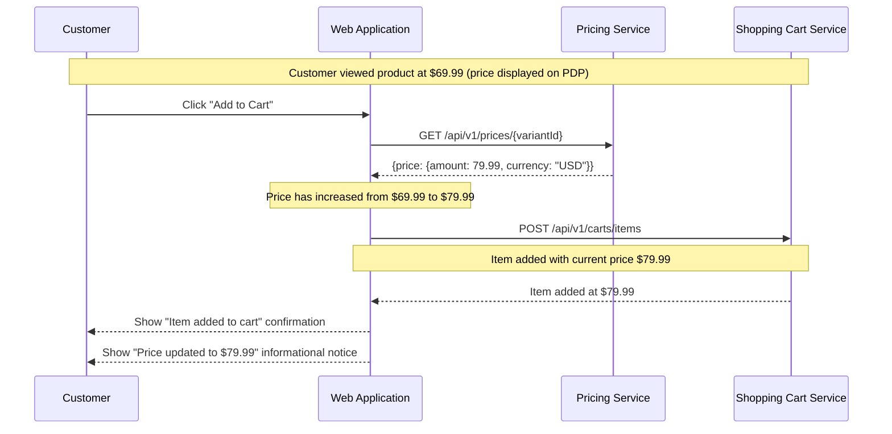

# US-0004-11: Price Change Handling

## User Story

**As a** customer adding a product to my cart,
**I want** the current price to be used when the item is added,
**So that** I am always charged the correct price even if it changed since I last viewed the product.

## Story Details

| Field | Value |
|-------|-------|
| Story ID | US-0004-11 |
| Epic | [US-0004: Customer Shopping Experience](./README.md) |
| Priority | Should Have |
| Phase | Phase 3 (Cart Foundation) |
| Story Points | 3 |

## Description

This story handles the scenario where a product's price changes between the time a customer views the product detail page and when they click "Add to Cart". The application always fetches the current price from the Pricing Service at the time of the add-to-cart operation. If the price has changed from the displayed price, the customer is notified with a non-blocking informational message. The add-to-cart operation is never blocked by a price change — the item is added at the current price.

## UI Requirements

- Price change notification displayed as a non-blocking toast or info banner
- Notification text: "Price updated to $[NEW_PRICE]" with the new price clearly shown
- The notification does not prevent the item from being added
- Cart confirmation shows the actual price used
- No user action is required in response to the notification

## Sequence Diagram



## Acceptance Criteria

### AC-0004-11-01: Current Price Always Used on Add (from AC-E3.1)

**Given** I viewed a product at $69.99
**And** the price changed to $79.99 before I clicked "Add to Cart"
**When** I click "Add to Cart"
**Then** the item is added to my cart at $79.99 (the current price from the Pricing Service)
**And** the price captured in the product snapshot is $79.99

### AC-0004-11-02: Price Change Notification (from AC-E3.2)

**Given** the price has increased since I last viewed the product detail page
**When** the item is added to my cart at the new higher price
**Then** an informational notification is displayed: "Price updated to $79.99"
**And** the notification is non-blocking (does not require confirmation)

**Given** the price has decreased since I last viewed the product detail page
**When** the item is added to my cart at the new lower price
**Then** a positive informational notification is displayed: "Great news! Price updated to $59.99"

### AC-0004-11-03: Add to Cart Not Blocked by Price Change (from AC-E3.3)

**Given** the price has changed from the displayed value
**When** the add-to-cart operation is executed
**Then** the item is added without requiring customer confirmation
**And** the add-to-cart flow completes normally
**And** no error state is entered due to the price change

### AC-0004-11-04: Significant Price Change Warning

**Given** the price has increased by more than 20% since the page was loaded
**When** the item is added to my cart
**Then** the notification is more prominent (e.g., amber/warning color) to draw attention
**And** the notification shows both the old and new price: "Price changed from $69.99 to $89.99"

### AC-0004-11-05: Cart Page Price Accuracy

**Given** I have items in my cart and return to the cart page
**When** the page loads
**Then** the prices shown are the prices at which items were added (captured in product snapshot)
**And** a "Prices may have changed since you added these items" notice is optionally shown if any price has changed since last cart load

### AC-0004-11-06: Price Fetched at Cart Operation Time

**Given** I am on the product detail page with a price displayed from a previous fetch
**When** I click "Add to Cart"
**Then** a fresh price request is made to the Pricing Service
**And** the fresh price is used for the cart operation (not the cached/displayed price)

## Technical Implementation

### Price Change Detection

```typescript
async function addToCartWithPriceCheck(params: AddToCartParams) {
  const [availability, currentPrice] = await Promise.all([
    fetchAvailability(params.variantId),
    fetchPrice(params.variantId),
  ]);

  // Check for price change
  const displayedPrice = params.displayedPrice;
  const priceChanged = Math.abs(currentPrice.price.amount - displayedPrice) > 0.001;
  const priceIncrease = currentPrice.price.amount > displayedPrice;

  const cart = await addToCart({
    variantId: params.variantId,
    quantity: params.quantity,
    productSnapshot: {
      ...params.productSnapshot,
      price: currentPrice.price,
    },
  });

  if (priceChanged) {
    const changePercent = Math.abs((currentPrice.price.amount - displayedPrice) / displayedPrice) * 100;
    notifyPriceChange({
      oldPrice: displayedPrice,
      newPrice: currentPrice.price.amount,
      significant: changePercent > 20,
      increase: priceIncrease,
    });
  }

  return cart;
}
```

### Component Structure

```
frontend-apps/customer/src/
├── components/
│   └── cart/
│       └── PriceChangeNotice.tsx
└── hooks/
    └── useAddToCart.ts (extended with price change detection)
```

## Accessibility Requirements

- Price change notification is announced via `aria-live="polite"` (non-disruptive)
- Significant price increase notification uses `aria-live="assertive"` so it is announced immediately
- The price change notification auto-dismisses after 5 seconds or can be manually closed

## Definition of Done

- [ ] Fresh price fetched from Pricing Service at time of "Add to Cart" click
- [ ] Item added to cart at current price (not cached/displayed price)
- [ ] Informational notification shown when price has changed
- [ ] Notification distinguishes between price increase and decrease
- [ ] Significant price change (>20%) shown with more prominent notice
- [ ] Add to cart is never blocked by price change
- [ ] Product snapshot captures the actual price used
- [ ] Unit tests cover price change detection logic
- [ ] Code reviewed and approved

## Dependencies

- [US-0004-06: Add Item to Cart](./US-0004-06-add-item-to-cart.md)
- Pricing Service `GET /api/v1/prices/{variantId}`

## Related Documents

- [Journey Error Scenario E3: Price Changed Between View and Cart](../../journeys/0004-customer-shopping-experience.md#e3-price-changed-between-view-and-cart)
- [US-0004-06: Add Item to Cart](./US-0004-06-add-item-to-cart.md)
