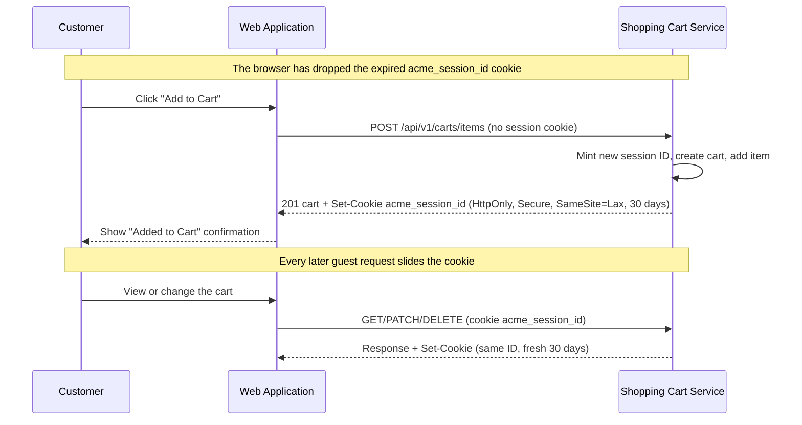

# US-0004-12: Cart Session Recovery

## User Story

**As a** customer whose cart session has expired,
**I want** a new cart to be created transparently when I try to add items,
**So that** I am not blocked from shopping even when my session has timed out.

## Story Details

| Field | Value |
|-------|-------|
| Story ID | US-0004-12 |
| Epic | [US-0004: Customer Shopping Experience](./README.md) |
| Capability | [Shopping Cart Management](../../epics/009-shopping-cart-management.md) |
| Priority | Must Have |
| Phase | Phase 3 (Cart Foundation) |
| Story Points | 3 |

## Description

This story makes an expired cart session a non-event for the customer. The original design had the web application catch a 404, create a session ID in the browser and retry. That can't work here: the session cookie (`acme_session_id`) is HttpOnly and minted by the Shopping Cart Service, so page scripts can neither read nor set it. Recovery therefore happens on the server:

- When the cookie has expired, the browser stops sending it. The next add is treated like a first visit: the service mints a new session, sets a new cookie and creates a new cart. There is no 404 and no retry.
- A session that is still valid but has no ACTIVE cart (for example, after its cart was merged at sign-in) gets a new cart on its next add.
- Updating or removing a line from a page loaded before the session expired returns 404. The web application reloads the cart without showing an error. Nothing is retried, because the line and its cart are gone.

To keep active shoppers from reaching the 30-day limit at all, the cookie **slides**: every cart request made as a guest with a valid session re-issues it with a fresh 30 days.

> Reframed in PIN-268 after the PIN-267 review found the cookie never slid. The original client-side interceptor design is superseded.

## UI Requirements

- No visible error to the customer during session recovery
- The operation completes successfully after the transparent recovery
- Success confirmations (e.g., "Added to cart") appear normally after recovery
- New session cookie is set with appropriate security attributes

## Sequence Diagram

## Acceptance Criteria

### AC-0004-12-01: New Cart Created Transparently (from AC-E4.1)

**Given** my cart session cookie has expired
**When** I click "Add to Cart"
**Then** the Shopping Cart Service starts a new session and a new cart
**And** the item is successfully added to the new cart

### AC-0004-12-02: Customer Not Blocked by an Expired Session (from AC-E4.2)

**Given** my cart session has expired
**When** I attempt any cart operation (add, update, remove, view)
**Then** I see no error message or interruption in my shopping experience

### AC-0004-12-03: New Session Cookie Set Automatically (from AC-E4.3)

**Given** a new session is started
**Then** the session cookie is set with:

- `HttpOnly` flag set
- `Secure` flag set
- `SameSite=Lax`
- 30-day expiry

### AC-0004-12-04: Session Cookie Slides

**Given** I am a guest with a valid session
**When** I view, add to, update or remove from my cart
**Then** the response re-issues the same session cookie with a fresh 30-day expiry
**And** a signed-in customer's requests never set the guest cookie

### AC-0004-12-05: Stale Lines Reload Instead of Failing

**Given** my session expired while the cart page was open
**When** I update or remove a line
**Then** the cart reloads and shows its current contents (empty, if the cart is gone)
**And** no error is shown and the operation is not retried

### AC-0004-12-06: Previous Cart Items Not Restored

**Given** my session has expired and a new cart is created
**When** I view my cart
**Then** the cart contains only what I added since (items from the expired session are not restored)

### AC-0004-12-07: Logged for Observability

**Given** a guest with a valid session adds an item and has no ACTIVE cart
**When** the new cart is created
**Then** the event is logged at INFO level with the new cart ID, and never the session ID, which is the only key to a guest cart
**And** the `cart_session_new_cart_total` counter metric (`cart.session.new_cart`) is incremented

This does not measure expiries. A cookie the browser has already dropped can't be told apart from a first visit, so it isn't counted. Server-side expiry (PIN-287) doesn't change that either: a cart only expires a day after its cookie could have lapsed. In practice, the metric counts guests who add again after their cart was merged at sign-in.

## Technical Implementation

- **Sliding cookie**: `CartController.slideGuestSession` re-issues `acme_session_id` on `GET /current`, `POST /items`, `PATCH` and `DELETE` when the caller is a guest with a valid session.
- **New-cart metric**: `AddItemToCartCommand.startedNewSession` tells `AddItemToCartUseCase` whether the controller just minted the session. A new cart for a session that already existed is logged (by cart ID) and counted.
- **Quiet stale lines**: cart error bodies carry a `code`. `isLineGone` in `frontend-apps/customer/src/hooks/useCart.ts` matches a 404 with `CART_ITEM_NOT_FOUND`. `useCart` reloads the cart, and `CartLineItem` shows no message. A `VARIANT_NOT_FOUND` 404 (the line is still in the cart) still shows its message.
- **Out of scope**: server-side expiry of `carts` rows, since delivered by PIN-287 (see `ARCHITECTURE.md`).

## Definition of Done

- [x] An add with an expired or missing session creates a new session and cart without an error
- [x] New session cookie set with correct security attributes
- [x] Guest session cookie re-issued with a fresh 30 days on every cart request
- [x] Update/remove of a stale line reloads the cart with no error and no retry
- [x] A returning session's new cart logged at INFO level, without the session ID
- [x] `cart_session_new_cart_total` metric incremented
- [x] Unit and acceptance tests cover sliding, recovery and the quiet 404
- [ ] Code reviewed and approved

## Dependencies

- [US-0004-07: Guest Cart Persistence](./US-0004-07-guest-cart-persistence.md)
- Shopping Cart Service returning 404 on expired/missing cart

## Related Documents

- [Journey Error Scenario E4: Cart Session Expired](../../journeys/0004-customer-shopping-experience.md#e4-cart-session-expired)
- [US-0004-07: Guest Cart Persistence](./US-0004-07-guest-cart-persistence.md)
