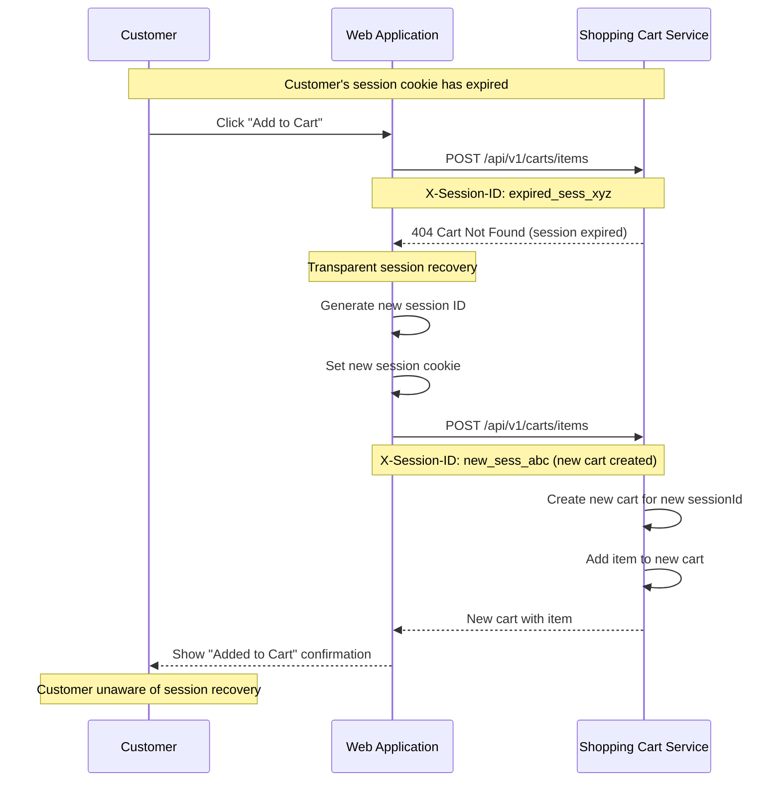

# US-0004-12: Cart Session Recovery

## User Story

**As a** customer whose cart session has expired,
**I want** a new cart to be created transparently when I try to add items,
**So that** I am not blocked from shopping even when my session has timed out.

## Story Details

| Field | Value |
|-------|-------|
| Story ID | US-0004-12 |
| Epic | [US-0004: Customer Shopping Experience](./README.md) |
| Priority | Must Have |
| Phase | Phase 3 (Cart Foundation) |
| Story Points | 3 |

## Description

This story implements automatic cart session recovery. When a guest customer's cart session has expired and they attempt an operation (such as adding an item), the Shopping Cart Service returns a 404. The web application intercepts this response, generates a new session ID, resets the session cookie, creates a new cart, and retries the original operation — all transparently without any error displayed to the customer. The customer's current action succeeds as if the session expiry never occurred.

## UI Requirements

- No visible error to the customer during session recovery
- The operation completes successfully after the transparent recovery
- Success confirmations (e.g., "Added to cart") appear normally after recovery
- New session cookie is set with appropriate security attributes

## Sequence Diagram



## Acceptance Criteria

### AC-0004-12-01: New Cart Created Transparently (from AC-E4.1)

**Given** my cart session cookie has expired
**When** I click "Add to Cart"
**Then** the web application detects the 404 response from the Shopping Cart Service
**And** automatically generates a new session ID
**And** retries the add-to-cart operation with the new session
**And** the item is successfully added to the new cart

### AC-0004-12-02: Customer Not Blocked from Adding Items (from AC-E4.2)

**Given** my cart session has expired
**When** I attempt any cart operation (add, update, remove)
**Then** the operation completes successfully after transparent recovery
**And** I see no error message or interruption in my shopping experience

### AC-0004-12-03: New Session Cookie Set Automatically (from AC-E4.3)

**Given** the session recovery is triggered
**When** a new session ID is generated
**Then** a new session cookie is set with the same security attributes as the original:
  - `HttpOnly` flag set
  - `Secure` flag set
  - `SameSite=Lax`
  - 30-day expiry

### AC-0004-12-04: Single Retry Only

**Given** the recovery is triggered
**When** the Shopping Cart Service returns another 404 on the retry
**Then** the retry is not attempted a third time
**And** an appropriate user-facing error is shown ("Unable to add item to cart. Please try again.")
**And** no infinite retry loop occurs

### AC-0004-12-05: Recovery Applies to All Cart Operations

**Given** my session has expired
**When** I attempt to update a cart item quantity or view my cart
**Then** the same transparent recovery creates a new cart
**And** the operation that triggered the recovery is re-executed

### AC-0004-12-06: Previous Cart Items Not Restored

**Given** my session has expired and a new cart is created during recovery
**When** I view my cart after recovery
**Then** the cart is empty (items from the expired session are not restored)
**And** I am not shown an error about the empty cart — it is treated as a fresh start

### AC-0004-12-07: Logged for Observability

**Given** a session recovery event occurs
**When** the recovery succeeds
**Then** the event is logged at INFO level with the old session ID and the new session ID
**And** a `cart_session_recovery_total` counter metric is incremented

## Technical Implementation

### Recovery Interceptor

```typescript
async function cartApiWithRecovery<T>(fn: () => Promise<T>): Promise<T> {
  try {
    return await fn();
  } catch (err) {
    if (isCartNotFoundError(err)) {
      // Session expired — create new session
      const newSessionId = crypto.randomUUID();
      setSessionCookie(newSessionId);

      // Retry once with new session
      try {
        return await fn();
      } catch (retryErr) {
        throw new Error('Unable to complete cart operation. Please try again.');
      }
    }
    throw err;
  }
}
```

### Session Cookie Reset

```typescript
function setSessionCookie(sessionId: string) {
  Cookies.set(SESSION_COOKIE, sessionId, {
    expires: 30,
    secure: true,
    sameSite: 'lax',
    // httpOnly is set server-side when using SSR
  });
}
```

### Component Structure

```
frontend-apps/customer/src/
├── lib/
│   └── cartApiWithRecovery.ts
└── api/
    └── cartApi.ts (wraps all cart operations with recovery)
```

### Observability

```
cart_session_recovery_total — Counter; incremented on each successful recovery
```

## Definition of Done

- [ ] 404 response from Shopping Cart Service triggers transparent session recovery
- [ ] New session ID generated and cookie set with correct security attributes
- [ ] Original cart operation retried successfully after recovery
- [ ] Customer sees normal success confirmation with no error
- [ ] Single retry only — no infinite loop
- [ ] Second 404 on retry shows user-facing error
- [ ] Recovery applies to add, update, view cart operations
- [ ] Session recovery events logged at INFO level
- [ ] `cart_session_recovery_total` metric incremented
- [ ] Unit tests cover recovery interceptor logic including retry failure
- [ ] Code reviewed and approved

## Dependencies

- [US-0004-07: Guest Cart Persistence](./US-0004-07-guest-cart-persistence.md)
- Shopping Cart Service returning 404 on expired/missing cart

## Related Documents

- [Journey Error Scenario E4: Cart Session Expired](../../journeys/0004-customer-shopping-experience.md#e4-cart-session-expired)
- [US-0004-07: Guest Cart Persistence](./US-0004-07-guest-cart-persistence.md)
