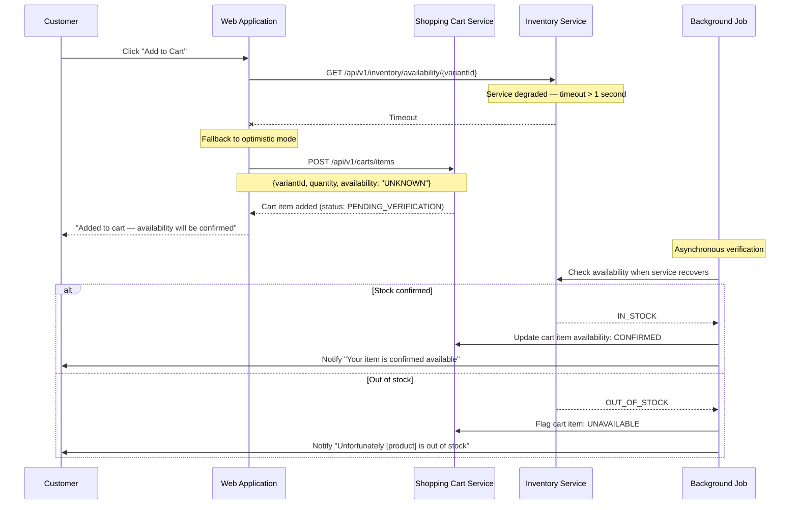

# US-0004-13: Inventory Service Resilience

## User Story

**As a** customer trying to add an item to my cart when the Inventory Service is degraded,
**I want** to be able to add items with a pending availability confirmation,
**So that** a temporary inventory service outage does not prevent me from shopping.

## Story Details

| Field | Value |
|-------|-------|
| Story ID | US-0004-13 |
| Epic | [US-0004: Customer Shopping Experience](./README.md) |
| Priority | Should Have |
| Phase | Phase 3 (Cart Foundation) |
| Story Points | 5 |

## Description

This story implements the optimistic add-to-cart fallback for when the Inventory Service times out or is unavailable. If the inventory check exceeds a 1-second timeout, the application allows the item to be added to the cart with an availability status of `UNKNOWN`. The customer is informed that availability will be confirmed shortly. A background process verifies inventory and either confirms the item or notifies the customer if the item turns out to be unavailable.

## UI Requirements

- "Added to cart — availability will be confirmed" notification instead of the usual "Added to cart" message
- Visual distinction for pending-verification items in the cart (e.g., an amber "Pending" badge)
- Notification sent to the customer (email or in-app) when the availability is confirmed or denied
- If confirmed unavailable, the item is flagged in the cart with an error indicator
- Optimistic add is transparent — customer is not blocked from browsing or checking out

## Sequence Diagram



## Acceptance Criteria

### AC-0004-13-01: Inventory Timeout Threshold (from AC-E5.1)

**Given** the Inventory Service is slow or degraded
**When** an availability check request exceeds 1 second without a response
**Then** the request is timed out
**And** the optimistic add fallback is triggered

### AC-0004-13-02: Optimistic Add Allowed (from AC-E5.2)

**Given** the inventory check timed out
**When** the optimistic fallback is triggered
**Then** the item is added to the cart with `availability: UNKNOWN` / status `PENDING_VERIFICATION`
**And** the item appears in the cart immediately

### AC-0004-13-03: Customer Informed of Pending Confirmation (from AC-E5.3)

**Given** an item was added via the optimistic fallback
**When** the cart confirmation is shown
**Then** the message reads: "Added to cart — availability will be confirmed"
**And** the item in the cart is marked with a "Pending" badge or similar visual indicator

### AC-0004-13-04: Background Verification (from AC-E5.4)

**Given** an item in the cart has `PENDING_VERIFICATION` status
**When** the Inventory Service recovers and the background job runs
**Then** the item's availability is verified
**And** the cart item status is updated to `CONFIRMED` or `UNAVAILABLE`

### AC-0004-13-05: Customer Notified on Availability Confirmed

**Given** a cart item's availability has been confirmed as `IN_STOCK` by the background job
**When** the verification completes
**Then** the customer receives a notification (email or in-app): "Great news! [Product Name] is confirmed available in your cart."
**And** the pending badge on the cart item is removed

### AC-0004-13-06: Customer Notified on Availability Denied

**Given** a cart item's availability has been confirmed as `OUT_OF_STOCK` by the background job
**When** the verification completes
**Then** the customer receives a notification: "Unfortunately [Product Name] is out of stock and cannot be included in your order."
**And** the cart item is flagged with an error/out-of-stock indicator
**And** the customer is shown a "Remove" button for the unavailable item

### AC-0004-13-07: Normal Flow Unaffected

**Given** the Inventory Service responds within the 1-second threshold
**When** I add an item to my cart
**Then** the normal inventory validation flow is used
**And** no optimistic behavior or pending status is applied

### AC-0004-13-08: Checkout Blocked for Unverified Items

**Given** my cart contains items with `PENDING_VERIFICATION` status
**When** I attempt to proceed to checkout
**Then** I am informed that some items are pending verification
**And** I am advised to wait for confirmation before checking out
**And** a "Refresh availability" button is shown

## Technical Implementation

### Timeout Configuration

```typescript
const INVENTORY_TIMEOUT_MS = 1000;

async function fetchAvailabilityWithTimeout(variantId: string) {
  const controller = new AbortController();
  const timeoutId = setTimeout(() => controller.abort(), INVENTORY_TIMEOUT_MS);

  try {
    const result = await fetchAvailability(variantId, { signal: controller.signal });
    clearTimeout(timeoutId);
    return result;
  } catch (err) {
    if (err.name === 'AbortError') {
      return { status: 'UNKNOWN', timedOut: true };
    }
    throw err;
  }
}
```

### Component Structure

```
frontend-apps/customer/src/
├── components/
│   └── cart/
│       ├── CartItemPendingBadge.tsx
│       └── CartItemUnavailableWarning.tsx
└── api/
    └── inventoryApi.ts (with timeout)
```

### Backend: Shopping Cart Service

Cart item model extended with availability status:

```kotlin
enum class CartItemAvailabilityStatus {
    CONFIRMED,
    PENDING_VERIFICATION,
    UNAVAILABLE
}
```

### Backend: Background Verification Job

A scheduled Kotlin coroutine (or Quartz job) in the Shopping Cart Service that:
1. Queries for cart items with `PENDING_VERIFICATION` status older than 30 seconds
2. Calls the Inventory Service for each item
3. Updates the cart item status accordingly
4. Publishes an event for the Notification Service

### Observability

| Metric | Type | Description |
|--------|------|-------------|
| `inventory_check_timeout_total` | Counter | Number of inventory check timeouts |
| `cart_optimistic_adds_total` | Counter | Items added via optimistic fallback |
| `cart_pending_verification_resolved_total` | Counter | Labels: result (confirmed/unavailable) |

## Definition of Done

- [ ] Inventory check request aborted after 1-second timeout
- [ ] Optimistic add proceeds when inventory check times out
- [ ] Cart item stored with `PENDING_VERIFICATION` status
- [ ] "Added to cart — availability will be confirmed" notification shown
- [ ] "Pending" badge shown on cart item
- [ ] Background job verifies inventory and updates item status
- [ ] Customer notified (email/in-app) on confirmation or denial
- [ ] Out-of-stock verified item shown with error indicator and remove button
- [ ] Checkout flow blocks on unverified items
- [ ] Normal flow unaffected when Inventory Service responds within threshold
- [ ] Metrics: timeout counter, optimistic add counter, resolution counter
- [ ] Unit tests cover timeout logic and optimistic add flow
- [ ] Code reviewed and approved

## Dependencies

- [US-0004-06: Add Item to Cart](./US-0004-06-add-item-to-cart.md)
- Inventory Service must recover from timeout gracefully
- Shopping Cart Service extended with `PENDING_VERIFICATION` status
- Notification Service for customer alerts
- Background job infrastructure

## Related Documents

- [Journey Error Scenario E5: Inventory Service Degraded](../../journeys/0004-customer-shopping-experience.md#e5-inventory-service-degraded)
- [US-0004-06: Add Item to Cart](./US-0004-06-add-item-to-cart.md)
- [US-0004-10: Out of Stock Handling](./US-0004-10-out-of-stock-handling.md)
